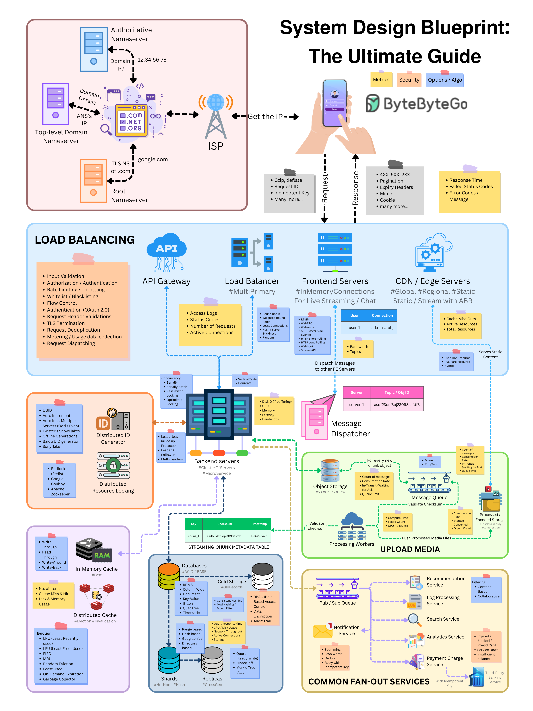
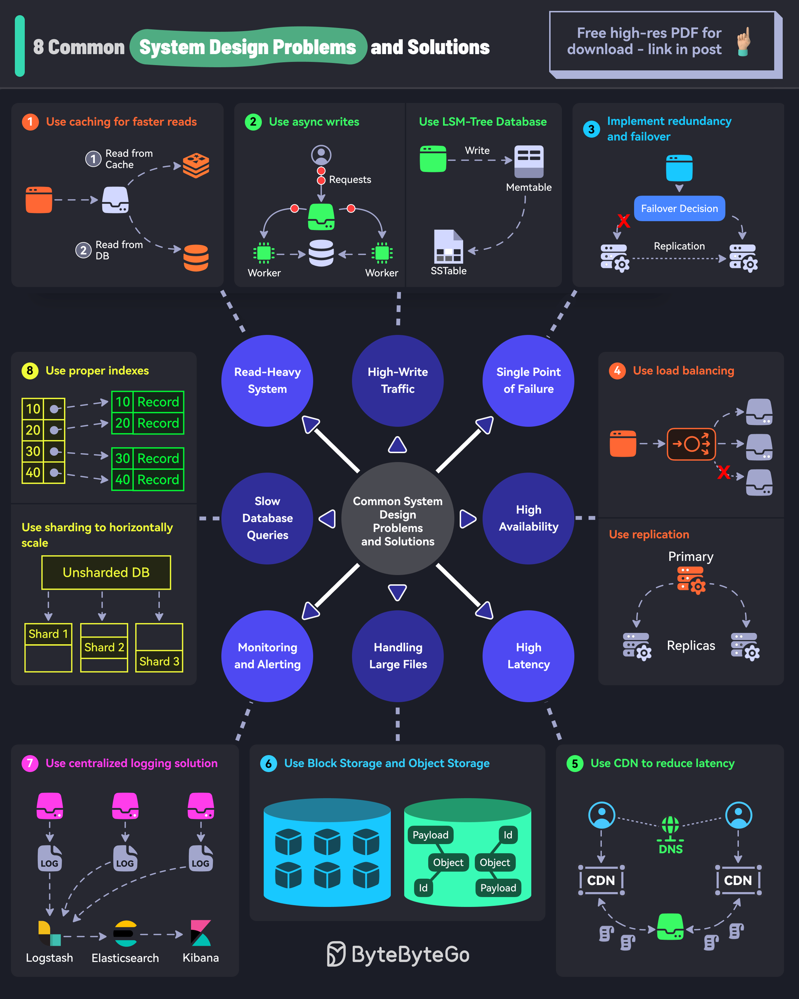

- Componenst
  - Load Balancing
  - API Gateway
  - Communication Protocols
  - Content Delivery Network (CDN)
  - Database
  - Cache
  - Message Queue

- Problems
  - Unique ID Generation
  - Scalability
  - Availability
  - Performance
  - Security
  - Fault Tolerance and Resilience
