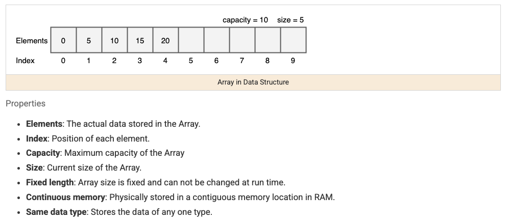

https://simplerize.com/data-structures/priority-queue

Arrays are the starting point for almost every other pattern on this list — a fixed-size, contiguous, indexable block of memory. Most array problems boil down to one question: can I answer this by looking at each element once (or twice), or do I actually need to compare every pair of elements?



## 1. Why Arrays Are Fast for Some Things, Slow for Others

Because array elements sit at contiguous memory addresses, jumping straight to index `i` is `O(1)` — the address is just `base + i * elementSize`, no searching required. That's the whole reason `arr[i]` is instant. But inserting or removing an element in the _middle_ is `O(n)`, because every element after it has to physically shift over by one slot.

```java
int[] arr = {10, 20, 30, 40, 50};
int x = arr[2]; // O(1) — direct address computation, no scanning

// Removing index 1 means shifting everything after it left by one — O(n)
for (int i = 1; i < arr.length - 1; i++) {
    arr[i] = arr[i + 1];
}
```

This single fact — fast random access, slow insertion/removal in the middle — is why arrays are the right structure when you mostly read and rarely resize, and why a linked list (covered separately) is the right structure when you do the opposite.

## 2. The Brute-Force Instinct to Watch For

The most common beginner mistake on array problems is defaulting to a nested loop (compare every element to every other element) when a single pass with the right supporting structure — a hash set, a running sum, two pointers — solves it in one pass instead.

```java
// BAD instinct: O(n²) — check every pair
boolean hasPairWithSum(int[] arr, int target) {
    for (int i = 0; i < arr.length; i++)
        for (int j = i + 1; j < arr.length; j++)
            if (arr[i] + arr[j] == target) return true;
    return false;
}

// GOOD: O(n) — remember what you've already seen
boolean hasPairWithSumFast(int[] arr, int target) {
    Set<Integer> seen = new HashSet<>();
    for (int num : arr) {
        if (seen.contains(target - num)) return true;
        seen.add(num);
    }
    return false;
}
```

The trick that unlocks most array problems: as you scan left to right, what's the smallest piece of information about "everything I've seen so far" that would let me answer the question right now, without looking back? A running sum, a max-so-far, a count in a hash map, or the previous element are the four most common answers.

## 3. Prefix Sums — Answering Range Questions Without Rescanning

If a problem asks "what's the sum of elements between index i and j" many times, recomputing the sum each time is `O(n)` per query. A prefix sum array precomputes cumulative sums once, so any range sum becomes a subtraction.

```java
// prefix[i] = sum of arr[0..i-1]
int[] buildPrefixSum(int[] arr) {
    int[] prefix = new int[arr.length + 1];
    for (int i = 0; i < arr.length; i++) {
        prefix[i + 1] = prefix[i] + arr[i];
    }
    return prefix;
}

// Sum of arr[left..right] inclusive, O(1) per query after O(n) setup
int rangeSum(int[] prefix, int left, int right) {
    return prefix[right + 1] - prefix[left];
}
```

## 4. In-Place Manipulation

Some array problems ask you to modify the array itself without allocating a new one — usually solved by tracking a "write pointer" that trails behind a "read pointer."

```java
// Remove all zeroes in-place, keep relative order of non-zero elements — O(n), O(1) extra space
int removeZeroes(int[] arr) {
    int writePos = 0;
    for (int readPos = 0; readPos < arr.length; readPos++) {
        if (arr[readPos] != 0) {
            arr[writePos] = arr[readPos];
            writePos++;
        }
    }
    return writePos; // new logical length
}
```

## 5. Recognizing When "Array" Is Really a Different Pattern

A lot of what looks like a plain array question is actually another pattern in disguise — recognizing which one avoids reinventing it from scratch:

| Signal in the problem                    | Likely the right pattern                     |
| ---------------------------------------- | -------------------------------------------- |
| "Find a pair/subarray with sum/target X" | Two pointers (if sorted) or hashing (if not) |
| "Sorted array, find something"           | Binary search                                |
| "Contiguous subarray with some property" | Sliding window                               |
| "Compare frequency of elements"          | Hashing                                      |

## 6. Best Practices

| Practice                                                                              | Recommendation                                                                                               |
| ------------------------------------------------------------------------------------- | ------------------------------------------------------------------------------------------------------------ |
| Ask "can I answer this in one pass" before writing a nested loop                      | Most `O(n²)` array solutions can drop to `O(n)` with a hash set/map tracking what's been seen.               |
| Use a prefix sum for repeated range-sum queries                                       | Turns `O(n)` per query into `O(1)` after one `O(n)` setup pass.                                              |
| Use a read/write pointer pair for in-place filtering                                  | Avoids allocating a new array when the problem only needs the existing one compacted.                        |
| Watch for off-by-one errors at array boundaries                                       | `arr.length - 1`, prefix-sum index shifts, and loop bounds are the most common source of bugs in array code. |
| Recognize when "array" is really sorted-array, sliding-window, or hashing in disguise | Picking the matching pattern is usually the entire difficulty of the problem.                                |
