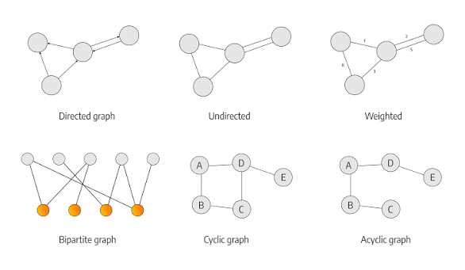
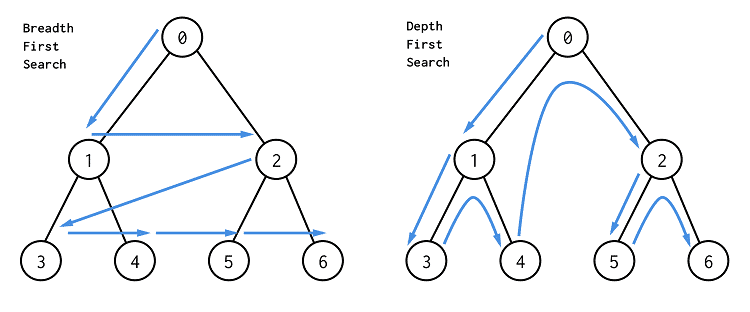

A graph is a set of nodes connected by edges — more general than a tree (which is just a graph with no cycles and exactly one path between any two nodes). Most graph problems are one of a small number of traversal patterns applied to whatever the nodes/edges actually represent in the problem.



## 1. Representing a Graph

The two common representations, chosen based on how dense the graph is (how many edges relative to nodes).

```java
// Adjacency list — most common; efficient for sparse graphs (edges much fewer than nodes²)
Map<Integer, List<Integer>> adjacencyList = new HashMap<>();
adjacencyList.computeIfAbsent(0, k -> new ArrayList<>()).add(1); // edge from node 0 to node 1

// Adjacency matrix — O(1) "are these two connected" check, but O(n²) space regardless of edge count
boolean[][] adjacencyMatrix = new boolean[n][n];
adjacencyMatrix[0][1] = true;
```

Use an adjacency list by default — most real-world graphs are sparse, and the matrix's `O(n²)` space cost is wasted when most of it would be `false`.



## 2. Depth-First Search (DFS)

DFS explores as far down one path as possible before backtracking — implemented recursively or with an explicit stack, and always needs a "visited" set to avoid infinite loops when the graph has cycles.

```java
void dfs(int node, Map<Integer, List<Integer>> graph, Set<Integer> visited) {
    if (visited.contains(node)) return;
    visited.add(node);
    for (int neighbor : graph.getOrDefault(node, List.of())) {
        dfs(neighbor, graph, visited);
    }
}
```

The `visited` set isn't optional bookkeeping — without it, a cycle (`A -> B -> A`) sends a graph traversal into an infinite loop, unlike a tree traversal where no cycles can ever exist in the first place.

## 3. Breadth-First Search (BFS)

BFS explores level by level using a queue — and critically, it's the only one of the two that guarantees the _shortest_ path in an unweighted graph, since it visits everything at distance 1 before anything at distance 2.

```java
int shortestPath(int start, int target, Map<Integer, List<Integer>> graph) {
    Queue<Integer> queue = new LinkedList<>();
    Set<Integer> visited = new HashSet<>();
    queue.offer(start);
    visited.add(start);
    int steps = 0;
    while (!queue.isEmpty()) {
        int size = queue.size();
        for (int i = 0; i < size; i++) {
            int node = queue.poll();
            if (node == target) return steps;
            for (int neighbor : graph.getOrDefault(node, List.of())) {
                if (!visited.contains(neighbor)) {
                    visited.add(neighbor);
                    queue.offer(neighbor);
                }
            }
        }
        steps++;
    }
    return -1; // unreachable
}
```

DFS _can_ find some path, but only BFS guarantees the shortest one in an unweighted graph — using DFS when the problem asks for "minimum steps/shortest path" is a very common mistake.

## 4. Cycle Detection

Detecting a cycle differs for undirected vs. directed graphs — an undirected edge visited from both ends looks like a false cycle unless you exclude the node you just came from.

```java
// Directed graph: detect a cycle using three states (unvisited / in-progress / done)
boolean hasCycleDirected(int node, Map<Integer, List<Integer>> graph, int[] state) {
    if (state[node] == 1) return true;  // currently on the recursion stack — found a back edge, a real cycle
    if (state[node] == 2) return false; // already fully explored, known cycle-free from here

    state[node] = 1; // mark as "in progress"
    for (int neighbor : graph.getOrDefault(node, List.of())) {
        if (hasCycleDirected(neighbor, graph, state)) return true;
    }
    state[node] = 2; // mark as "done" — fully explored, no cycle found through here
    return false;
}
```

The three-state trick (unvisited/in-progress/done) is what correctly distinguishes "this neighbor is a real cycle back to something currently being explored" from "this neighbor was already fully explored via a different path" — a plain visited/unvisited boolean can't make that distinction in a directed graph.

## 5. Topological Sort — Ordering by Dependency

When edges represent "must happen before" (task dependencies, course prerequisites), topological sort produces a valid ordering — and it only exists if the graph has no cycle (a cyclic dependency has no valid order).

```java
// Kahn's algorithm: repeatedly remove nodes with no remaining incoming edges
List<Integer> topologicalSort(int n, Map<Integer, List<Integer>> graph) {
    int[] inDegree = new int[n];
    for (List<Integer> neighbors : graph.values()) {
        for (int neighbor : neighbors) inDegree[neighbor]++;
    }
    Queue<Integer> queue = new LinkedList<>();
    for (int i = 0; i < n; i++) if (inDegree[i] == 0) queue.offer(i); // no prerequisites — can start immediately

    List<Integer> order = new ArrayList<>();
    while (!queue.isEmpty()) {
        int node = queue.poll();
        order.add(node);
        for (int neighbor : graph.getOrDefault(node, List.of())) {
            if (--inDegree[neighbor] == 0) queue.offer(neighbor); // this neighbor's last prerequisite just finished
        }
    }
    return order.size() == n ? order : List.of(); // fewer than n means a cycle exists — no valid order
}
```

## 6. Shortest Path With Weighted Edges: Dijkstra's Algorithm

When edges have different costs (not just "1 step"), BFS no longer finds the shortest path — Dijkstra's algorithm uses a priority queue to always expand the currently-cheapest-to-reach node next.

```java
int[] dijkstra(int start, int n, Map<Integer, List<int[]>> graph) { // graph: node -> list of [neighbor, weight]
    int[] dist = new int[n];
    Arrays.fill(dist, Integer.MAX_VALUE);
    dist[start] = 0;
    PriorityQueue<int[]> pq = new PriorityQueue<>((a, b) -> a[1] - b[1]); // [node, distance]
    pq.offer(new int[]{start, 0});

    while (!pq.isEmpty()) {
        int[] current = pq.poll();
        int node = current[0], d = current[1];
        if (d > dist[node]) continue; // a cheaper path to this node was already found and processed
        for (int[] edge : graph.getOrDefault(node, List.of())) {
            int neighbor = edge[0], weight = edge[1];
            if (dist[node] + weight < dist[neighbor]) {
                dist[neighbor] = dist[node] + weight;
                pq.offer(new int[]{neighbor, dist[neighbor]});
            }
        }
    }
    return dist;
}
```

This is the same "cap and evict the worst" heap discipline seen in the heap pattern, applied here as "always expand the cheapest known frontier next" — Dijkstra only works correctly with non-negative weights, since it assumes a path already marked "cheapest so far" can never be beaten later by adding more edges.

## 7. Recognizing Which Technique Applies

| Signal in the problem                                            | Likely technique                                                           |
| ---------------------------------------------------------------- | -------------------------------------------------------------------------- |
| "Shortest path," unweighted edges                                | BFS                                                                        |
| "Shortest path," weighted edges, no negative weights             | Dijkstra's algorithm                                                       |
| "Is there a cycle," "can these tasks be ordered"                 | Cycle detection / topological sort                                         |
| "All possible paths," "any path will do," connectivity questions | DFS                                                                        |
| "Number of connected components/islands"                         | DFS or BFS from each unvisited node, counting how many traversals it takes |

## 8. Best Practices

| Practice                                                                                  | Recommendation                                                                                           |
| ----------------------------------------------------------------------------------------- | -------------------------------------------------------------------------------------------------------- |
| Always track visited nodes                                                                | Without it, a cycle causes infinite recursion/looping — this is not optional bookkeeping.                |
| Use BFS for shortest path in unweighted graphs, never DFS                                 | DFS finds _a_ path but has no guarantee it's the shortest one.                                           |
| Use Dijkstra only when all edge weights are non-negative                                  | Negative weights break its core assumption — use Bellman-Ford instead if negative weights are possible.  |
| Use the three-state (unvisited/in-progress/done) trick for directed-graph cycle detection | A simple visited boolean can't distinguish a real back-edge cycle from an already-fully-explored branch. |
| Default to an adjacency list over a matrix                                                | Most real graphs are sparse — a matrix's `O(n²)` space is usually wasted space.                          |
