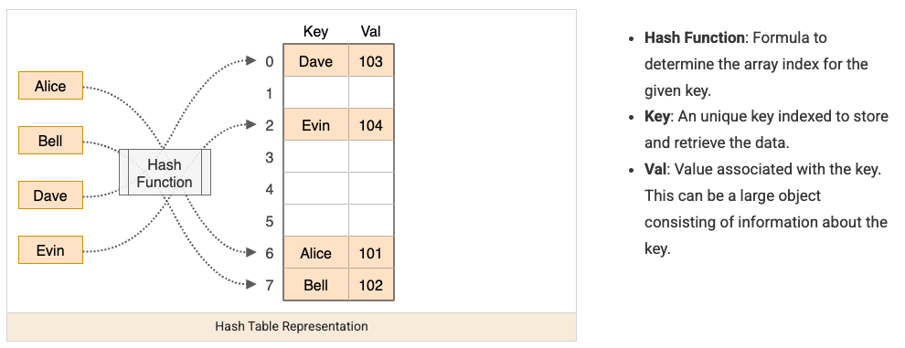
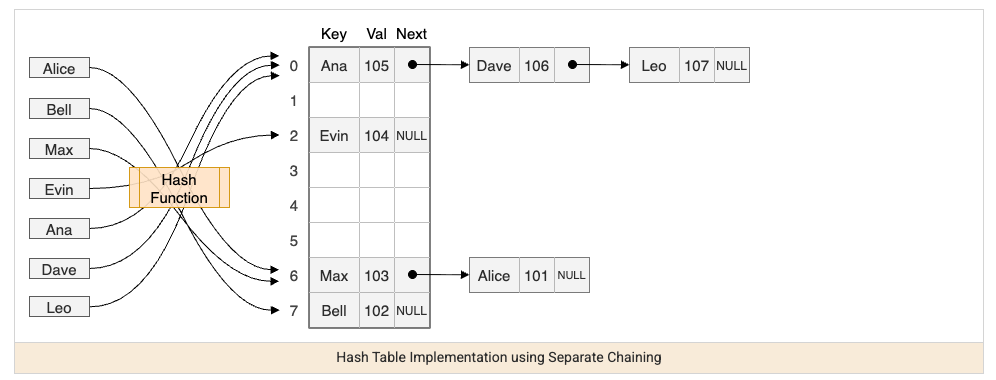

Hashing is the pattern for one specific superpower: turning "have I seen this before" or "how many times has this occurred" from an `O(n)` search into an `O(1)` lookup. Whenever a problem involves counting, deduplicating, or checking membership, a `HashMap` or `HashSet` is almost always the fastest tool available.




## 1. The Core Idea

A hash map/set converts a key into a numeric hash code, uses that to jump directly to a storage bucket, and stores the value there — so looking a key up doesn't require scanning anything, just recomputing the same hash and jumping to the same bucket.

```java
Map<String, Integer> wordCounts = new HashMap<>();
for (String word : words) {
    wordCounts.merge(word, 1, Integer::sum); // increment count, or insert 1 if new
}
```

This is why hashing beats a nested loop for "have I seen this" questions: instead of comparing the current element against every previous one (`O(n)` per check, `O(n²)` total), you check one hash lookup (`O(1)` per check, `O(n)` total).

## 2. The Most Common Shape: One-Pass with a Map

The recurring template across a huge fraction of hashing problems: walk the array once, and for each element, ask "does something I need already exist in my map?" before adding the current element to the map.

```java
// Classic "two sum": find indices of two numbers that add to target
int[] twoSum(int[] nums, int target) {
    Map<Integer, Integer> seen = new HashMap<>(); // value -> index
    for (int i = 0; i < nums.length; i++) {
        int complement = target - nums[i];
        if (seen.containsKey(complement)) {
            return new int[]{seen.get(complement), i};
        }
        seen.put(nums[i], i);
    }
    throw new IllegalArgumentException("No solution");
}
```

The order matters: check for the complement _before_ inserting the current element, so you never match an element with itself.

## 3. Grouping by a Derived Key

A common variant: instead of counting individual elements, group elements that share some computed property — the hash map's key becomes that derived property, not the raw value.

```java
// Group anagrams together — words with the same letters, sorted, share the same key
List<List<String>> groupAnagrams(String[] words) {
    Map<String, List<String>> groups = new HashMap<>();
    for (String word : words) {
        char[] chars = word.toCharArray();
        Arrays.sort(chars);
        String key = new String(chars); // "eat", "tea", "ate" all sort to "aet"
        groups.computeIfAbsent(key, k -> new ArrayList<>()).add(word);
    }
    return new ArrayList<>(groups.values());
}
```

## 4. Frequency Counting for Comparison

Comparing two collections for "same elements, possibly different order" is a hashing problem: build a frequency map for one, then decrement while scanning the other.

```java
// Are two strings anagrams of each other?
boolean isAnagram(String s, String t) {
    if (s.length() != t.length()) return false;
    Map<Character, Integer> counts = new HashMap<>();
    for (char c : s.toCharArray()) counts.merge(c, 1, Integer::sum);
    for (char c : t.toCharArray()) {
        counts.merge(c, -1, Integer::sum);
        if (counts.get(c) < 0) return false; // t has a character s didn't, or too many of one
    }
    return true;
}
```

## 5. HashMap vs. HashSet vs. TreeMap

| Structure             | Use when                                                                                                                                |
| --------------------- | --------------------------------------------------------------------------------------------------------------------------------------- |
| `HashSet`             | You only need to know "does this exist," not any associated value                                                                       |
| `HashMap`             | You need to associate a key with a value/count/index                                                                                    |
| `TreeMap` / `TreeSet` | You need the keys sorted, or need "closest value" queries (`floorKey`, `ceilingKey`) — costs `O(log n)` instead of `O(1)` per operation |

Reach for `TreeMap` only when ordering is actually required — using it by default where a plain `HashMap` would do trades away performance for a guarantee you don't need.

## 6. Best Practices

| Practice                                                                                  | Recommendation                                                                                                                            |
| ----------------------------------------------------------------------------------------- | ----------------------------------------------------------------------------------------------------------------------------------------- |
| Default to `HashMap`/`HashSet` for "have I seen this" or "count occurrences"              | Turns an `O(n²)` nested-loop check into an `O(n)` single pass.                                                                            |
| Check before inserting, not after, in one-pass problems                                   | Prevents matching an element with itself (e.g. two-sum) and other subtle order bugs.                                                      |
| Use a derived key when grouping by a computed property                                    | Sorted characters, a normalized form, or a tuple of properties all work as map keys — the key doesn't have to be the raw value.           |
| Remember hash map iteration order isn't guaranteed                                        | If order matters for the output, use a `LinkedHashMap` (insertion order) or sort explicitly — don't rely on `HashMap`'s incidental order. |
| Reach for `TreeMap`/`TreeSet` only when sorted order or range queries are actually needed | The `O(log n)` cost isn't worth paying when a plain `O(1)` `HashMap` already answers the question.                                        |
