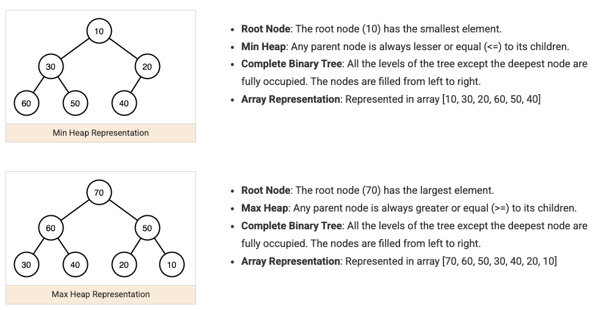

A heap is a tree-shaped structure that keeps one specific element — the smallest (min-heap) or largest (max-heap) — always instantly accessible at the root, while only guaranteeing partial order everywhere else. That weaker guarantee (versus a fully sorted structure) is exactly what makes insert and remove-root fast, and it's the foundation the priority queue pattern is built on top of.



## 1. The Core Idea: Partial Order, Not Full Order

A heap doesn't fully sort its elements — it only guarantees the root is the min (or max), and that the same guarantee holds recursively for every subtree (the "heap property"). A fully sorted structure has to maintain a total order across every element; a heap gets away with maintaining far less, and that's precisely why its operations are cheaper.

```
Min-heap property: every parent is <= both its children (recursively, at every level)

              1
            /   \
           3     2
          / \   /
         5   4 6

Note: 3 and 2 aren't compared to each other directly — only parent-to-child order is guaranteed.
This is why a heap is NOT a sorted list — it's just enough order to always know the minimum instantly.
```

## 2. Array Representation — No Actual Pointers Needed

A binary heap is conventionally stored as a plain array, with parent/child relationships computed by index arithmetic instead of explicit left/right pointers — this is what makes heaps compact and cache-friendly compared to a pointer-based tree.

```
Index:    0   1   2   3   4   5
Value:    1   3   2   5   4   6

For any index i:
  parent(i)      = (i - 1) / 2
  leftChild(i)   = 2*i + 1
  rightChild(i)  = 2*i + 2
```

```java
int parent(int i) { return (i - 1) / 2; }
int leftChild(int i) { return 2 * i + 1; }
int rightChild(int i) { return 2 * i + 2; }
```

## 3. Insert: Sift-Up

Adding a new element appends it at the end of the array, then repeatedly swaps it with its parent while it violates the heap property — "bubbling up" toward the root until it finds its correct resting place.

```java
void insert(int[] heap, int size, int value) {
    heap[size] = value; // add at the end
    int i = size;
    while (i > 0 && heap[parent(i)] > heap[i]) { // min-heap: swap while parent is bigger than child
        swap(heap, i, parent(i));
        i = parent(i);
    }
}
```

Each swap moves the new element up one level, and a binary heap's height is `O(log n)` — so in the worst case, sift-up performs `O(log n)` swaps, giving insert its `O(log n)` complexity.

## 4. Remove the Root: Sift-Down

Removing the minimum (or maximum) moves the _last_ element into the now-empty root position, then repeatedly swaps it with its smaller child while it violates the heap property — "sinking down" until it finds its correct level.

```java
int extractMin(int[] heap, int size) {
    int min = heap[0];
    heap[0] = heap[size - 1]; // move the last element to the root
    size--;
    int i = 0;
    while (true) {
        int smallest = i;
        if (leftChild(i) < size && heap[leftChild(i)] < heap[smallest]) smallest = leftChild(i);
        if (rightChild(i) < size && heap[rightChild(i)] < heap[smallest]) smallest = rightChild(i);
        if (smallest == i) break; // heap property restored
        swap(heap, i, smallest);
        i = smallest;
    }
    return min;
}
```

This is also `O(log n)` for the same reason as insert — at most one swap per level, and there are only `O(log n)` levels.

## 5. Complexity Summary

| Operation                               | Complexity | Why                                                                                                                                                                                        |
| --------------------------------------- | ---------- | ------------------------------------------------------------------------------------------------------------------------------------------------------------------------------------------ |
| Peek at the min/max                     | `O(1)`     | Always sitting at index 0 — no search needed                                                                                                                                               |
| Insert                                  | `O(log n)` | Sift-up traverses at most the heap's height                                                                                                                                                |
| Remove the min/max                      | `O(log n)` | Sift-down traverses at most the heap's height                                                                                                                                              |
| Search for an arbitrary element         | `O(n)`     | The heap property only orders parent-to-child, not siblings — no shortcut exists for a general search                                                                                      |
| Build a heap from `n` unsorted elements | `O(n)`     | Sifting down from the middle of the array outward is cheaper in aggregate than `n` individual inserts (`O(n log n)`) — a classic, non-obvious result worth knowing rather than re-deriving |

## 6. Using Java's Built-In Heap: `PriorityQueue`

In practice, you rarely implement sift-up/sift-down by hand — `java.util.PriorityQueue` is a ready-made binary heap.

```java
// Java's PriorityQueue is a min-heap by default
PriorityQueue<Integer> minHeap = new PriorityQueue<>();
minHeap.offer(5);
minHeap.offer(1);
minHeap.offer(3);
int smallest = minHeap.poll(); // 1 — offer/poll internally perform sift-up/sift-down

// Max-heap: reverse the natural ordering
PriorityQueue<Integer> maxHeap = new PriorityQueue<>(Collections.reverseOrder());
```

How this array-backed heap gets used as an actual priority queue ADT — top-K selection, merging sorted sources, custom orderings — is covered in queue-priority, since that's a pattern built on top of the heap, not a property of the heap itself.

## 7. Best Practices

| Practice                                                                                      | Recommendation                                                                                                                             |
| --------------------------------------------------------------------------------------------- | ------------------------------------------------------------------------------------------------------------------------------------------ |
| Reach for a heap specifically when you need repeated access to the current min/max            | If you only need it once, a single linear scan is simpler and equally fast — a heap earns its keep across many operations.                 |
| Don't expect a heap to support fast arbitrary search                                          | Finding a specific non-root element is `O(n)` — use a different structure (a balanced tree, a hash map) if that's a frequent need.         |
| Use `PriorityQueue` rather than hand-writing sift-up/sift-down in application code            | The JDK implementation is well-tested and already optimized — reserve manual heap mechanics for learning or genuinely custom requirements. |
| Build a heap from a known dataset in one pass, not via repeated single inserts, when possible | Bulk construction is `O(n)`, versus `O(n log n)` for `n` individual inserts — meaningful at scale.                                         |
| Remember a heap only orders parent-to-child, not siblings                                     | Don't assume any relationship between a node's two children — the heap property says nothing about that comparison.                        |
