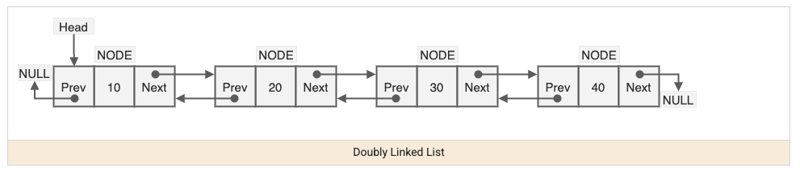

A linked list is a chain of nodes, each holding a value and a pointer to the next node — the opposite tradeoff from an array: no random access (`O(n)` to reach index `i`), but `O(1)` insertion/removal once you're already at the right node, since nothing needs to shift.



## 1. The Core Structure

```java
class ListNode {
    int val;
    ListNode next;
    ListNode(int val) { this.val = val; }
}
```

There's no built-in index — the only way to reach the 5th node is to walk from the head through four `next` pointers. This is exactly why linked lists are the wrong structure for "give me element 5,000" but the right structure for "insert/delete here, right now, without shifting anything else."

## 2. The Dummy Node Trick

A huge fraction of linked-list bugs come from special-casing "what if I need to modify the head itself." A dummy (sentinel) node placed before the real head sidesteps this entirely — every real node, including the first, is now "some node's next," so there's no special case.

```java
// Remove all nodes with a given value
ListNode removeElements(ListNode head, int val) {
    ListNode dummy = new ListNode(0);
    dummy.next = head;
    ListNode current = dummy;
    while (current.next != null) {
        if (current.next.val == val) {
            current.next = current.next.next; // skip over the node to remove
        } else {
            current = current.next;
        }
    }
    return dummy.next; // real head, whatever it ended up being
}
```

## 3. Fast/Slow Pointers: Finding the Middle and Detecting Cycles

Two pointers moving at different speeds through the same list solve two classic problems without needing to know the list's length in advance.

```java
// Find the middle node — fast moves twice as far as slow
ListNode middleNode(ListNode head) {
    ListNode slow = head, fast = head;
    while (fast != null && fast.next != null) {
        slow = slow.next;
        fast = fast.next.next;
    }
    return slow; // when fast reaches the end, slow is at the middle
}

// Detect a cycle — if fast ever catches up to slow, there's a loop
boolean hasCycle(ListNode head) {
    ListNode slow = head, fast = head;
    while (fast != null && fast.next != null) {
        slow = slow.next;
        fast = fast.next.next;
        if (slow == fast) return true;
    }
    return false;
}
```

If there's no cycle, `fast` reaches `null` and the loop ends normally. If there is a cycle, `fast` can never escape it, and because it closes the gap on `slow` by one extra step every iteration, it's mathematically guaranteed to eventually land on the exact same node as `slow`.

## 4. Reversing a Linked List

Reversal is the pattern most other linked-list manipulations build on (reverse a sublist, check palindrome, reorder a list) — it's done by walking forward once while re-pointing each node's `next` backward.

```java
ListNode reverse(ListNode head) {
    ListNode prev = null;
    ListNode current = head;
    while (current != null) {
        ListNode next = current.next; // save before overwriting
        current.next = prev;           // flip this node's pointer
        prev = current;
        current = next;
    }
    return prev; // new head — what used to be the last node
}
```

The one line that trips people up is saving `next` _before_ overwriting `current.next` — without that save, the rest of the original list becomes unreachable the moment you flip the pointer.

## 5. Merging Two Sorted Lists

A common building block for merge sort on linked lists and for combining sorted data streams — walk both lists simultaneously, always attaching the smaller current node.

```java
ListNode mergeTwoLists(ListNode l1, ListNode l2) {
    ListNode dummy = new ListNode(0);
    ListNode tail = dummy;
    while (l1 != null && l2 != null) {
        if (l1.val <= l2.val) { tail.next = l1; l1 = l1.next; }
        else { tail.next = l2; l2 = l2.next; }
        tail = tail.next;
    }
    tail.next = (l1 != null) ? l1 : l2; // attach whichever list has leftovers
    return dummy.next;
}
```

## 6. Recognizing When Linked-List Patterns Apply

| Signal in the problem                                       | Likely technique                                         |
| ----------------------------------------------------------- | -------------------------------------------------------- |
| "Find the middle" / "is there a cycle"                      | Fast/slow pointers                                       |
| "Reverse," "reverse between positions i and j"              | Iterative pointer-flipping                               |
| Modifying the head is a special case in your draft solution | Introduce a dummy node to eliminate the special case     |
| Merging or combining sorted lists                           | Two pointers, one per list, always advancing the smaller |

## 7. Best Practices

| Practice                                                                        | Recommendation                                                                                                |
| ------------------------------------------------------------------------------- | ------------------------------------------------------------------------------------------------------------- |
| Use a dummy node whenever the head might change                                 | Removes the need to special-case "what if we're modifying/removing the first node."                           |
| Save `node.next` before reassigning it during reversal                          | Overwriting a pointer before saving what it pointed to permanently loses the rest of the list.                |
| Use fast/slow pointers instead of counting the list's length first              | Avoids a separate `O(n)` pass just to learn the length before doing the real work.                            |
| Draw the pointers on paper (or in comments) before coding a multi-step reversal | Linked-list pointer bugs are notoriously easy to get subtly wrong without tracing through an example by hand. |
| Set the last node's `next` to `null` explicitly when required                   | Forgetting this after a reversal/splice operation silently leaves a dangling reference to the old structure.  |
