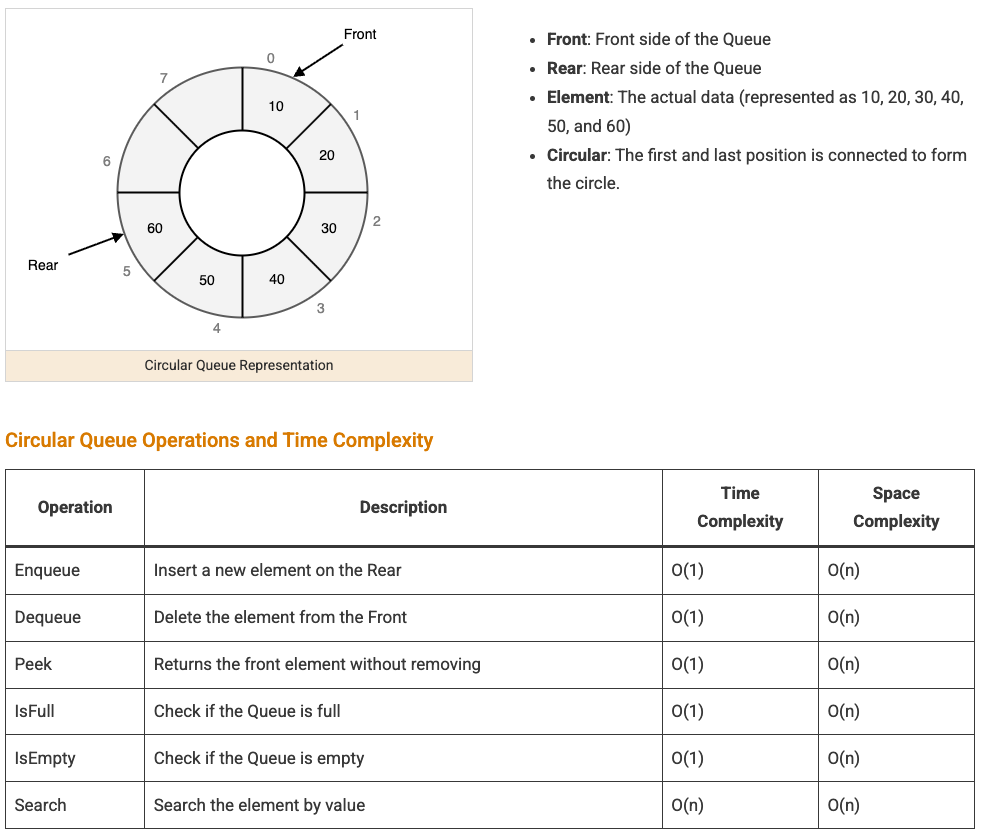

A circular queue reuses a fixed-size array by wrapping the front/back indices around with modulo arithmetic, instead of shifting elements or growing the array as things are added and removed. It's the FIFO structure of choice whenever the maximum size is known upfront and predictable, fixed memory usage matters more than flexibility.



## 1. The Problem With a Naive Array-Based Queue

A plain array-backed queue that always removes from index 0 has to shift every remaining element left by one on every removal — `O(n)` per dequeue, which defeats the point of a queue being cheap to operate on.

```java
// Naive removal — O(n), because everything after index 0 has to shift left
int poll(int[] data, int size) {
    int value = data[0];
    for (int i = 0; i < size - 1; i++) data[i] = data[i + 1]; // the expensive part
    return value;
}
```

A circular queue avoids this entirely by never physically moving existing elements — it just moves a "front" pointer forward and wraps it back to index 0 once it runs off the end of the array.

## 2. The Core Idea: Wrap Around With Modulo

Instead of always inserting at index 0 and removing by shifting, a circular queue tracks a `front` index and a `size`, and computes the next insertion point as `(front + size) % capacity` — once the back position reaches the end of the array, it simply wraps to the beginning.

```java
class CircularQueue {
    private final int[] data;
    private int front = 0, size = 0;

    CircularQueue(int capacity) { data = new int[capacity]; }

    boolean offer(int value) {
        if (size == data.length) return false; // full
        data[(front + size) % data.length] = value;
        size++;
        return true;
    }

    int poll() {
        int value = data[front];
        front = (front + 1) % data.length; // wrap around instead of shifting everything left
        size--;
        return value;
    }

    boolean isFull() { return size == data.length; }
    boolean isEmpty() { return size == 0; }
}
```

```
Capacity 5, after offering 1,2,3,4,5 then polling twice, then offering 6,7:

Index:     0   1   2   3   4
Value:     6   7   3   4   5
                ↑           ↑
              front      (front + size - 1) % capacity

The array never resizes and nothing shifts — "6" and "7" simply wrapped around to the front of the array.
```

## 3. Distinguishing Full From Empty

A subtle bug in a naive circular queue implementation: if you only track `front` and `back` indices (no separate `size` counter), a full queue and an empty queue can end up with `front == back` in both cases — indistinguishable without extra information.

```java
// This ambiguity is exactly why the CircularQueue above tracks `size` explicitly,
// rather than trying to infer full/empty purely from front and back index positions.
```

The two standard fixes: track an explicit `size` field (as above — the simplest and most common), or reserve one array slot permanently empty so `front == back` unambiguously means "empty" and "one slot away from that" means "full." Tracking `size` explicitly is simpler to reason about and is what most real implementations (including the JDK's `ArrayDeque`) effectively do internally.

## 4. Real-World Use: Ring Buffers

This exact structure, usually called a ring buffer in a systems context, is the standard tool for a fixed-size buffer that continuously overwrites its oldest data once full — a sliding log of the last N events, an audio/video streaming buffer, or a fixed-size history of recent metric samples.

```java
// A ring buffer that overwrites the oldest entry instead of rejecting new ones once full
class RingBuffer<T> {
    private final Object[] data;
    private int front = 0, size = 0;

    RingBuffer(int capacity) { data = new Object[capacity]; }

    void add(T value) {
        int insertAt = (front + size) % data.length;
        data[insertAt] = value;
        if (size < data.length) {
            size++;
        } else {
            front = (front + 1) % data.length; // buffer was full — the oldest entry is now overwritten
        }
    }
}
```

This "overwrite the oldest" variant is a deliberate design choice, not a bug — appropriate whenever the most recent N items matter more than never losing any item, which is the opposite tradeoff from a queue that should reject (or block on) an insert once full, covered in queue-blocking.

## 5. Recognizing When a Circular Queue Applies

| Signal in the problem                                                | Why a circular queue fits                                                                              |
| -------------------------------------------------------------------- | ------------------------------------------------------------------------------------------------------ |
| Fixed, known maximum size, FIFO order needed                         | Avoids both the shifting cost of a naive array queue and the allocation overhead of a linked structure |
| "Keep the last N events/samples," sliding history                    | The overwrite-oldest ring buffer variant is a natural fit                                              |
| Memory must be bounded and predictable (embedded, streaming buffers) | Fixed backing array, no dynamic resizing ever needed                                                   |

## 6. Best Practices

| Practice                                                                     | Recommendation                                                                                                                                                                                  |
| ---------------------------------------------------------------------------- | ----------------------------------------------------------------------------------------------------------------------------------------------------------------------------------------------- |
| Track size explicitly rather than inferring full/empty from front/back alone | Avoids the classic ambiguity where a full and an empty queue can otherwise look identical.                                                                                                      |
| Choose reject-when-full vs. overwrite-oldest deliberately                    | A task queue usually should reject or block when full; a metrics/event ring buffer usually should overwrite its oldest entry instead.                                                           |
| Use `(index + 1) % capacity` consistently for every pointer advance          | Mixing manual bounds-checking with modulo arithmetic in the same implementation is a common source of off-by-one bugs.                                                                          |
| Reach for `ArrayDeque` in ordinary Java code instead of hand-writing this    | The JDK's implementation already handles the wraparound and resizing correctly — hand-roll a circular queue mainly for fixed-capacity or ring-buffer-specific needs `ArrayDeque` doesn't cover. |
| Size the backing array to the actual maximum expected load, not a guess      | An undersized fixed capacity forces constant rejection/overwriting; an oversized one wastes memory that a dynamic structure wouldn't.                                                           |
