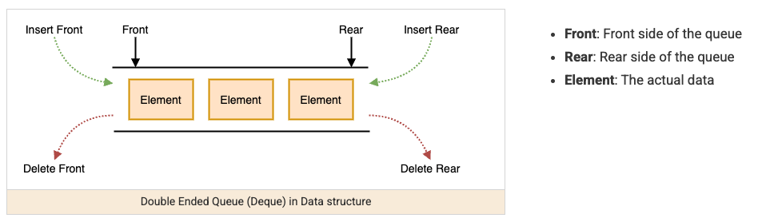

A deque (double-ended queue, pronounced "deck") supports insertion and removal at both ends in `O(1)` — it's the structure that generalizes stack and queue into one: use only the front for a queue's FIFO behavior, use only one end for a stack's LIFO behavior, or use both ends deliberately for the problems that actually need that flexibility.



## 1. The Core Idea: One Structure, Both Ends

Where a stack only ever touches one end and a queue adds at one end while removing from the other, a deque exposes all four operations explicitly — nothing forces you to pick a single discipline.

```java
Deque<Integer> deque = new ArrayDeque<>();

deque.addFirst(1);   // [1]
deque.addLast(2);     // [1, 2]
deque.addFirst(0);    // [0, 1, 2]

int front = deque.peekFirst(); // 0 — doesn't remove
int back = deque.peekLast();   // 2 — doesn't remove

deque.removeFirst(); // [1, 2]
deque.removeLast();  // [1]
```

`ArrayDeque` is the standard implementation — already the recommended class for both stack and queue usage elsewhere, because a deque is a strict superset of both. `LinkedList` also implements `Deque`, but `ArrayDeque` is faster in practice (no per-node allocation) and should be preferred unless a specific `LinkedList` capability is needed.

## 2. The Two Method Families: Exception-Throwing vs. Null/Boolean-Returning

`Deque`'s API has two parallel sets of methods for the same operations, differing only in how they signal failure — this mirrors the same blocking-vs-non-blocking distinction seen in `queue-blocking`, but here the choice is exception vs. sentinel value, not blocking vs. immediate return.

| Operation         | Throws on failure | Returns `null`/`false` on failure |
| ----------------- | ----------------- | --------------------------------- |
| Insert at front   | `addFirst(e)`     | `offerFirst(e)`                   |
| Insert at back    | `addLast(e)`      | `offerLast(e)`                    |
| Remove from front | `removeFirst()`   | `pollFirst()`                     |
| Remove from back  | `removeLast()`    | `pollLast()`                      |
| Peek at front     | `getFirst()`      | `peekFirst()`                     |
| Peek at back      | `getLast()`       | `peekLast()`                      |

```java
Deque<Integer> deque = new ArrayDeque<>();
deque.getFirst();   // throws NoSuchElementException on an empty deque
deque.peekFirst();  // returns null on an empty deque — safer when emptiness is expected, not exceptional
```

Prefer the `peek`/`poll`/`offer` family whenever an empty deque is a normal, expected condition to check for (e.g., "loop while there's still something to process") — reserve the exception-throwing family for situations where hitting an empty deque genuinely indicates a bug.

## 3. Using a Deque as Both a Stack and a Queue

The same instance, using only the methods relevant to the discipline you want, becomes either structure without needing a different class.

```java
// As a stack (LIFO) — only ever touch the front
Deque<Integer> stack = new ArrayDeque<>();
stack.push(1);   // equivalent to addFirst
stack.push(2);
stack.pop();     // 2 — equivalent to removeFirst

// As a queue (FIFO) — add at the back, remove from the front
Deque<Integer> queue = new ArrayDeque<>();
queue.offer(1);      // equivalent to addLast (offer/add mean "add at the back" on a plain Queue reference)
queue.offer(2);
queue.poll();        // 1 — equivalent to removeFirst
```

`push`/`pop` on a `Deque` operate on the _front_, matching a stack's usual mental model — this is why `ArrayDeque` implementing both `Queue` and `Deque` isn't a coincidence: the two are really the same underlying structure with different access disciplines applied to it.

## 4. When Both Ends Are Genuinely Needed

A deque earns its extra complexity over a plain stack or queue specifically when an algorithm needs to inspect or remove from _either_ end depending on runtime conditions — not just consistently one end.

```java
// Palindrome check — compares from both ends inward simultaneously
boolean isPalindrome(String s) {
    Deque<Character> deque = new ArrayDeque<>();
    for (char c : s.toCharArray()) deque.addLast(c);

    while (deque.size() > 1) {
        if (deque.removeFirst() != deque.removeLast()) return false; // compares front and back at once
    }
    return true;
}
```

The monotonic deque technique (covered in queue) is the sharpest example of genuinely needing both ends within one algorithm: elements are evicted from the _front_ when they age out of a sliding window, and evicted from the _back_ when a new, better candidate arrives — neither end alone would solve the problem.

## 5. Deque vs. Stack vs. Queue: Choosing the Right Abstraction

| Need                                                            | Reach for                                                                        |
| --------------------------------------------------------------- | -------------------------------------------------------------------------------- |
| Only ever add/remove from one end (LIFO)                        | Stack discipline — use a `Deque` but only call `push`/`pop`/`peek`               |
| Only ever add at the back, remove from the front (FIFO)         | Queue discipline — use a `Deque` but only call `offer`/`poll`/`peek`             |
| Need to add/remove from _either_ end depending on the algorithm | Full `Deque` usage — `addFirst`/`addLast`/`removeFirst`/`removeLast` all in play |
| Elements must come out ordered by priority, not by position     | Not a deque at all — see queue-priority                                          |

Even though `ArrayDeque` is almost always the concrete class underneath, naming a variable `stack` or `queue` when only one discipline is actually used communicates intent to a reader far better than exposing the full `Deque` interface for a use that never touches both ends.

## 6. Best Practices

| Practice                                                                           | Recommendation                                                                                                                                              |
| ---------------------------------------------------------------------------------- | ----------------------------------------------------------------------------------------------------------------------------------------------------------- |
| Use `ArrayDeque` over `LinkedList` for deque operations                            | Avoids per-node allocation overhead — faster in practice for the same double-ended behavior.                                                                |
| Choose the `peek`/`poll`/`offer` family when emptiness is an expected condition    | Avoids wrapping every operation in a try/catch for a case that isn't actually exceptional.                                                                  |
| Name the variable and restrict the API surface to match the actual discipline used | Calling it `stack` and only using `push`/`pop` (even though the concrete type is `Deque`) communicates intent better than exposing all four ends of access. |
| Reach for genuine double-ended access only when an algorithm truly needs both ends | Palindrome checks and the monotonic deque pattern are real cases — most problems only need one end, and forcing both is unnecessary complexity.             |
| Don't confuse a deque with a priority queue                                        | A deque orders strictly by position (front/back); anything ordered by comparator/priority is a different structure entirely — see queue-priority.           |
