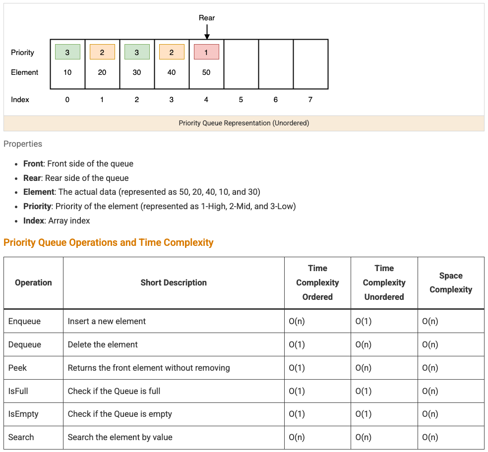
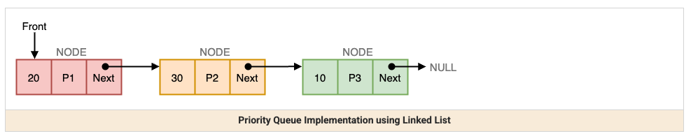
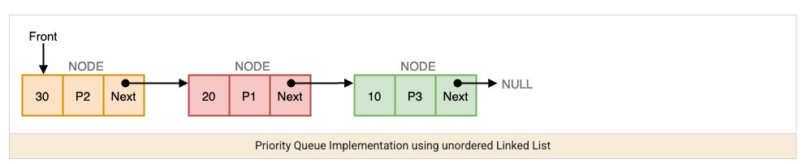

A priority queue is an abstract data type — a queue where elements come out in order of priority rather than arrival order — almost always implemented on top of a heap (already covered in heap), whose `O(1)` peek and `O(log n)` insert/remove are exactly what the ADT needs. This note covers the algorithmic patterns priority queues unlock: top-K selection, custom orderings, merging sorted sources, and a running median.







## 1. Top-K Problems: The Signature Use Case

Whenever a problem asks for "the K largest/smallest," a priority queue answers it in `O(n log k)` — much better than fully sorting everything (`O(n log n)`) when `k` is much smaller than `n`.

```java
// K largest elements — use a MIN-heap of size k (counterintuitive, but this is the trick)
int[] kLargest(int[] nums, int k) {
    PriorityQueue<Integer> minHeap = new PriorityQueue<>();
    for (int num : nums) {
        minHeap.offer(num);
        if (minHeap.size() > k) {
            minHeap.poll(); // evict the current smallest — it can't be in the top k anymore
        }
    }
    return minHeap.stream().mapToInt(Integer::intValue).toArray();
}
```

The trick that surprises people the first time: to find the K _largest_ elements, you use a _min_-heap capped at size K — the smallest element in that capped heap is always the weakest member of the current top-K, so evicting it whenever the heap overflows correctly keeps only the strongest K seen so far.

## 2. Custom Comparators for Complex Orderings

A priority queue doesn't have to order by a raw value — a custom comparator lets it order by any derived property, which is what makes it useful for problems like "closest points" or "highest frequency."

```java
// K closest points to the origin — order by squared distance, use a max-heap capped at size k
PriorityQueue<int[]> maxHeap = new PriorityQueue<>(
    (a, b) -> (b[0]*b[0] + b[1]*b[1]) - (a[0]*a[0] + a[1]*a[1]) // farther point sorts first (root)
);
for (int[] point : points) {
    maxHeap.offer(point);
    if (maxHeap.size() > k) maxHeap.poll(); // evict the farthest — same "cap and evict" pattern as top-K
}
```

## 3. Merging K Sorted Structures

A priority queue efficiently tracks "the smallest not-yet-taken element across K separate sorted sources" — put one candidate from each source in the queue, and every time you pop the smallest, push that source's next element in.

```java
// Merge K sorted linked lists into one sorted list
ListNode mergeKLists(ListNode[] lists) {
    PriorityQueue<ListNode> heap = new PriorityQueue<>((a, b) -> a.val - b.val);
    for (ListNode node : lists) if (node != null) heap.offer(node);

    ListNode dummy = new ListNode(0), tail = dummy;
    while (!heap.isEmpty()) {
        ListNode smallest = heap.poll();
        tail.next = smallest;
        tail = tail.next;
        if (smallest.next != null) heap.offer(smallest.next); // that source has a new candidate now
    }
    return dummy.next;
}
```

This runs in `O(n log k)` where `n` is the total number of nodes across all lists — each of the `n` nodes passes through the queue exactly once, and the queue never holds more than `k` elements at a time.

## 4. Two Heaps: Tracking a Running Median

A less obvious but powerful pattern: split incoming numbers across a max-heap (holding the smaller half) and a min-heap (holding the larger half), keeping them balanced so the median is always at one or both roots.

```java
class MedianFinder {
    private final PriorityQueue<Integer> smallerHalf = new PriorityQueue<>(Collections.reverseOrder());
    private final PriorityQueue<Integer> largerHalf = new PriorityQueue<>();

    void addNum(int num) {
        smallerHalf.offer(num);
        largerHalf.offer(smallerHalf.poll()); // always push the larger half's new floor across
        if (largerHalf.size() > smallerHalf.size()) {
            smallerHalf.offer(largerHalf.poll()); // rebalance if largerHalf grew too big
        }
    }

    double findMedian() {
        if (smallerHalf.size() > largerHalf.size()) return smallerHalf.peek();
        return (smallerHalf.peek() + largerHalf.peek()) / 2.0;
    }
}
```

## 5. Recognizing When a Priority Queue Applies

| Signal in the problem                                          | Why a priority queue fits                                        |
| -------------------------------------------------------------- | ---------------------------------------------------------------- |
| "Kth largest/smallest," "top K"                                | Cap a heap-backed queue at size K instead of fully sorting       |
| "Merge K sorted lists/streams"                                 | The queue tracks the current smallest across all sources at once |
| "Running median," "running max so far, with removals"          | Two-priority-queue structures maintain this incrementally        |
| Scheduling by priority (shortest job first, earliest deadline) | The queue's front is always "what to do next"                    |

## 6. Best Practices

| Practice                                                                             | Recommendation                                                                                                                  |
| ------------------------------------------------------------------------------------ | ------------------------------------------------------------------------------------------------------------------------------- |
| Use a min-heap capped at K for "K largest," not a max-heap of everything             | Counterintuitive but correct — keeps the queue small (`O(k)` space) instead of holding all `n` elements.                        |
| Reach for a priority queue only when you need repeated access to the current min/max | If you only need the min/max once, a single linear scan is simpler and just as fast.                                            |
| Use a custom comparator instead of transforming data to fit natural ordering         | Cleaner and avoids extra allocation compared to wrapping values just to make them sort correctly.                               |
| Recognize the two-heap median pattern as a distinct technique                        | It's not intuitive from first principles — worth recognizing by name when a "running median" question appears.                  |
| Don't confuse a priority queue with a plain FIFO queue                               | Priority queues reorder by comparator, not arrival order — see queue-blocking and queue-circular for the FIFO-ordered variants. |
