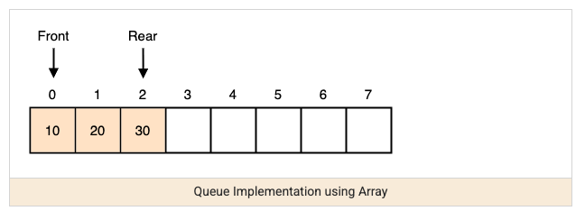
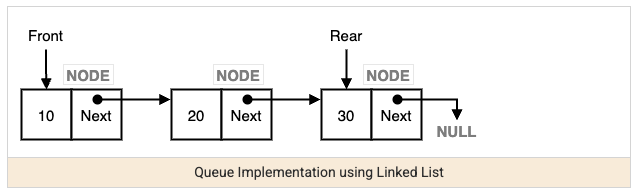

A queue is a first-in-first-out (FIFO) structure — the first element added is the first one removed, the opposite discipline from a stack. It's the natural structure for "process things in the order they arrived," and it's the specific piece that makes breadth-first traversal (already used in trees and graphs) actually breadth-first instead of depth-first.





## 1. The Core Idea

Think of a line at a checkout counter: whoever joined first gets served first. In Java, `Deque<T>` (via `ArrayDeque`) is the standard way to use a queue — the same class recommended for a stack, just used with the opposite pair of operations.

```java
Queue<Integer> queue = new ArrayDeque<>();
queue.offer(1); // add to the back
queue.offer(2);
queue.offer(3);
int front = queue.poll(); // 1 — the earliest-added element comes out first
```

`LinkedList` also implements `Queue` and is what most textbook examples use, but `ArrayDeque` is faster in practice (no per-node allocation) and should be preferred unless you specifically need `LinkedList`'s other capabilities.

## 2. Why BFS Needs a Queue Specifically

Breadth-first traversal's entire "level by level" behavior comes directly from FIFO ordering — nodes are explored in exactly the order they were discovered, so everything at the current depth is processed before anything at the next depth ever gets a turn.

```java
// BFS on a graph — the queue is what makes this breadth-first rather than depth-first
void bfs(int start, Map<Integer, List<Integer>> graph) {
    Queue<Integer> queue = new ArrayDeque<>();
    Set<Integer> visited = new HashSet<>();
    queue.offer(start);
    visited.add(start);
    while (!queue.isEmpty()) {
        int node = queue.poll(); // process in discovery order
        for (int neighbor : graph.getOrDefault(node, List.of())) {
            if (visited.add(neighbor)) { // returns true only if it wasn't already present
                queue.offer(neighbor);
            }
        }
    }
}
```

Swapping the `Queue` for a `Deque` used as a stack (LIFO) here would turn this same code into DFS instead — the traversal order is entirely a property of which end you add/remove from, not of anything else in the algorithm.

## 3. Monotonic Deque: Sliding Window Maximum

A `Deque` used as a double-ended queue (not a plain FIFO queue) enables a specific, powerful trick: maintaining the maximum (or minimum) of a sliding window in `O(1)` amortized per step, instead of rescanning the window every time it moves.

```java
// Maximum value in every sliding window of size k
int[] maxSlidingWindow(int[] nums, int k) {
    Deque<Integer> deque = new ArrayDeque<>(); // stores indices, values at those indices stay decreasing
    int[] result = new int[nums.length - k + 1];

    for (int i = 0; i < nums.length; i++) {
        while (!deque.isEmpty() && deque.peekFirst() <= i - k) {
            deque.pollFirst(); // this index fell out of the window — discard it
        }
        while (!deque.isEmpty() && nums[deque.peekLast()] < nums[i]) {
            deque.pollLast(); // this value can never be the max while nums[i] is still in the window — discard it
        }
        deque.offerLast(i);
        if (i >= k - 1) {
            result[i - k + 1] = nums[deque.peekFirst()]; // front of the deque is always the current window's max
        }
    }
    return result;
}
```

The reason this is efficient despite the nested-looking `while` loops: each index is pushed onto the deque exactly once and popped at most once across the entire run, so the total work is `O(n)` — this is the exact same amortized-cost argument already seen in the monotonic stack pattern, just applied at both ends of a deque instead of one end of a stack.

## 4. Recognizing When a Queue Applies

| Signal in the problem | Why a queue fits |
| --- | --- |
| "Process in the order received," level-by-level traversal | Plain FIFO — a `Queue` via `ArrayDeque` |
| BFS on a tree or graph | The queue is what guarantees breadth-first, not depth-first, order |
| Fixed-capacity buffer that must never resize or shift | See queue-circular for the wraparound-array technique |
| A dedicated thread should wait for work, or backpressure is needed | See queue-blocking for `put`/`take` vs. `offer`/`poll` |
| "Sliding window maximum/minimum" | Monotonic deque — `O(n)` instead of rescanning each window |

## 5. Best Practices

| Practice | Recommendation |
| --- | --- |
| Use `ArrayDeque` over `LinkedList` for queue operations | Avoids per-node allocation overhead — faster in practice for the same FIFO behavior. |
| Remember the traversal order is determined by which end you use, not the algorithm's other logic | A FIFO queue gives BFS; using the same structure as a LIFO stack instead silently turns it into DFS. |
| Recognize monotonic deque as the answer to "sliding window max/min" | It's not obvious from first principles — worth recognizing by name rather than re-deriving an `O(n*k)` brute-force scan. |
| Check `isEmpty()` before `poll()`/`peek()` when a queue might legitimately run dry | Polling an empty `Queue` returns `null` rather than throwing — a silent `null` propagating downstream is a common source of subtle bugs. |
| Reach for queue-circular or queue-blocking for their specific concerns | Fixed-capacity wraparound and thread-blocking semantics are distinct enough from plain FIFO traversal use to warrant their own dedicated notes. |
