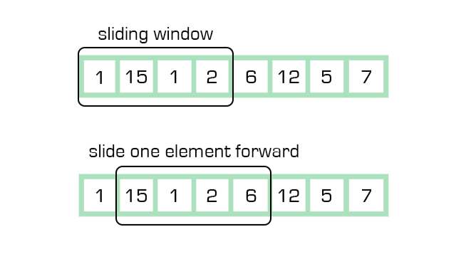

Sliding window is the pattern for problems about a contiguous subarray or substring — "longest," "shortest," "contains exactly/at most X" — solved by growing and shrinking a window's boundaries instead of checking every possible subarray with a nested loop.



## 1. The Core Idea

Instead of recomputing a property from scratch for every possible subarray (`O(n²)` or worse), maintain a running window `[left, right]` and incrementally update its property as the window grows or shrinks — each element is added and removed from the window's tracked state at most once.

```java
// Longest substring without repeating characters
int longestUniqueSubstring(String s) {
    Set<Character> window = new HashSet<>();
    int left = 0, maxLen = 0;
    for (int right = 0; right < s.length(); right++) {
        char c = s.charAt(right);
        while (window.contains(c)) {
            window.remove(s.charAt(left)); // shrink from the left until c is no longer a duplicate
            left++;
        }
        window.add(c);
        maxLen = Math.max(maxLen, right - left + 1);
    }
    return maxLen;
}
```

The right pointer only ever moves forward, and the left pointer only ever moves forward too — neither ever goes backward, which is exactly why the total work is `O(n)` and not `O(n²)`, even though there's a `while` loop inside a `for` loop.

## 2. Fixed-Size Window

The simpler variant: the window's size is a known constant, so it just slides forward one step at a time, adding one new element and removing one old element per step.

```java
// Maximum sum of any contiguous subarray of size k
int maxSumFixedWindow(int[] arr, int k) {
    int windowSum = 0;
    for (int i = 0; i < k; i++) windowSum += arr[i]; // build the first window

    int maxSum = windowSum;
    for (int right = k; right < arr.length; right++) {
        windowSum += arr[right] - arr[right - k]; // add new element, remove the one falling out
        maxSum = Math.max(maxSum, windowSum);
    }
    return maxSum;
}
```

## 3. Variable-Size Window: Grow, Then Shrink

The more common variant: the window grows by moving `right` until some condition breaks, then shrinks by moving `left` until the condition is satisfied again — this is the general template most sliding-window problems follow.

```java
// Smallest subarray with a sum >= target
int minSubarrayLength(int[] arr, int target) {
    int left = 0, sum = 0, minLen = Integer.MAX_VALUE;
    for (int right = 0; right < arr.length; right++) {
        sum += arr[right]; // grow the window
        while (sum >= target) { // shrink while the condition still holds, looking for a smaller valid window
            minLen = Math.min(minLen, right - left + 1);
            sum -= arr[left];
            left++;
        }
    }
    return minLen == Integer.MAX_VALUE ? 0 : minLen;
}
```

## 4. Tracking Window State with a Frequency Map

When the window's "condition" is about character/element counts rather than a single sum, a hash map tracks the window's contents, and the same grow/shrink template applies.

```java
// Smallest substring of s containing all characters of t
String minWindowSubstring(String s, String t) {
    Map<Character, Integer> need = new HashMap<>();
    for (char c : t.toCharArray()) need.merge(c, 1, Integer::sum);

    Map<Character, Integer> window = new HashMap<>();
    int left = 0, matched = 0, bestLen = Integer.MAX_VALUE, bestStart = 0;

    for (int right = 0; right < s.length(); right++) {
        char c = s.charAt(right);
        window.merge(c, 1, Integer::sum);
        if (need.containsKey(c) && window.get(c).intValue() == need.get(c).intValue()) matched++;

        while (matched == need.size()) { // window currently satisfies the condition — try to shrink
            if (right - left + 1 < bestLen) {
                bestLen = right - left + 1;
                bestStart = left;
            }
            char leftChar = s.charAt(left);
            window.put(leftChar, window.get(leftChar) - 1);
            if (need.containsKey(leftChar) && window.get(leftChar) < need.get(leftChar)) matched--;
            left++;
        }
    }
    return bestLen == Integer.MAX_VALUE ? "" : s.substring(bestStart, bestStart + bestLen);
}
```

## 5. Recognizing When Sliding Window Applies

| Signal in the problem                                                       | Why sliding window fits                                            |
| --------------------------------------------------------------------------- | ------------------------------------------------------------------ |
| "Longest/shortest/smallest contiguous substring or subarray"                | The window naturally represents the current candidate answer       |
| "Contains exactly/at most/at least K of something"                          | The window's condition is a count check that updates incrementally |
| A fixed window size is given ("subarray of size k")                         | The simpler fixed-window variant applies directly                  |
| Brute force would be checking every substring/subarray (`O(n²)` or `O(n³)`) | Sliding window almost always drops this to `O(n)`                  |

## 6. Best Practices

| Practice                                                                             | Recommendation                                                                                                                        |
| ------------------------------------------------------------------------------------ | ------------------------------------------------------------------------------------------------------------------------------------- |
| Update window state incrementally, never recompute from scratch                      | Recomputing a sum/count for every window position defeats the entire point of sliding window's `O(n)` guarantee.                      |
| Trust that left/right pointers only move forward                                     | Even with a `while` nested in a `for`, total movement across the whole run is bounded by `2n`, keeping it `O(n)`.                     |
| Use a frequency map when the window's condition is about counts, not a single number | Sum-based conditions need one running total; count-based conditions need a map tracking each element's count in the window.           |
| Grow first, then shrink, as the default template                                     | Growing until a condition breaks (or is met), then shrinking to find the tightest valid window, covers most variable-window problems. |
| Watch the "matched" bookkeeping carefully in multi-character-target problems         | Off-by-one errors in incrementing/decrementing a match counter are the most common bug in the frequency-map variant.                  |
