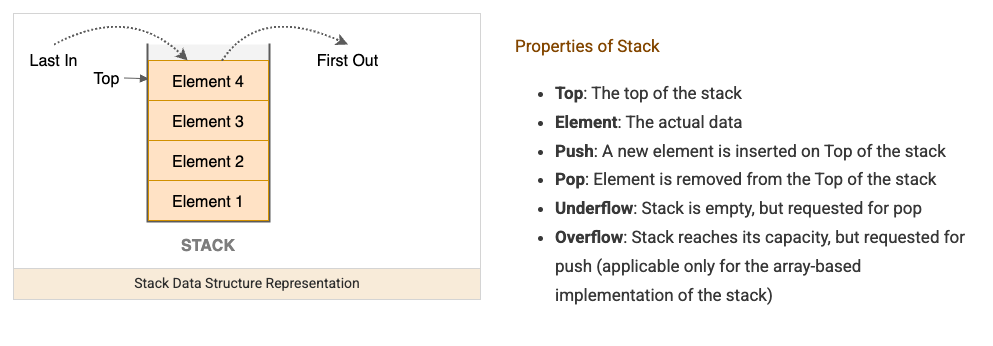

A stack is a last-in-first-out (LIFO) structure — the last element pushed is the first one popped. It's the pattern for any problem involving matching pairs, undoing the most recent thing, or tracking "what's the nearest unresolved item behind me."



## 1. The Core Idea

Think of a stack of plates: you can only add to (push) or remove from (pop) the top. In Java, `Deque<T>` (via `ArrayDeque`) is the standard way to use a stack — avoid the legacy `Stack` class, which is synchronized and slower for no benefit in single-threaded code.

```java
Deque<Integer> stack = new ArrayDeque<>();
stack.push(1);
stack.push(2);
stack.push(3);
int top = stack.pop(); // 3 — most recently added comes out first
```

## 2. Matching Pairs: Valid Parentheses

The single most common stack problem: whenever you see an "opening" symbol, push it; whenever you see a "closing" symbol, it must match whatever's currently on top of the stack.

```java
boolean isValidParentheses(String s) {
    Deque<Character> stack = new ArrayDeque<>();
    Map<Character, Character> pairs = Map.of(')', '(', ']', '[', '}', '{');
    for (char c : s.toCharArray()) {
        if (pairs.containsValue(c)) {
            stack.push(c); // opening bracket
        } else if (pairs.containsKey(c)) {
            if (stack.isEmpty() || stack.pop() != pairs.get(c)) return false; // mismatch
        }
    }
    return stack.isEmpty(); // everything got matched and closed
}
```

The intuition: a stack naturally tracks "what's still open, most-recent first" — exactly the property needed to validate nested structures like brackets, HTML tags, or nested function calls.

## 3. Monotonic Stack: Finding the "Next Greater" Element

A monotonic stack keeps its elements in increasing (or decreasing) order at all times, popping off anything that violates that order as new elements arrive — this solves "for each element, what's the next one bigger than it" in one pass instead of `O(n²)`.

```java
// For each element, how many steps until a warmer temperature?
int[] dailyTemperatures(int[] temps) {
    int[] result = new int[temps.length];
    Deque<Integer> stack = new ArrayDeque<>(); // stores indices, temps at those indices stay decreasing
    for (int i = 0; i < temps.length; i++) {
        while (!stack.isEmpty() && temps[stack.peek()] < temps[i]) {
            int prevIndex = stack.pop();
            result[prevIndex] = i - prevIndex; // found the next warmer day
        }
        stack.push(i);
    }
    return result;
}
```

Each index gets pushed once and popped at most once, so despite the nested-looking `while` inside a `for`, the total work across the whole run is `O(n)`, not `O(n²)` — this is the key insight that makes monotonic stack solutions efficient.

## 4. Using a Stack to Simulate Undo/Backtrack

A stack naturally models "go back to the previous state" — useful for problems like evaluating expressions or simplifying paths, where you need to undo the most recent operation.

```java
// Simplify a Unix-style path: "/a/./b/../../c/" -> "/c"
String simplifyPath(String path) {
    Deque<String> stack = new ArrayDeque<>();
    for (String part : path.split("/")) {
        if (part.isEmpty() || part.equals(".")) continue;
        if (part.equals("..")) {
            if (!stack.isEmpty()) stack.pop(); // go back up one directory
        } else {
            stack.push(part);
        }
    }
    return "/" + String.join("/", stack.stream().collect(Collectors.toList()));
}
```

## 5. Recognizing When a Stack Applies

| Signal in the problem                           | Why a stack fits                                              |
| ----------------------------------------------- | ------------------------------------------------------------- |
| Matching/nesting (brackets, tags, nested calls) | Stack naturally tracks "what's still open, most recent first" |
| "Next greater/smaller element"                  | Monotonic stack solves this in one `O(n)` pass                |
| Undo, backtrack, simplify a path/expression     | Popping the most recent operation is exactly LIFO behavior    |
| Depth-first traversal without recursion         | An explicit stack can replace recursive call-stack behavior   |

## 6. Best Practices

| Practice                                                                           | Recommendation                                                                                                                                 |
| ---------------------------------------------------------------------------------- | ---------------------------------------------------------------------------------------------------------------------------------------------- |
| Use `Deque<T>` (`ArrayDeque`) instead of the legacy `Stack` class                  | `Stack` is synchronized for thread safety nobody needs in a typical solution, and it's slower for no benefit.                                  |
| Recognize monotonic stack for "next greater/smaller" problems                      | Looks like nested loops but amortizes to `O(n)` since each element is pushed and popped at most once.                                          |
| Always check `stack.isEmpty()` before popping                                      | Popping an empty stack (or checking a mismatch against nothing) is the most common bug in bracket-matching code.                               |
| Use a stack to replace recursion when recursion depth risks a `StackOverflowError` | An explicit stack gives you the same LIFO traversal order with control over memory instead of relying on the call stack.                       |
| Match the stack's job to the problem's "undo" structure                            | If the problem describes going back to a previous state, a stack is very likely the right structure before reaching for anything more complex. |
