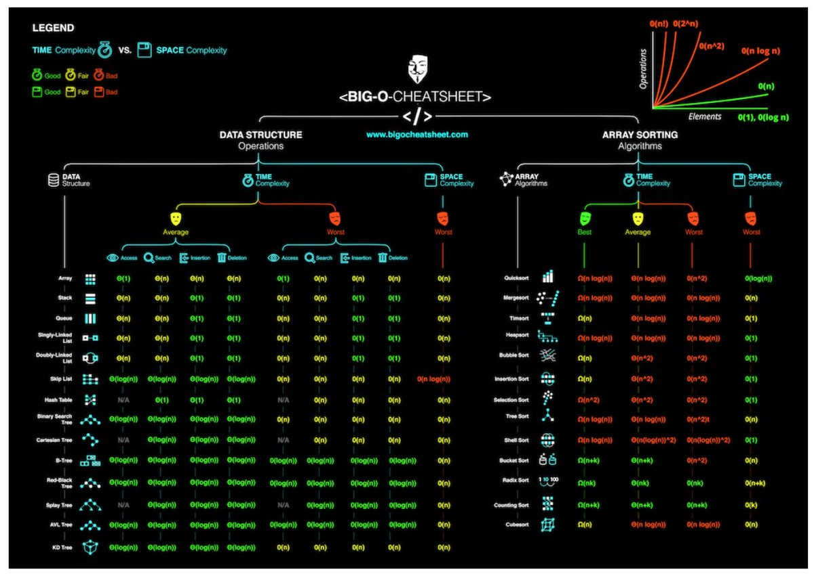

Time and space complexity describe how an algorithm's running time and memory usage grow as its input size grows — not a literal stopwatch/profiler measurement (which depends on hardware, JVM warmup, JIT compilation), but a hardware-independent way to compare how two algorithms scale as `n` gets large. It's the single most useful lens for predicting whether code that works fine on a test dataset will fall over in production once real data volume shows up.

## 1. Big O Notation — Describing the Growth, Not the Exact Count

Big O describes the _upper bound_ on an algorithm's growth rate as input size `n` approaches infinity, deliberately dropping constants and lower-order terms because they stop mattering at scale.

```java
// This algorithm does exactly 3n + 5 operations — but we call it O(n), not O(3n + 5)
public int sumWithOverhead(int[] arr) {
    int sum = 0;              // 1 operation
    int a = 1, b = 2;          // 2 operations
    for (int x : arr) {        // n iterations
        sum += x;               // 1 operation per iteration
    }
    return sum;
}
```

The constants (`3n + 5`) matter for real-world performance tuning, but Big O answers a different question: "if I double the input size, does my running time stay the same, double, quadruple, or explode?" That question is what determines whether an algorithm is even viable once `n` grows from a thousand to a hundred million — no constant-factor optimization saves an `O(n²)` algorithm from an `O(n log n)` one at real scale.

## 2. Common Complexity Classes, Fastest to Slowest

| Notation     | Name        | Example                                                     |
| ------------ | ----------- | ----------------------------------------------------------- |
| `O(1)`       | Constant    | Array index access, `HashMap.get()`                         |
| `O(log n)`   | Logarithmic | Binary search, balanced tree lookup                         |
| `O(n)`       | Linear      | A single loop over the input, linear search                 |
| `O(n log n)` | Log-linear  | Efficient sorting (merge sort, quicksort average case)      |
| `O(n²)`      | Quadratic   | Nested loops over the same input, bubble sort               |
| `O(2^n)`     | Exponential | Naive recursive Fibonacci, brute-force subset generation    |
| `O(n!)`      | Factorial   | Brute-force traveling salesman, generating all permutations |

```java
// O(1) — HashMap lookup, independent of map size
Map<String, Integer> cache = new HashMap<>();
int value = cache.get("key");

// O(log n) — binary search halves the search space every step
int binarySearch(int[] sorted, int target) {
    int lo = 0, hi = sorted.length - 1;
    while (lo <= hi) {
        int mid = (lo + hi) / 2;
        if (sorted[mid] == target) return mid;
        if (sorted[mid] < target) lo = mid + 1; else hi = mid - 1;
    }
    return -1;
}

// O(n²) — nested loop over the same array, classic accidental complexity trap
boolean hasDuplicate(int[] arr) {
    for (int i = 0; i < arr.length; i++)
        for (int j = i + 1; j < arr.length; j++)
            if (arr[i] == arr[j]) return true; // this same check is O(n) with a HashSet instead
    return false;
}
```

At `n = 1,000,000`: `O(log n)` is ~20 operations, `O(n)` is a million, `O(n log n)` is ~20 million, and `O(n²)` is a trillion — the gap between these classes isn't a minor tuning difference, it's the difference between milliseconds and an algorithm that will never finish within a request timeout.

## 3. Best, Average, and Worst Case

The same algorithm can have different complexities depending on the input's shape — Big O by itself doesn't say which case you're looking at unless it's specified.

| Algorithm                     | Best case             | Average case | Worst case                                            |
| ----------------------------- | --------------------- | ------------ | ----------------------------------------------------- |
| Quicksort                     | `O(n log n)`          | `O(n log n)` | `O(n²)` (already-sorted or adversarial pivot choice)  |
| HashMap get/put               | `O(1)`                | `O(1)`       | `O(n)` (all keys collide into one bucket)             |
| Binary search tree operations | `O(log n)` (balanced) | `O(log n)`   | `O(n)` (degenerates into a linked list if unbalanced) |

This is precisely why a self-balancing tree (red-black tree, backing Java's `TreeMap`) or a well-distributed hash function matter in practice — they're what prevents the worst case from being the case that actually happens, and it's why choosing the right data structure is inseparable from reasoning about complexity: a `HashMap`'s advertised `O(1)` is a property of a good hash function, not a magic guarantee.

## 4. Big O, Big Omega, and Big Theta



Big O specifically describes an _upper bound_ — "this algorithm is no worse than X." Two related but less commonly used notations complete the picture:

| Notation      | Describes                                                                       |
| ------------- | ------------------------------------------------------------------------------- |
| O (Big O)     | Upper bound — the algorithm never does worse than this                          |
| Ω (Big Omega) | Lower bound — the algorithm never does better than this                         |
| Θ (Big Theta) | Tight bound — the algorithm's growth rate is exactly this, both upper and lower |

In casual engineering conversation, "Big O" is often used loosely to mean "the actual growth rate" (which is technically Θ), and that loose usage is fine in practice — the important habit is knowing whether the number you're quoting describes a guarantee (worst case) or a typical case, since those can differ enormously (quicksort's `O(n log n)` is really its average case, not its worst).

## 5. Analyzing Recursive Algorithms

A loop's complexity is usually visible by inspection; a recursive algorithm's complexity requires accounting for both the depth of recursion and the work done at each level.

```java
// Naive recursive Fibonacci — O(2^n): each call spawns two more calls, depth n
int fib(int n) {
    if (n <= 1) return n;
    return fib(n - 1) + fib(n - 2); // exponential blowup — fib(5) alone re-computes fib(3) twice, fib(2) three times
}

// Memoized version — O(n): each subproblem computed exactly once, cached
int fibMemo(int n, Map<Integer, Integer> cache) {
    if (n <= 1) return n;
    if (cache.containsKey(n)) return cache.get(n);
    int result = fibMemo(n - 1, cache) + fibMemo(n - 2, cache);
    cache.put(n, result);
    return result;
}
```

The naive version's exponential blowup comes entirely from redundant work — recomputing the same subproblem repeatedly instead of reusing a previous result. Recognizing "am I solving the same subproblem more than once" is the trigger for memoization/dynamic programming, and it's usually the single biggest complexity win available in a recursive algorithm, bigger than any micro-optimization of the base logic.

## 6. Space Complexity — The Other Half of the Tradeoff

Space complexity describes how much additional memory an algorithm uses as `n` grows, and it's frequently in direct tension with time complexity — improving one often costs the other.

```java
// O(n) time, O(1) extra space — in-place, but destructive to the input
void reverseInPlace(int[] arr) {
    for (int i = 0, j = arr.length - 1; i < j; i++, j--) {
        int tmp = arr[i]; arr[i] = arr[j]; arr[j] = tmp;
    }
}

// O(n) time, O(n) extra space — non-destructive, costs a full copy
int[] reverseCopy(int[] arr) {
    int[] result = new int[arr.length];
    for (int i = 0; i < arr.length; i++) result[arr.length - 1 - i] = arr[i];
    return result;
}
```

The memoized Fibonacci above is the classic version of this tradeoff made explicit: it turns `O(2^n)` time into `O(n)` time by spending `O(n)` space on a cache — a textbook time-space tradeoff, and the right call almost always, since exponential time is rarely acceptable while linear extra memory usually is. Recursion itself also has a hidden space cost worth remembering: each recursive call adds a frame to the call stack, so a naive recursive algorithm with depth `n` carries `O(n)` space on the stack alone, even if it allocates nothing else — which is why a very deep recursion (unbounded by input validation) risks a `StackOverflowError` regardless of how little each individual frame does.

## 7. Best Practices

| Practice                                                            | Recommendation                                                                                                                                             |
| ------------------------------------------------------------------- | ---------------------------------------------------------------------------------------------------------------------------------------------------------- |
| Reason about growth rate, not just a benchmark on today's dataset   | An `O(n²)` algorithm that's "fast enough" on a 1,000-row test dataset can become the production incident once real data hits a million rows.               |
| Watch for nested iteration over the same collection                 | The most common accidental `O(n²)` — often fixable by trading it for `O(n)` with a `HashSet`/`HashMap` lookup instead of a nested loop.                    |
| Know which case (best/average/worst) a claimed complexity refers to | Quicksort's `O(n log n)` is an average case; its `O(n²)` worst case is real and can be adversarially triggered on already-sorted input.                    |
| Recognize repeated subproblem computation as a memoization signal   | Recomputing the same recursive call multiple times is usually the largest available complexity win, larger than any other micro-optimization.              |
| Treat space complexity as a real cost, not an afterthought          | A time-for-space tradeoff is often the right call, but only if that extra memory is actually available at the scale you're running at.                     |
| Account for call-stack depth in recursive algorithms                | Deep, unbounded recursion carries `O(n)` space on the stack alone and risks a `StackOverflowError` independent of any other memory the algorithm uses.     |
| Use Big O to compare algorithms, not to predict exact runtime       | It tells you which of two approaches scales better as `n` grows — for an actual runtime number, you still need to measure on real hardware with real data. |
