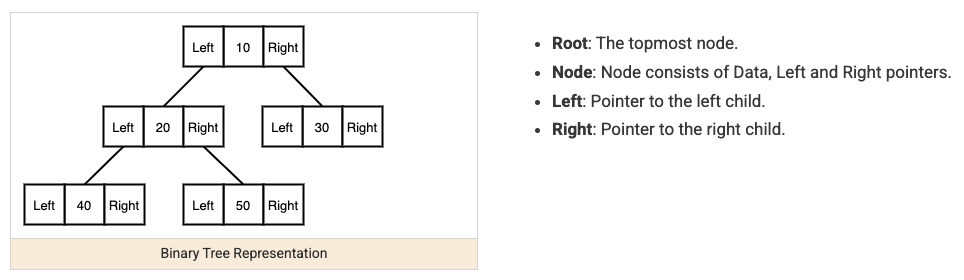

A tree is a hierarchical structure of nodes where each node points to its children, with exactly one path from the root to any other node. Nearly every tree problem is solved by recursion, because a tree is naturally recursive: a tree's subtree is itself a smaller tree, and most tree questions decompose into "answer this for the left subtree, answer it for the right subtree, then combine."



## 1. The Core Structure

```java
class TreeNode {
    int val;
    TreeNode left, right;
    TreeNode(int val) { this.val = val; }
}
```

## 2. Depth-First Traversal — The Default Tool

Depth-first traversal (DFS) explores as far down one branch as possible before backing up — implemented recursively, it mirrors the tree's own recursive shape almost exactly.

```java
// Maximum depth of a tree
int maxDepth(TreeNode root) {
    if (root == null) return 0; // base case: an empty tree has depth 0
    return 1 + Math.max(maxDepth(root.left), maxDepth(root.right));
}
```

The three traversal orders (preorder, inorder, postorder) differ only in _when_ you visit the current node relative to its children — this small difference matters a lot for specific problems (inorder visits a binary search tree's nodes in sorted order; postorder is needed whenever a node's answer depends on its children's answers being fully computed first).

```java
void preorder(TreeNode node, List<Integer> result) {
    if (node == null) return;
    result.add(node.val);       // visit current node first
    preorder(node.left, result);
    preorder(node.right, result);
}

void inorder(TreeNode node, List<Integer> result) {
    if (node == null) return;
    inorder(node.left, result);
    result.add(node.val);       // visit current node between children
    inorder(node.right, result);
}

void postorder(TreeNode node, List<Integer> result) {
    if (node == null) return;
    postorder(node.left, result);
    postorder(node.right, result);
    result.add(node.val);       // visit current node last
}
```

## 3. Breadth-First Traversal — Level by Level

Breadth-first traversal (BFS) visits all nodes at depth 1 before any at depth 2, and so on — implemented with a queue rather than recursion, since it needs to track "everything currently at this level" rather than diving down one path at a time.

```java
// Level-order traversal: return each level as its own list
List<List<Integer>> levelOrder(TreeNode root) {
    List<List<Integer>> result = new ArrayList<>();
    if (root == null) return result;
    Queue<TreeNode> queue = new LinkedList<>();
    queue.offer(root);
    while (!queue.isEmpty()) {
        int levelSize = queue.size(); // exactly the nodes at this level, captured before adding the next level
        List<Integer> level = new ArrayList<>();
        for (int i = 0; i < levelSize; i++) {
            TreeNode node = queue.poll();
            level.add(node.val);
            if (node.left != null) queue.offer(node.left);
            if (node.right != null) queue.offer(node.right);
        }
        result.add(level);
    }
    return result;
}
```

Capturing `levelSize` before the inner loop starts is the key trick — it's what separates "this level's nodes" from "the next level's nodes" that get added to the same queue during the loop.

## 4. Binary Search Trees: A Structural Guarantee You Can Exploit

In a binary search tree (BST), every node's left subtree contains only smaller values and its right subtree only larger ones — this lets you discard half the tree at each step, the same idea as binary search on an array.

```java
TreeNode searchBST(TreeNode root, int target) {
    if (root == null || root.val == target) return root;
    return target < root.val ? searchBST(root.left, target) : searchBST(root.right, target);
}
```

This is why BST operations are `O(log n)` on a balanced tree — but `O(n)` if the tree happens to be unbalanced (e.g., built by inserting already-sorted data, degenerating into a linked list). Self-balancing variants (red-black trees, backing Java's `TreeMap`/`TreeSet`) exist specifically to guarantee the balanced case always holds.

## 5. Bottom-Up Answers: Postorder in Disguise

Many "harder" tree problems are really postorder traversal where each node combines its children's already-computed answers — recognizing this shape turns an intimidating problem into the same simple recursive template.

```java
// Is this tree balanced (heights of left/right subtrees never differ by more than 1, anywhere)?
boolean isBalanced(TreeNode root) {
    return height(root) != -1;
}

int height(TreeNode node) {
    if (node == null) return 0;
    int left = height(node.left);
    if (left == -1) return -1; // already found an imbalance below — propagate it up immediately
    int right = height(node.right);
    if (right == -1) return -1;
    if (Math.abs(left - right) > 1) return -1; // -1 is an overloaded "not balanced" signal
    return 1 + Math.max(left, right);
}
```

Using a single return value to carry two pieces of information (the height, and a "still balanced" flag encoded as -1) is a common technique for avoiding two separate recursive passes over the tree.

## 6. Recognizing When Each Traversal Applies

| Signal in the problem                                                | Likely technique                                            |
| -------------------------------------------------------------------- | ----------------------------------------------------------- |
| "Level by level," "minimum depth," "connect nodes at the same level" | BFS with a queue                                            |
| A node's answer depends on its children's answers                    | Postorder DFS (compute children first, then combine)        |
| BST-specific ("kth smallest," "closest value," validate BST)         | Exploit sorted-order structure, often via inorder traversal |
| Simple "visit every node" with no dependency between them            | Any DFS order works, pick whichever is simplest to write    |

## 7. Best Practices

| Practice                                                                               | Recommendation                                                                                                                               |
| -------------------------------------------------------------------------------------- | -------------------------------------------------------------------------------------------------------------------------------------------- |
| Always handle the `null` base case first                                               | A tree recursion without a `null` check is the most common source of a `NullPointerException` in tree problems.                              |
| Match the traversal order to what the problem actually needs                           | Postorder for "children's answers feed the parent's," BFS for "level by level," inorder for BST sorted-order questions.                      |
| Exploit BST ordering instead of treating it as a generic binary tree                   | Skipping this turns an `O(log n)` search into an unnecessary `O(n)` full traversal.                                                          |
| Use an explicit queue for BFS, not recursion                                           | Recursion naturally expresses depth-first order; forcing it to do breadth-first is awkward and usually more complex than just using a queue. |
| Consider encoding two pieces of information in one return value for bottom-up problems | Avoids two separate tree traversals when one combined pass (like the balanced-tree height/flag example) is sufficient.                       |
