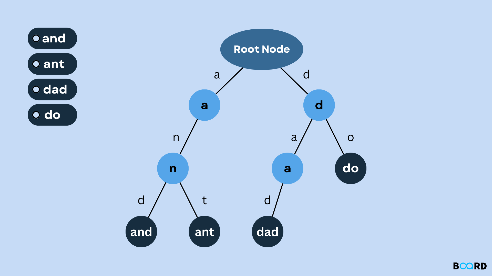

A trie (prefix tree) is a tree specialized for storing strings, where each path from the root spells out a prefix, and nodes are shared between words that start with the same characters. It's the go-to structure whenever a problem is really about prefixes — autocomplete, spell-check, "does any word start with this."



## 1. The Core Idea

Each node represents one character position, has up to 26 (or however many) children — one per possible next character — and a flag marking "a real word ends here." Words that share a prefix literally share the same nodes, so common prefixes are stored only once no matter how many words use them.

```java
class TrieNode {
    Map<Character, TrieNode> children = new HashMap<>();
    boolean isEndOfWord = false;
}
```

```
Inserting "cat" and "car" builds:

root -> c -> a -> t (isEndOfWord)
             \-> r (isEndOfWord)

"ca" is stored once, shared by both words — this sharing is the entire point of the structure.
```

## 2. Insert, Search, and StartsWith

The three core operations all walk the tree one character at a time, following (or creating) a child node for each character.

```java
class Trie {
    private final TrieNode root = new TrieNode();

    void insert(String word) {
        TrieNode node = root;
        for (char c : word.toCharArray()) {
            node = node.children.computeIfAbsent(c, k -> new TrieNode());
        }
        node.isEndOfWord = true;
    }

    boolean search(String word) {
        TrieNode node = findNode(word);
        return node != null && node.isEndOfWord; // must be a complete word, not just a prefix
    }

    boolean startsWith(String prefix) {
        return findNode(prefix) != null; // just needs the path to exist
    }

    private TrieNode findNode(String s) {
        TrieNode node = root;
        for (char c : s.toCharArray()) {
            node = node.children.get(c);
            if (node == null) return null; // path doesn't exist — can't possibly match
        }
        return node;
    }
}
```

`search` and `startsWith` share almost identical logic — the only difference is `search` also requires `isEndOfWord`, since a valid prefix that happens to not be a complete inserted word (e.g. "ca" when only "cat" was inserted) should fail `search` but pass `startsWith`.

## 3. Why a Trie Beats a HashSet for Prefix Questions

A `HashSet<String>` answers "is this exact string present" in `O(1)`, but answering "does any word start with this prefix" would require scanning every word in the set — `O(n * k)` where `n` is word count and `k` is average length. A trie answers the same prefix question in `O(k)` — just the length of the prefix itself, completely independent of how many words are stored.

```java
// Autocomplete: find all stored words starting with a given prefix
List<String> autocomplete(Trie trie, TrieNode root, String prefix) {
    TrieNode node = findNodeOrNull(root, prefix);
    List<String> results = new ArrayList<>();
    if (node != null) collectWords(node, prefix, results);
    return results;
}

void collectWords(TrieNode node, String currentWord, List<String> results) {
    if (node.isEndOfWord) results.add(currentWord);
    for (Map.Entry<Character, TrieNode> entry : node.children.entrySet()) {
        collectWords(entry.getValue(), currentWord + entry.getKey(), results);
    }
}
```

## 4. Word Search / Wildcard Matching

A trie also enables efficient wildcard search — when a character can be "anything," explore every child instead of following one specific path.

```java
// Search supporting '.' as a wildcard matching any single character
boolean searchWithWildcard(TrieNode node, String word, int index) {
    if (index == word.length()) return node.isEndOfWord;
    char c = word.charAt(index);
    if (c == '.') {
        for (TrieNode child : node.children.values()) {
            if (searchWithWildcard(child, word, index + 1)) return true; // try every possible character here
        }
        return false;
    }
    TrieNode next = node.children.get(c);
    return next != null && searchWithWildcard(next, word, index + 1);
}
```

## 5. Recognizing When a Trie Applies

| Signal in the problem                                     | Why a trie fits                                                                                      |
| --------------------------------------------------------- | ---------------------------------------------------------------------------------------------------- |
| "Autocomplete," "all words with prefix X"                 | A trie answers prefix questions in `O(k)`, independent of dictionary size                            |
| Repeated prefix lookups against a fixed, large dictionary | Shared prefix storage pays off across many queries                                                   |
| Wildcard or pattern matching against a word list          | Branching over all children at a wildcard position is natural in a trie's structure                  |
| Word search on a grid, combined with a dictionary         | Trie prunes the search early — if no word starts with the path so far, stop exploring that direction |

## 6. Best Practices

| Practice                                                                                                    | Recommendation                                                                                                                     |
| ----------------------------------------------------------------------------------------------------------- | ---------------------------------------------------------------------------------------------------------------------------------- |
| Use a trie only when prefix operations are actually needed repeatedly                                       | For a single "does this exact word exist" check, a plain `HashSet` is simpler and just as fast.                                    |
| Distinguish `isEndOfWord` from "node exists" carefully                                                      | A node existing only means some longer word passes through it — it doesn't mean the prefix itself was inserted as a word.          |
| Use an array (fixed alphabet) instead of a `HashMap` for children when the character set is small and known | A 26-element array indexed by `c - 'a'` is faster and lower-overhead than a hash map for lowercase-English-only problems.          |
| Prune early during search/wildcard matching                                                                 | Stop descending the moment the current path can't lead to any valid word — avoids wasted work in large tries.                      |
| Recognize trie + backtracking as a common pairing for grid word search                                      | The trie tells you early whether continuing down a path could ever match a dictionary word, avoiding full brute-force exploration. |
