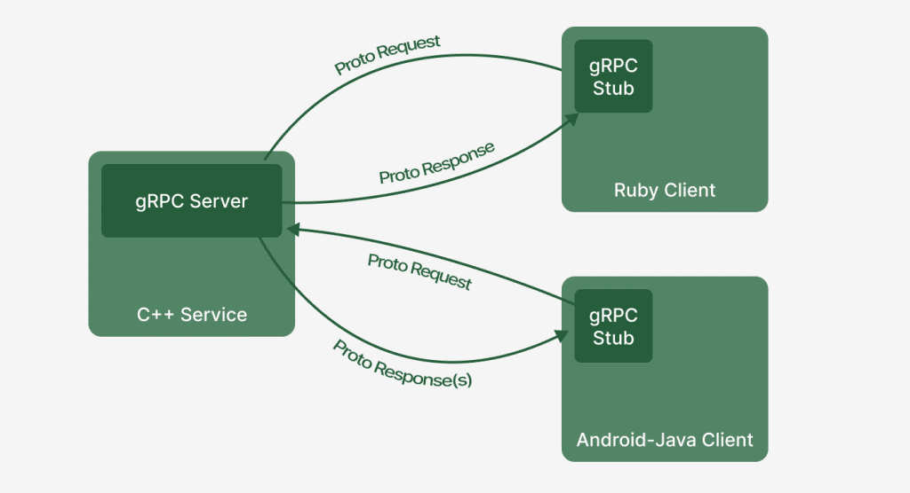
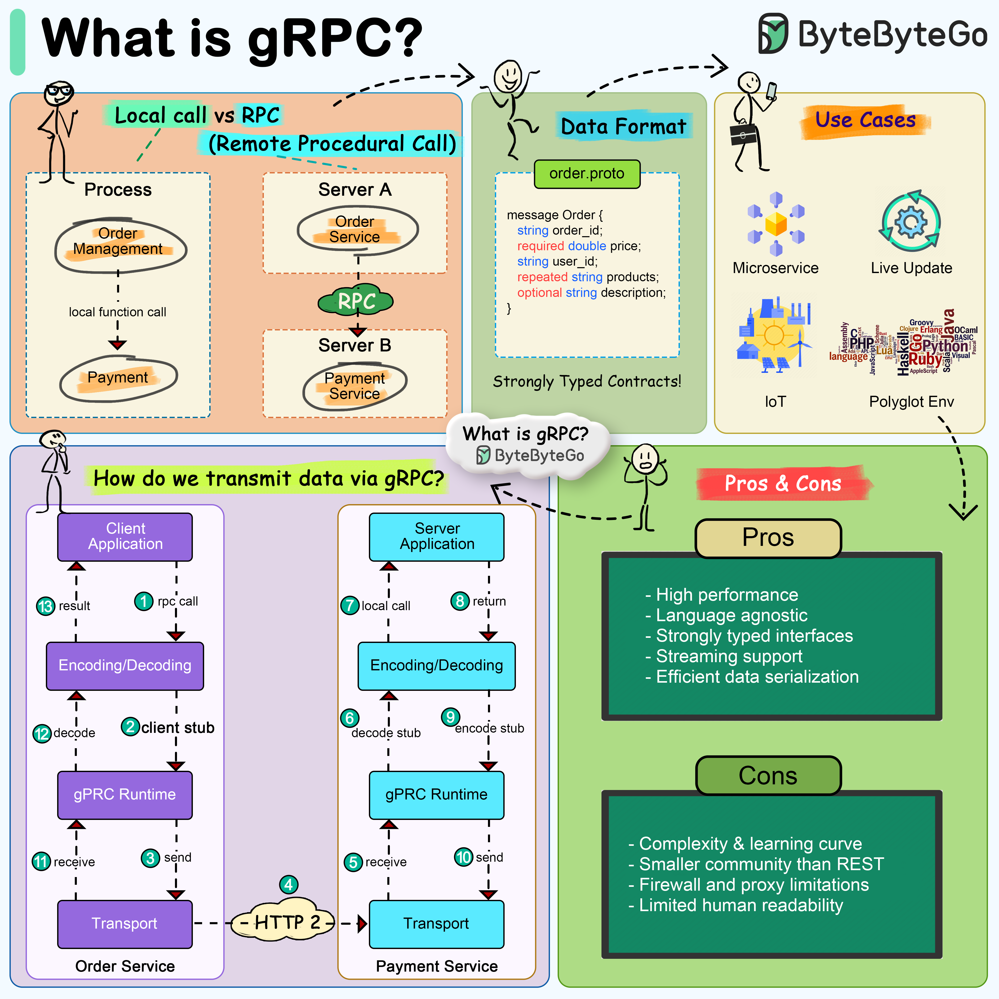

# Comprehensive gRPC Guide: Core Concepts, Best Practices, and Spring Boot Integration




---

## 1. Core Concepts of gRPC

**gRPC** (gRPC Remote Procedure Calls) is a high-performance, open-source universal RPC framework initially developed by Google. It enables client applications to call methods on server applications across different environments or machines as if they were local procedure calls.

### 1.1 Protocol Buffers (Protobuf)

Protocol Buffers serve as gRPC’s **Interface Definition Language (IDL)** and underlying binary serialization protocol.

- **Contract-First Development:** API interfaces and message structures are defined in `.proto` files.
- **Compact & Fast Serialization:** Binary format reduces wire payload size and speeds up processing compared to JSON/XML.
- **Code Generation:** The `protoc` compiler automatically creates strongly typed data classes and service stubs across multiple supported programming languages.

### 1.2 HTTP/2 Transport Layer

gRPC utilizes **HTTP/2** as its transport protocol, bringing several core features:

- **Multiplexing:** Requests and responses execute concurrently over a single TCP connection, eliminating head-of-line blocking.
- **Header Compression (HPACK):** Minimizes overhead for metadata exchange.
- **Bidirectional Streaming:** Enables long-lived, continuous two-way communication channels.

### 1.3 Communication Patterns

gRPC natively supports four interaction patterns:

1. **Unary RPC:** Client sends a single request and gets a single response back.
2. **Server Streaming RPC:** Client sends a single request and receives a stream of messages back.
3. **Client Streaming RPC:** Client streams a sequence of requests and receives a single summary response back.
4. **Bidirectional Streaming RPC:** Both client and server send streams of messages independently.

### 1.4 Channels and Stubs

- **Channel:** Represents an abstraction of a persistent connection to a gRPC server endpoint.
- **Stub:** Client-side object that provides the API methods exposed by the service.
  - **Blocking Stub:** Synchronous call (Unary only).
  - **Async Stub:** Non-blocking interface based on callbacks (`StreamObserver`).
  - **Future Stub:** Returns standard Java `ListenableFuture` objects.

---

## 2. Best Practices for Production Deployment

1. **Channel Reuse:** Creating channels involves TCP connection handshakes and TLS processing. Keep `ManagedChannel` instances as application-scoped singletons.
2. **Enforce Deadlines (Timeouts):** Always define explicit deadlines for requests using `.withDeadlineAfter()` to prevent lingering calls from locking resources.
3. **Configure Keepalive Pings:** Set HTTP/2 keepalives to detect dropped connections or keep connection pools alive across firewalls and load balancers.
4. **Interceptors for Cross-Cutting Concerns:** Implement `ServerInterceptor` or `ClientInterceptor` to handle authentication, logging, tracing, metrics, and global error handling uniformly.
5. **Backpressure Management:** Respect receiver capacity during streaming calls using manual flow control (`CallStreamObserver.request()`) to prevent out-of-memory errors.
6. **Graceful Shutdown:** Implement shutdown hooks on gRPC servers to complete active requests prior to process termination.

---

## 3. Native Java Example

### 3.1 Protobuf Definition (`userService.proto`)

```protobuf
syntax = "proto3";

package com.example.grpc;

option java_multiple_files = true;
option java_package = "com.example.grpc";

message UserRequest {
  int32 user_id = 1;
}

message UserResponse {
  int32 user_id = 1;
  string name = 2;
  string email = 3;
}

service UserService {
  rpc GetUser (UserRequest) returns (UserResponse);
}
```

### 3.2 Native Server (`UserServiceServer.java`)

```java
package com.example.grpc;

import io.grpc.Server;
import io.grpc.ServerBuilder;
import io.grpc.stub.StreamObserver;
import java.io.IOException;

public class UserServiceServer {

    public static void main(String[] args) throws IOException, InterruptedException {
        int port = 50051;
        Server server = ServerBuilder.forPort(port)
                .addService(new UserServiceImpl())
                .build()
                .start();

        System.out.println("gRPC Server started on port " + port);

        Runtime.getRuntime().addShutdownHook(new Thread(() -> {
            System.out.println("Shutting down gRPC server...");
            server.shutdown();
        }));

        server.awaitTermination();
    }

    static class UserServiceImpl extends UserServiceGrpc.UserServiceImplBase {
        @Override
        public void getUser(UserRequest request, StreamObserver<UserResponse> responseObserver) {
            UserResponse response = UserResponse.newBuilder()
                    .setUserId(request.getUserId())
                    .setName("Jane Doe")
                    .setEmail("jane.doe@example.com")
                    .build();

            responseObserver.onNext(response);
            responseObserver.onCompleted();
        }
    }
}
```

---

## 4. Spring Boot Integration

Integrating gRPC into Spring Boot simplifies lifecycle management, configuration, dependency injection, and security by using community starters such as **`grpc-spring-boot-starter`** (or `net.devh:grpc-spring-boot-starter`).

### 4.1 Key Spring Boot Concepts for gRPC

- **`@GrpcService` Annotation:** Registers gRPC service implementations as Spring-managed beans and binds them automatically to the embedded gRPC server lifecycle.
- **`@GrpcClient` Injection:** Automatically creates, configures, and injects managed gRPC stubs or channels into Spring beans with context-aware channel lifecycle management.
- **Auto-Configuration & Yaml Properties:** Configure ports, TLS, keepalives, and maximum message sizes natively in `application.yml`.
- **Actuator Integration:** Expose gRPC health checks and Prometheus metrics alongside HTTP Actuator endpoints.
- **Global Interceptors:** Register cross-cutting concerns as Spring beans marked with `@GrpcGlobalServerInterceptor` or `@GrpcGlobalClientInterceptor`.

---

### 4.2 Spring Boot Configuration (`application.yml`)

```yaml
grpc:
  server:
    port: 9090
    security:
      enabled: false
  client:
    user-service-provider:
      address: "static://localhost:9090"
      negotiation-type: plaintext
```

---

### 4.3 Spring Boot gRPC Server Implementation

```java
package com.example.grpc.server;

import com.example.grpc.UserRequest;
import com.example.grpc.UserResponse;
import com.example.grpc.UserServiceGrpc;
import io.grpc.stub.StreamObserver;
import net.devh.boot.grpc.server.service.GrpcService;

@GrpcService
public class SpringUserService extends UserServiceGrpc.UserServiceImplBase {

    @Override
    public void getUser(UserRequest request, StreamObserver<UserResponse> responseObserver) {
        // Business logic invocation via injected Spring Beans is now straightforward
        UserResponse response = UserResponse.newBuilder()
                .setUserId(request.getUserId())
                .setName("Alice Smith")
                .setEmail("alice.smith@example.com")
                .build();

        responseObserver.onNext(response);
        responseObserver.onCompleted();
    }
}
```

---

### 4.4 Spring Boot gRPC Client & Controller

```java
package com.example.grpc.client;

import com.example.grpc.UserRequest;
import com.example.grpc.UserResponse;
import com.example.grpc.UserServiceGrpc;
import net.devh.boot.grpc.client.inject.GrpcClient;
import org.springframework.web.bind.annotation.GetMapping;
import org.springframework.web.bind.annotation.PathVariable;
import org.springframework.web.bind.annotation.RestController;

import java.util.concurrent.TimeUnit;

@RestController
public class UserController {

    // Spring Boot manages the underlying ManagedChannel lifecycle
    @GrpcClient("user-service-provider")
    private UserServiceGrpc.UserServiceBlockingStub userServiceStub;

    @GetMapping("/users/{id}")
    public String getUserById(@PathVariable int id) {
        UserRequest request = UserRequest.newBuilder()
                .setUserId(id)
                .build();

        // Enforce Deadline Best Practice
        UserResponse response = userServiceStub
                .withDeadlineAfter(3, TimeUnit.SECONDS)
                .getUser(request);

        return "Retrieved User: " + response.getName() + " (" + response.getEmail() + ")";
    }
}
```

---

### 4.5 Global Interceptor in Spring Boot

```java
package com.example.grpc.config;

import io.grpc.Metadata;
import io.grpc.ServerCall;
import io.grpc.ServerCallHandler;
import io.grpc.ServerInterceptor;
import net.devh.boot.grpc.server.interceptor.GrpcGlobalServerInterceptor;
import org.slf4j.Logger;
import org.slf4j.LoggerFactory;

@GrpcGlobalServerInterceptor
public class LogServerInterceptor implements ServerInterceptor {

    private static final Logger log = LoggerFactory.getLogger(LogServerInterceptor.class);

    @Override
    public <ReqT, RespT> ServerCall.Listener<ReqT> interceptCall(
            ServerCall<ReqT, RespT> call,
            Metadata headers,
            ServerCallHandler<ReqT, RespT> next) {

        log.info("gRPC Call Received: {}", call.getMethodDescriptor().getFullMethodName());
        return next.startCall(call, headers);
    }
}
```
