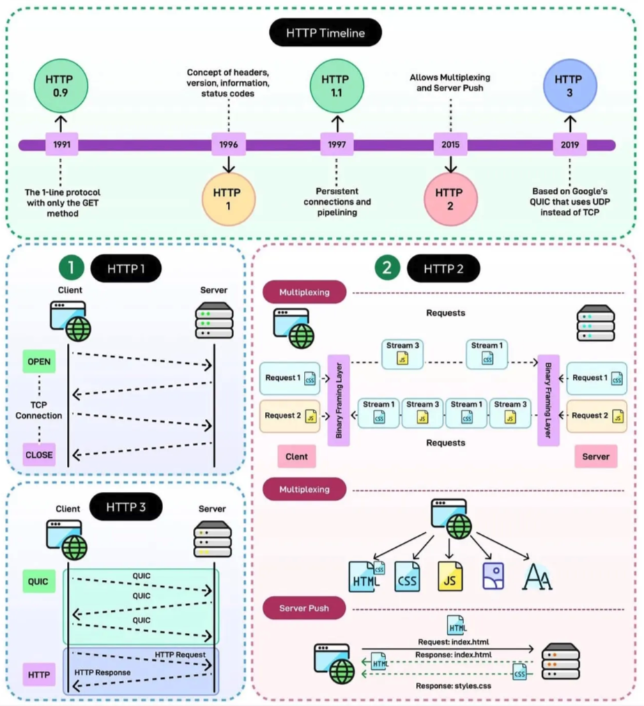

# Comprehensive Guide: HTTP/1 vs HTTP/2 vs HTTP/3

The evolution of HTTP from **HTTP/1.1** to **HTTP/2** and **HTTP/3** represents a shift from solving _basic connection limits_ to fixing _transport-layer bottlenecks_.

Each generation was designed to solve the primary architectural bottleneck of its predecessor.

---

## At a Glance: Feature Comparison

| Feature                         | HTTP/1.1 (1997)                              | HTTP/2 (2015)                        | HTTP/3 (2020+)                               |
| :------------------------------ | :------------------------------------------- | :----------------------------------- | :------------------------------------------- |
| **Transport Protocol**          | **TCP**                                      | **TCP**                              | **QUIC** (over **UDP**)                      |
| **Data Format**                 | Plaintext                                    | Binary frames                        | Binary frames                                |
| **Concurrency**                 | Sequential (or limited parallel connections) | Multiplexed over a single connection | Multiplexed over independent stream channels |
| **Head-of-Line (HoL) Blocking** | At **Application Level**                     | At **TCP Transport Level**           | **Fully Eliminated**                         |
| **Header Compression**          | None                                         | HPACK                                | QPACK                                        |
| **Security / TLS**              | Optional (TLS 1.0–1.2)                       | Practically mandatory (TLS 1.2+)     | Mandatory (TLS 1.3 integrated into QUIC)     |
| **Handshake Latency**           | 2–3 Round Trips (TCP + TLS)                  | 2–3 Round Trips (TCP + TLS)          | **1 Round Trip** (0-RTT on resumption)       |
| **Connection Migration**        | Breaks on IP change                          | Breaks on IP change                  | Seamless (uses Connection IDs)               |

---

## Detailed Protocol Breakdown

### 1. HTTP/1.1: The Text-Based Foundation

HTTP/1.1 processes requests sequentially over TCP connections. Because a server must respond to request `#1` before sending a response for request `#2` on the same connection, slow requests block everything behind them—a problem known as **Application-Level Head-of-Line (HoL) Blocking**.

- **Workarounds Used:**
  - **Parallel Connections:** Browsers opened up to 6 separate TCP connections per domain.
  - **Domain Sharding:** Hosting assets across `cdn1.example.com`, `cdn2.example.com` to bypass browser connection limits.
  - **Asset Bundling & Sprites:** Merging small files or images to reduce request counts.

---

### 2. HTTP/2: Binary Multiplexing

HTTP/2 introduced **binary framing** and **multiplexing**. Instead of plain text, data is broken down into small binary frames. Multiple requests and responses can now travel simultaneously over a **single TCP connection**.

- **Key Improvements:**
  - **Multiplexing:** Solved application-level blocking and eliminated the need for connections-per-domain hacks.
  - **HPACK:** Compressed heavy HTTP headers to reduce bandwidth usage.
  - **Server Push:** Allowed servers to send critical resources to the browser before they were explicitly requested.
- **The Remaining Bottleneck:**
  - Because HTTP/2 relies on a single underlying TCP connection, if **one single packet is dropped** in transit, TCP pauses all streams on that connection until the lost packet is retransmitted. This causes **TCP-Level Head-of-Line Blocking**, particularly on lossy or unstable networks (e.g., cellular data).

---

### 3. HTTP/3: QUIC over UDP

HTTP/3 replaces TCP entirely with **QUIC**, a modern transport protocol developed on top of **UDP**.

- **No Transport HoL Blocking:** QUIC treats streams as independent entities at the transport layer. A lost packet belonging to Stream A will not pause or affect Stream B.
- **Faster Connection Setup:** Encryption (TLS 1.3) is built directly into the QUIC handshake rather than layered on top of TCP. Connecting requires fewer round trips (1-RTT or 0-RTT for returning visitors).
- **Connection Migration:** QUIC identifies connections using a unique **Connection ID** rather than the IP/Port tuple. If a user switches from Wi-Fi to cellular data on a mobile device, active HTTP/3 streams continue seamlessly without re-establishing a connection.

---

## Best Technical Resources for Further Reading

For deep technical specifications, packet analyses, and architectural breakdowns, refer to these industry standards:

1. **[HTTP/3 Explained](https://daniel.haxx.se/http3-explained/) by Daniel Stenberg**  
   _Written by the lead developer of `curl`. The single most authoritative, open-source guide detailing the shift to HTTP/3 and QUIC._
2. **[High Performance Browser Networking](https://hpbn.co/) by Ilya Grigorik**  
   _Published by O'Reilly (available free online). Chapters 10–13 break down TCP limits, HTTP/1.x bottlenecks, and HTTP/2 inner workings._
3. **[Cloudflare Learning Center: HTTP/3](https://www.cloudflare.com/learning/performance/what-is-http3/)**  
   _An accessible, visual overview explaining QUIC performance on real-world networks._
4. **Official IETF RFC Specifications:**
   - **RFC 7230:** Hypertext Transfer Protocol (HTTP/1.1)
   - **RFC 7540:** Hypertext Transfer Protocol Version 2 (HTTP/2)
   - **RFC 9114:** Hypertext Transfer Protocol Version 3 (HTTP/3)
