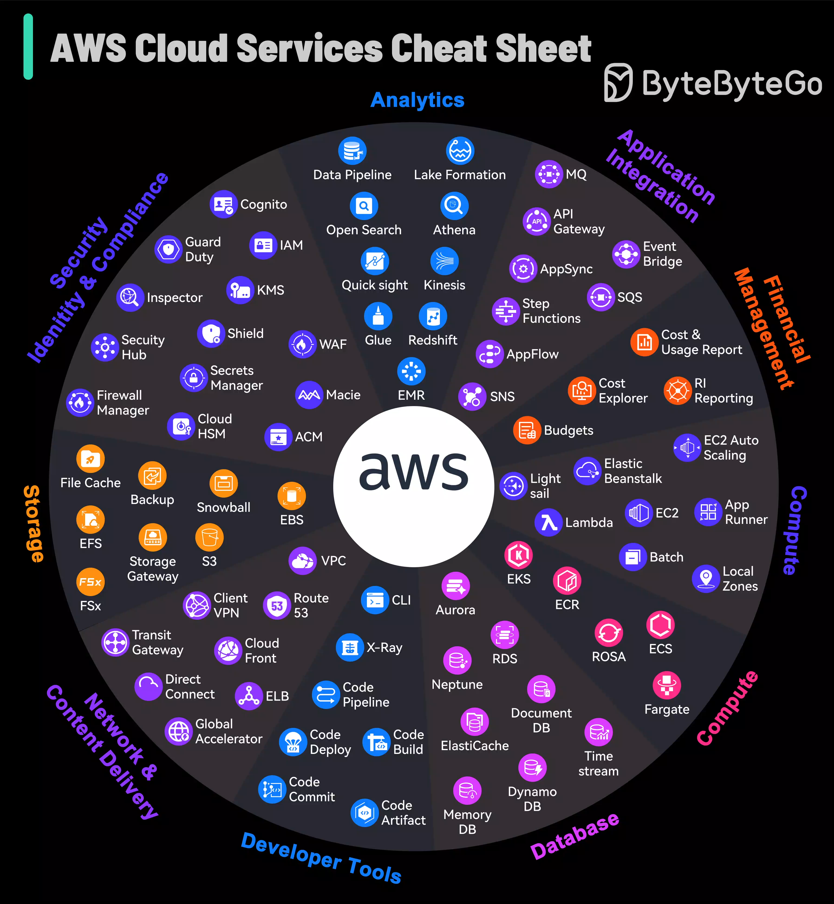

# AWS Microservices Architecture & Ecosystem Reference

## 1. Core AWS Services

AWS provides over 200 services, but its foundational ecosystem centers on several core categories:

- **Compute:**
  - **Amazon EC2:** Scalable virtual machines.
  - **AWS Lambda:** Serverless, event-driven compute.
  - **AWS Fargate / ECS / EKS:** Container management and Kubernetes orchestration.
- **Storage & Content Delivery:**
  - **Amazon S3:** Scalable object storage.
  - **Amazon EBS:** Block storage for EC2.
  - **Amazon CloudFront:** Global content delivery network (CDN).
- **Databases:**
  - **Amazon RDS:** Managed relational databases (PostgreSQL, MySQL).
  - **Amazon Aurora:** High-performance, cloud-native relational database.
  - **Amazon DynamoDB:** Fully managed NoSQL key-value/document database.
- **Networking & Security:**
  - **Amazon VPC:** Isolated private virtual network.
  - **AWS IAM:** Fine-grained identity, access management, and credentials.
  - **AWS KMS:** Encryption key management.
- **Integration & Messaging:**
  - **Amazon SQS:** Managed message queuing.
  - **Amazon SNS:** Pub/sub notification service.

---

## 2. Key Discussion Topics in Microservices

When designing or evaluating microservice architectures, core engineering discussions typically revolve around the following six pillars:

1. **Service Boundaries & Domain Modeling**
   - _Domain-Driven Design (DDD):_ Defining bounded contexts to align microservices with business domains.
   - _Sizing:_ Balancing granularity to avoid overly complex "nano-services" or sprawling monoliths.
2. **Communication Protocols**
   - _Synchronous vs. Asynchronous:_ Choosing between REST/gRPC for immediate responses vs. event-driven messaging for decoupling.
   - _API Gateways:_ Centralizing routing, rate-limiting, and authentication at the boundary.
3. **Data Management Strategies**
   - _Database per Service:_ Enforcing isolation by keeping data stores service-private.
   - _Distributed Consistency:_ Managing multi-service consistency via Eventual Consistency and patterns like Saga.
   - _CQRS:_ Separating read and write models to optimize performance.
4. **Observability & Distributed Tracing**
   - Centralizing logs, metrics, and distributed tracing across hundreds of independent services.
5. **Fault Tolerance & Resilience**
   - Implementing circuit breakers, automatic retries, and graceful degradation to prevent cascading system failures.
6. **Deployment & Infrastructure**
   - Containerizing services (Docker/Kubernetes) and establishing dynamic service discovery.

---

## 3. Microservice Architecture Mapping to AWS Native Services

| Discussion Topic                    | Architectural Challenge                                                                | AWS Native Service(s)                                                                               | Primary Function & Role                                                                                              |
| :---------------------------------- | :------------------------------------------------------------------------------------- | :-------------------------------------------------------------------------------------------------- | :------------------------------------------------------------------------------------------------------------------- |
| **API Gateway & Routing**           | Entry point routing, authentication, throttling, and request translation.              | **Amazon API Gateway** **AWS Application Load Balancer (ALB)**                                   | Handles API management, edge security, rate limiting, REST/WebSocket routing, and path-based HTTP routing.           |
| **Asynchronous Queuing**            | Decoupling services using point-to-point buffers to absorb traffic spikes.             | **Amazon SQS**                                                                                      | Fully managed message queues (Standard and FIFO) ensuring delivery without dropped requests.                         |
| **Pub/Sub Messaging**               | Broadcasting single events to multiple subscriber services simultaneously.             | **Amazon SNS** **Amazon EventBridge**                                                            | SNS handles push notification fan-out; EventBridge acts as an enterprise event bus with schema registries and rules. |
| **Event Streaming**                 | High-throughput, ordered event logs for event-sourcing architectures.                  | **Amazon MSK** (Managed Kafka) **Amazon Kinesis**                                                | Ingests and processes real-time, high-volume streaming data logs across decoupled services.                          |
| **Distributed Tracing**             | Tracking individual requests end-to-end as they traverse multiple microservices.       | **AWS X-Ray** **CloudWatch ServiceLens**                                                         | Generates end-to-end service maps and traces latency bottleneck points across distributed nodes.                     |
| **Centralized Logging & Metrics**   | Aggregating operational logs and health metrics across all running instances.          | **Amazon CloudWatch** **Amazon OpenSearch Service**                                              | Centralized log aggregation, metric alerts, and full-text log querying.                                              |
| **Service Discovery**               | Dynamically locating container or serverless instances as they scale automatically.    | **AWS Cloud Map**                                                                                   | Dynamic service registry integrating with DNS and Kubernetes to track network locations.                             |
| **Service Mesh & Resilience**       | Traffic control, circuit breaking, mTLS, and retries between internal services.        | **AWS App Mesh**                                                                                    | Standardizes service-to-service communication policies without requiring application code changes.                   |
| **Distributed Transactions (Saga)** | Coordinating complex multi-step processes across microservices without database locks. | **AWS Step Functions**                                                                              | Serverless state machines that coordinate workflows, execution logic, and rollback/compensation steps.               |
| **Database per Service**            | Polyglot persistence: selecting the optimal database store for each service domain.    | **Amazon Aurora** (Relational) **Amazon DynamoDB** (NoSQL) **Amazon ElastiCache** (In-Memory) | Aurora for SQL compliance, DynamoDB for fast key-value scale, ElastiCache (Redis) for ultra-low latency caching.     |
| **Container Orchestration**         | Managing lifecycle, scaling, and deployment of containerized services.                 | **Amazon EKS** (Kubernetes) **Amazon ECS** **AWS Fargate**                                    | Orchestrates container deployments; Fargate enables serverless compute execution.                                    |
| **Configuration & Secrets**         | Securing application credentials and managing environment configurations centrally.    | **AWS Secrets Manager** **Systems Manager Parameter Store**                                      | Encrypts, rotates, and safely injects API keys and database credentials into runtime containers.                     |
