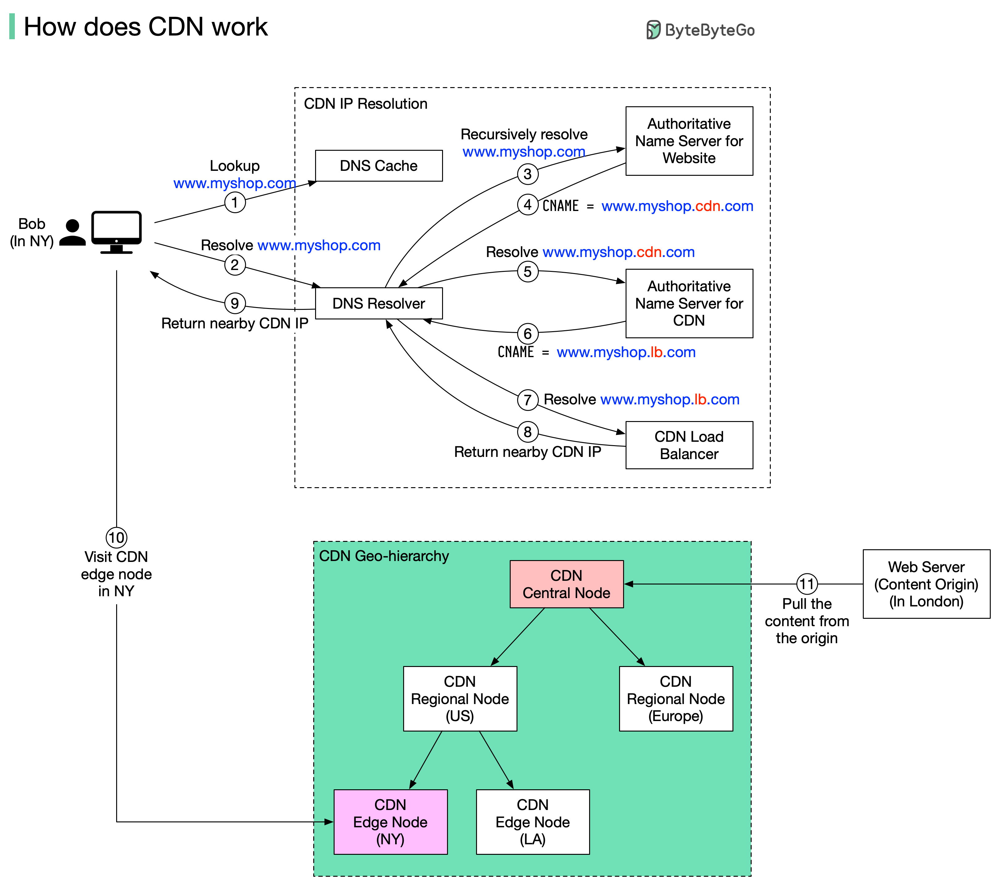

A CDN (Content Delivery Network) is a geographically distributed network of caching servers (edge servers/points of presence) that sit between your users and your origin server, serving cached content from a location physically close to the requester instead of every request traveling all the way back to wherever your application actually runs. It's the largest, most effective latency win available for a globally distributed user base, and it's also the cheapest possible cache hit — a request a CDN edge answers never reaches your infrastructure at all.



## 1. The Core Idea: Move the Content Closer to the User

Without a CDN, every user's request travels the full physical distance to wherever your origin server is hosted — a user in Sydney requesting a page served from a US-East data center pays that round-trip latency on every single request, no matter how fast your server itself responds.

```
Without a CDN:
  User (Sydney) ────────────────────────────────► Origin server (US-East)
                        ~250ms round trip

With a CDN:
  User (Sydney) ──► Nearest edge server (Sydney) ──(cache hit)──► response
                     ~5-10ms round trip, origin never contacted
```

A CDN solves this by replicating cacheable content across hundreds of edge locations worldwide, so the request never has to travel further than the nearest edge — the physical distance, and the network latency that comes with it, is what's actually being eliminated, not any processing time on the origin itself.

## 2. What a CDN Can and Can't Cache

| Content type                                                                                      | Cacheable at the edge?                        | Why                                                                                                 |
| ------------------------------------------------------------------------------------------------- | --------------------------------------------- | --------------------------------------------------------------------------------------------------- |
| Static assets (images, CSS, JS, fonts, videos)                                                    | Yes, easily                                   | Identical for every user, changes infrequently                                                      |
| Static HTML / pre-rendered pages                                                                  | Yes                                           | Same reasoning, as long as the page doesn't vary per user                                           |
| API responses that are the same for everyone (public product catalog, a country's tax rate table) | Yes, with a short TTL                         | Cacheable but needs a deliberate freshness window                                                   |
| Personalized or authenticated responses (a user's account balance, their order history)           | No — or only with careful per-user cache keys | Serving one user's cached response to another user is a serious data leak, not just a staleness bug |

The line that matters most: a CDN should never accidentally serve one user's personalized response to a different user. This is why naively slapping a CDN in front of every endpoint is dangerous — caching needs to be deliberate about which responses are actually safe to share across requesters.

## 3. HTTP Caching Headers: How a CDN Decides What and How Long to Cache

A CDN (and the browser cache alongside it) obeys the same HTTP caching headers already covered in caching — the origin server is what actually declares cacheability, the CDN just enforces it at the edge.

```
Cache-Control: public, max-age=3600       # cacheable by shared caches (CDNs), fresh for 1 hour
Cache-Control: private, no-store          # never cache anywhere but the requesting client, and not even there
ETag: "a1b2c3"                            # a version fingerprint — lets a stale cache revalidate cheaply
```

```java
@GetMapping("/products/{id}")
public ResponseEntity<Product> getProduct(@PathVariable Long id) {
    Product product = productService.findById(id);
    return ResponseEntity.ok()
        .cacheControl(CacheControl.maxAge(1, TimeUnit.HOURS).cachePublic()) // safe to cache at a CDN edge
        .body(product);
}
```

Getting `Cache-Control` wrong in either direction has a real cost: marking something `private` that's actually safe to share throws away free CDN caching for no reason; marking something `public` that's actually personalized risks leaking one user's data to another through the shared cache.

## 4. Cache Invalidation: Purging Stale Content

When content changes before its `max-age` expires (a new product image, an urgent bug-fixed script), the CDN needs to be told explicitly to drop its cached copy rather than waiting for the TTL to naturally expire.

```bash
# Explicit purge — most CDN providers offer an API for this
curl -X POST "https://api.cdn-provider.com/v1/purge" \
  -d '{"urls": ["https://cdn.example.com/assets/app.js"]}'
```

A more scalable pattern than purging by exact URL: **cache-busting via versioned filenames** — instead of purging `app.js` every time it changes, deploy `app.a3f9c21.js` (a hash of the content, or a build version, embedded in the filename) with an effectively infinite `max-age`, and change which filename the HTML references on each deploy. This sidesteps invalidation entirely: old cached copies simply become irrelevant once nothing references them anymore, rather than needing to be actively evicted.

## 5. CDNs for Dynamic Content and APIs

Modern CDNs aren't limited to static files — many now run logic at the edge itself (edge functions/edge compute), letting some request handling happen at the nearest edge location instead of always reaching the origin.

| Capability                                                              | What it enables                                                                                                                                                                                               |
| ----------------------------------------------------------------------- | ------------------------------------------------------------------------------------------------------------------------------------------------------------------------------------------------------------- |
| Edge caching of API responses                                           | Short-TTL caching of public, non-personalized API responses close to the user                                                                                                                                 |
| Edge functions (Cloudflare Workers, Lambda@Edge, Vercel Edge Functions) | Running small pieces of logic (auth checks, A/B test routing, header rewriting) at the edge, without a round trip to origin                                                                                   |
| Origin shielding                                                        | An additional caching layer between edge locations and the origin, so a cache miss at one edge doesn't turn into a full origin hit — it can be satisfied by the shield instead                                |
| Request coalescing                                                      | If many identical requests arrive at an edge simultaneously during a cache miss, the CDN sends only one request to the origin and shares the result, instead of stampeding the origin with duplicate requests |

Request coalescing specifically is what protects an origin from the "thundering herd" problem — a popular resource expiring from cache and immediately triggering thousands of simultaneous origin requests all racing to refill the same cache entry.

## 6. CDNs as a Security Layer, Not Just Performance

Because every request already passes through the CDN's edge before reaching origin, that same edge is a natural place to absorb attacks before they ever reach your infrastructure — most major CDN providers bundle this in.

| Capability                     | What it protects against                                                                                                                       |
| ------------------------------ | ---------------------------------------------------------------------------------------------------------------------------------------------- |
| DDoS mitigation                | Absorbs and filters volumetric attack traffic across a massive distributed edge network, far beyond what a single origin could withstand alone |
| Web Application Firewall (WAF) | Filters known attack patterns (SQL injection, XSS payloads) at the edge, before the request reaches the application                            |
| TLS termination at the edge    | Offloads the cost of the TLS handshake to the edge, closer to the user, reducing connection setup latency                                      |

## 7. Best Practices

| Practice                                                                                               | Recommendation                                                                                                                           |
| ------------------------------------------------------------------------------------------------------ | ---------------------------------------------------------------------------------------------------------------------------------------- |
| Never cache personalized or authenticated responses at a shared CDN layer without a per-user cache key | Serving another user's cached response is a data leak, not just a staleness issue.                                                       |
| Set `Cache-Control` deliberately, not by copying a default                                             | Marking a cacheable response `private` throws away free performance; marking a personalized one `public` risks a real security incident. |
| Prefer versioned/hashed filenames over manual purge-on-deploy                                          | Cache-busting via the filename sidesteps invalidation entirely — old cached versions simply stop being referenced.                       |
| Use origin shielding for high-traffic cacheable content                                                | Protects the origin from cache-miss storms across many edge locations converging on it simultaneously.                                   |
| Treat the CDN as a security layer, not just a latency optimization                                     | DDoS mitigation and WAF filtering at the edge stop attack traffic before it costs your own infrastructure anything.                      |
| Set a short, deliberate TTL for cacheable API responses rather than leaving APIs uncached by default   | Even a 30-60 second edge cache on a hot, non-personalized endpoint can meaningfully cut origin load during traffic spikes.               |
