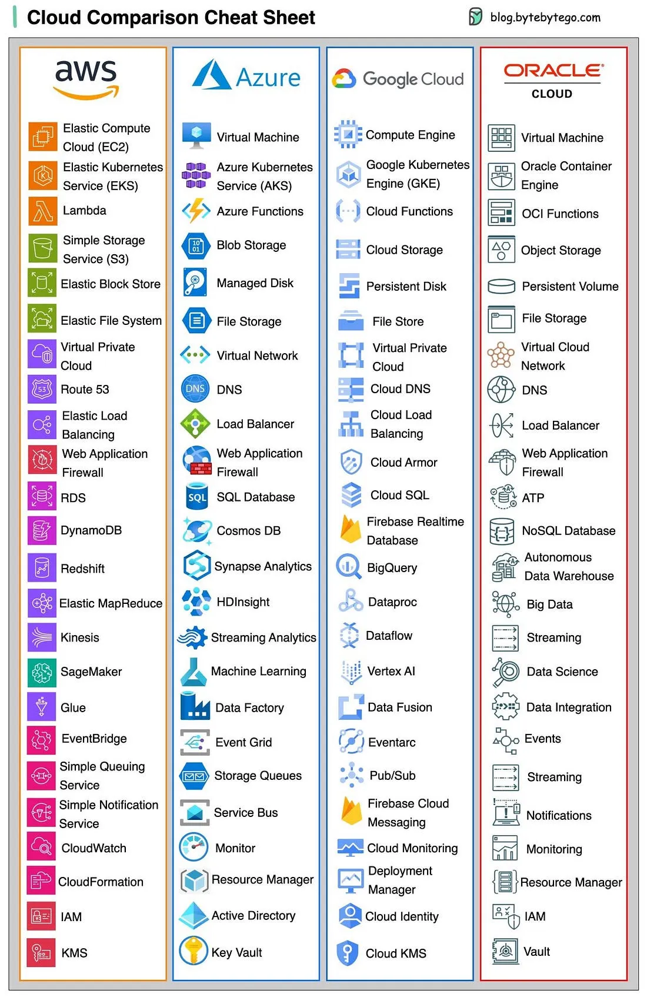
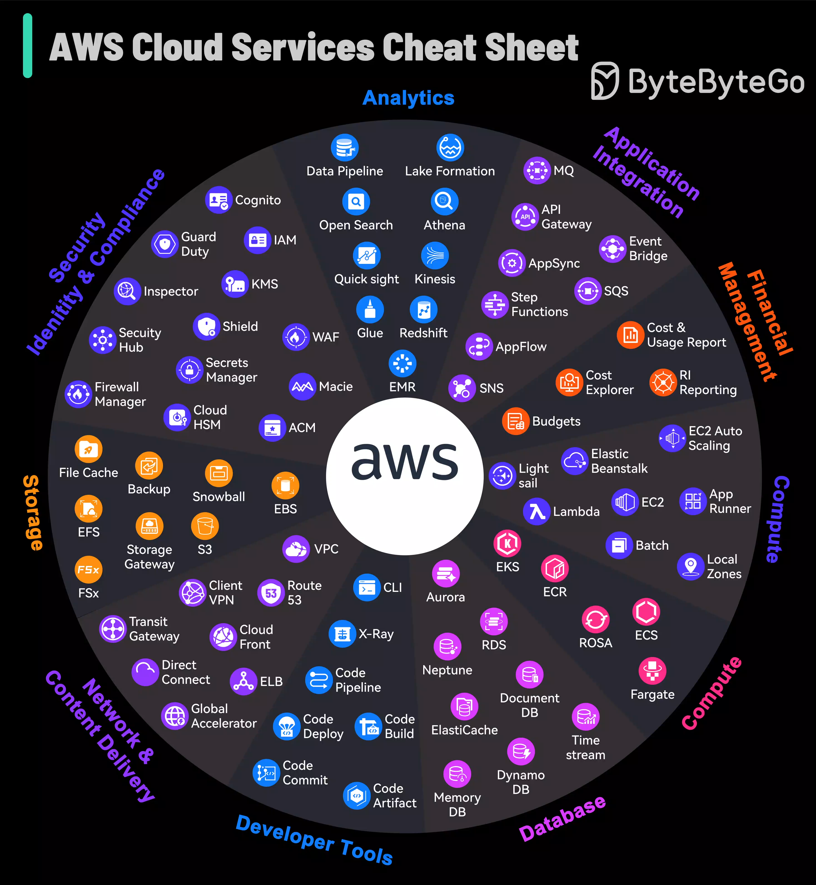

The big three clouds (AWS, GCP, Azure) offer largely equivalent building blocks — compute, storage, managed databases, messaging, identity — under different names and with different defaults. For a Java developer, the useful skill isn't memorizing every service name; it's recognizing the underlying concept (e.g., "managed message queue," "serverless function," "managed relational DB") and knowing which concrete service maps to it on whichever provider you're using. This note maps the concepts to each provider's naming and calls out where Java-specific concerns (cold starts, connection pooling, SDKs) actually differ.




## 1. Compute — The Core Building Blocks

| Concept                                                | AWS                   | GCP                  | Azure            |
| ------------------------------------------------------ | --------------------- | -------------------- | ---------------- |
| Virtual machines                                       | EC2                   | Compute Engine (GCE) | Virtual Machines |
| Managed Kubernetes                                     | EKS                   | GKE                  | AKS              |
| Serverless containers (no cluster to manage)           | Fargate (via ECS/EKS) | Cloud Run            | Container Apps   |
| Functions-as-a-Service                                 | Lambda                | Cloud Functions      | Azure Functions  |
| Managed container orchestration (proprietary, non-K8s) | ECS                   | —                    | —                |

For a Java service already built around Docker, **Cloud Run** and **Fargate**/**Container Apps** are usually the least-friction path: you give them a container image and they handle scaling/networking, without you managing Kubernetes nodes directly. Reach for EKS/GKE/AKS only when you need Kubernetes-specific features (custom operators, complex networking, existing K8s tooling like ArgoCD) — running a full K8s cluster for a handful of simple services is often unnecessary operational overhead.

## 2. Serverless Java: The Cold Start Problem

Java's JVM startup and class-loading overhead make it a notably worse fit for FaaS (Lambda/Cloud Functions/Azure Functions) than languages with near-instant startup (Go, Node, Python) — a "cold start" (spinning up a fresh execution environment) can add hundreds of milliseconds to seconds of latency to the first request.

Mitigations, roughly in order of effectiveness:

- **Provisioned concurrency** (AWS Lambda) / minimum instances (Cloud Run, Azure Functions): keep N instances warm at all times, at a standing cost — trades money for eliminating cold starts entirely.
- **GraalVM native image**: ahead-of-time compiles the JVM app to a native binary, cutting startup from ~1-2 seconds to tens of milliseconds. Spring Boot 3+ and Micronaut/Quarkus have first-class native image support.
- **Smaller dependency footprint**: fewer classes to load at startup means faster cold starts even on the standard JVM — this is one reason lightweight frameworks (Micronaut, Quarkus) gained traction specifically for serverless Java.

Rule of thumb: for latency-sensitive, high-traffic endpoints, prefer an always-warm option (Cloud Run/Fargate/Container Apps with min instances, or a regular Kubernetes Deployment) over FaaS. Reserve Lambda/Cloud Functions/Azure Functions for genuinely bursty, infrequent, or event-driven workloads (e.g., processing an uploaded file, reacting to a queue message) where the cold-start cost is acceptable or amortized.

## 3. Managed Relational Databases

| Concept                          | AWS               | GCP                           | Azure                               |
| -------------------------------- | ----------------- | ----------------------------- | ----------------------------------- |
| Managed PostgreSQL/MySQL         | RDS               | Cloud SQL                     | Azure Database for PostgreSQL/MySQL |
| High-throughput distributed SQL  | Aurora            | AlloyDB / Spanner             | Azure SQL Hyperscale                |
| Serverless-scaling relational DB | Aurora Serverless | Cloud SQL (limited) / Spanner | Azure SQL Serverless                |

From the JPA/JDBI side, these are just a Postgres/MySQL endpoint — your entity mappings, repositories, and connection pool configuration (HikariCP) work identically to a self-hosted database. The operational difference that actually matters for app code: managed DBs enforce connection limits more strictly, so tune `HikariCP`'s pool size to the provider's connection cap, and use connection poolers (RDS Proxy, Cloud SQL Auth Proxy) for serverless/high-concurrency workloads where many short-lived function instances would otherwise each open their own connection pool and collectively exhaust the database's connection limit.

## 4. Object Storage

| Concept        | AWS | GCP                 | Azure        |
| -------------- | --- | ------------------- | ------------ |
| Object storage | S3  | Cloud Storage (GCS) | Blob Storage |

All three provide an S3-compatible or similar REST API for storing files/blobs (images, documents, backups, data lake files) — not a filesystem, and not for data you need to query with SQL. Java SDKs (`software.amazon.awssdk.s3`, `com.google.cloud.storage`, `com.azure.storage.blob`) follow a similar pattern: a client object, a bucket/container name, and put/get/list operations by key. Use pre-signed URLs (all three support them) to let a client upload/download directly without routing the file through your application server.

## 5. Managed Messaging — Mapping to message queues

| Concept                                       | AWS                           | GCP                                      | Azure              |
| --------------------------------------------- | ----------------------------- | ---------------------------------------- | ------------------ |
| Simple queue (point-to-point)                 | SQS                           | Pub/Sub (with a single subscription)     | Service Bus Queues |
| Pub/Sub with multiple independent subscribers | SNS (fan-out to SQS queues)   | Pub/Sub                                  | Service Bus Topics |
| High-throughput event streaming (Kafka-like)  | Kinesis / MSK (managed Kafka) | Pub/Sub (partial fit) / Confluent on GCP | Event Hubs         |

The concepts from message queues carry over directly: SQS is the point-to-point queue model, SNS+SQS fan-out is pub/sub, Kinesis/MSK/Event Hubs are the "ordered, replayable log" model closest to Kafka. Delivery semantics still apply the same way — SQS standard queues are at-least-once (design consumers idempotently, same as Kafka/RabbitMQ), while SQS FIFO queues trade some throughput for exactly-once processing and strict ordering within a message group.

## 6. Identity and Access Management (IAM)

All three use a similar model: identities (users, service accounts/managed identities) are granted permissions via policies attached to roles, following least-privilege — don't grant broad admin access when a service only needs to read one S3 bucket or publish to one topic.

| Concept                               | AWS                                                     | GCP              | Azure                      |
| ------------------------------------- | ------------------------------------------------------- | ---------------- | -------------------------- |
| Non-human identity for an app/service | IAM Role (often via an instance profile / IRSA for EKS) | Service Account  | Managed Identity           |
| Policy attached to an identity        | IAM Policy                                              | IAM Role binding | Azure RBAC Role Assignment |

The pattern that matters for application code: **never embed long-lived cloud credentials (access keys) in application config or environment variables** — instead, attach a role/service account/managed identity to the compute resource (EC2 instance, Kubernetes pod via IRSA/Workload Identity, Azure VM) and let the SDK pick up short-lived, automatically-rotated credentials from the instance metadata service. This is the cloud-native equivalent of the "don't hardcode secrets" principle.

## 7. Secrets Management

| Concept         | AWS             | GCP            | Azure     |
| --------------- | --------------- | -------------- | --------- |
| Secrets storage | Secrets Manager | Secret Manager | Key Vault |

```java
// AWS SDK v2 example — fetch a secret at startup, never hardcode it
SecretsManagerClient client = SecretsManagerClient.create();
GetSecretValueResponse response = client.getSecretValue(
    GetSecretValueRequest.builder().secretId("prod/order-service/db-password").build());
String dbPassword = response.secretString();
```

Spring Cloud has provider-specific starters (`spring-cloud-aws-secrets-manager`, `spring-cloud-gcp-secretmanager`, `spring-cloud-azure-starter-keyvault-secrets`) that inject secrets directly into Spring's `Environment`/`@Value`, so application code never calls the SDK directly — prefer this over manual SDK calls scattered through the codebase.

## 8. Infrastructure as Code

Provisioning cloud resources by hand (clicking through a console) is not reproducible or reviewable — Infrastructure as Code (IaC) tools declare infrastructure the same way ArgoCD declares application deployments.

| Tool           | Scope                                                                                                                                      |
| -------------- | ------------------------------------------------------------------------------------------------------------------------------------------ |
| Terraform      | Cloud-agnostic, works across AWS/GCP/Azure with provider plugins — the common choice when a team uses multiple clouds or wants portability |
| CloudFormation | AWS-native only                                                                                                                            |
| Pulumi         | Cloud-agnostic, infrastructure defined in a general-purpose language (including Java) instead of a DSL                                     |

```hcl
# Terraform — declarative, provider-agnostic syntax
resource "aws_db_instance" "orders" {
  engine         = "postgres"
  instance_class = "db.t3.medium"
  allocated_storage = 20
}
```

Same GitOps principle as ArgoCD: infrastructure changes go through a PR, get reviewed, and are applied via `terraform plan`/`apply` in CI — not manually in the console, which would drift the actual infrastructure away from what's documented in code.

## 9. Multi-Cloud / Vendor Lock-In Considerations

Fully abstracting away provider differences (e.g., writing your own interface over S3/GCS/Blob Storage "just in case you switch clouds someday") is usually premature engineering — most teams never actually migrate providers, and the abstraction adds real complexity for a hypothetical need. The pragmatic middle ground:

- Keep application code decoupled at natural boundaries anyway (e.g., a `FileStorageService` interface with one implementation) — this is good design regardless of multi-cloud plans, and happens to make a future migration easier if it ever comes.
- Prefer Kubernetes-based deployment (EKS/GKE/AKS) over provider-specific compute (Lambda-specific handlers, proprietary PaaS features) if genuine portability is a real, current requirement — Kubernetes itself is the closest thing to a portable abstraction across clouds.
- Don't pay the complexity cost of full portability abstractions until multi-cloud is an actual, funded requirement — not a "just in case."

## 10. Best Practices

| Practice                                                              | Recommendation                                                                                                                                                     |
| --------------------------------------------------------------------- | ------------------------------------------------------------------------------------------------------------------------------------------------------------------ |
| Prefer serverless containers over raw FaaS for latency-sensitive Java | Cloud Run/Fargate/Container Apps avoid the JVM cold-start penalty that Lambda/Cloud Functions impose on the first request.                                         |
| Use provisioned concurrency or native image if you must use FaaS      | GraalVM native image or minimum-warm-instance settings are the two real levers against Java cold starts.                                                           |
| Never hardcode cloud credentials                                      | Use instance roles/service accounts/managed identities so the SDK picks up short-lived, auto-rotated credentials instead.                                          |
| Tune connection pool size to the managed DB's connection limit        | Managed databases enforce hard connection caps — HikariCP's default pool size can exhaust it under concurrent serverless instances.                                |
| Manage infrastructure as code, not console clicks                     | Terraform/CloudFormation/Pulumi changes go through the same PR review discipline as application code.                                                              |
| Map to the concept, not the brand name                                | Learn "managed message queue," "object storage," "managed relational DB" as concepts — the specific service name is a lookup, not something to memorize per cloud. |
| Don't build multi-cloud abstractions speculatively                    | Only invest in cloud-portability layers once multi-cloud is an actual, funded requirement.                                                                         |
