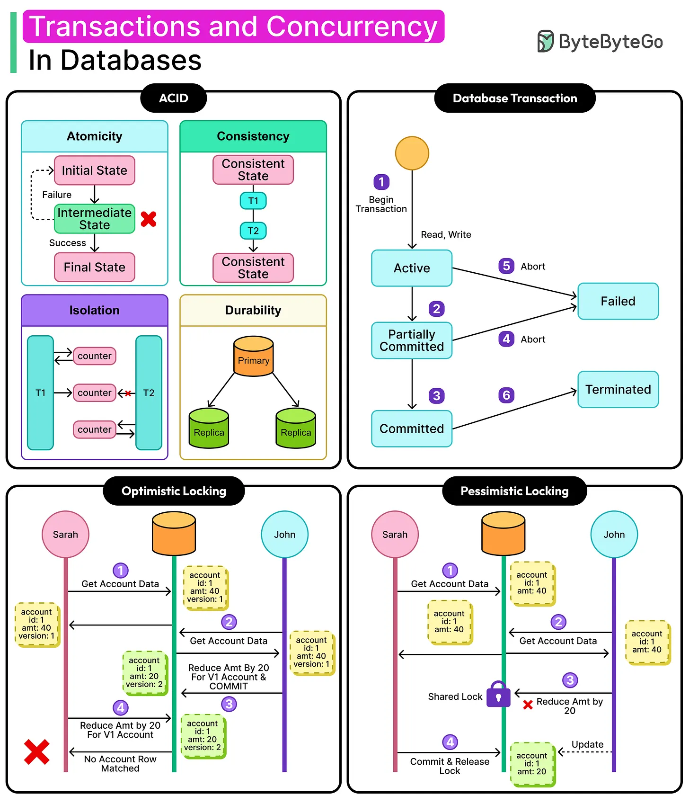

ACID is the set of guarantees a relational transaction makes about how it affects the database — Atomicity, Consistency, Isolation, Durability. These four properties are what let you reason about a multi-statement operation as if it were a single, indivisible step, even though the database is actually executing it as several separate writes under the hood, possibly interleaved with other transactions running at the same time.



## 1. Atomicity — All or Nothing

A transaction's statements either all succeed and commit together, or all roll back together — there's no state where only some of them took effect.

```java
@Transactional
public void transferFunds(Long fromId, Long toId, BigDecimal amount) {
    Account from = accountRepository.findById(fromId).orElseThrow();
    Account to = accountRepository.findById(toId).orElseThrow();
    from.withdraw(amount);
    to.deposit(amount);
    // if the deposit throws, the withdrawal is rolled back too — never "money left one account but never arrived"
}
```

Under the hood, atomicity is implemented via a transaction log (a write-ahead log, or WAL): before any data page is actually modified, the intended change is recorded in the log. If the transaction fails partway through, the database replays the log backward (undo) to reverse whatever had already been applied — this is what makes "roll back" possible even after some individual statements already executed successfully.

## 2. Consistency — Valid State to Valid State

A transaction moves the database from one state that satisfies all defined constraints to another state that also satisfies them — foreign keys, `NOT NULL`, `UNIQUE`, `CHECK` constraints are never left violated at the end of a committed transaction.

```sql
CREATE TABLE accounts (
    id BIGSERIAL PRIMARY KEY,
    balance NUMERIC(12,2) NOT NULL CHECK (balance >= 0) -- the database itself rejects an overdraft
);
```

This "Consistency" is narrower than it sounds — it means the _schema's declared rules_ are upheld, not that your business logic is automatically correct. A transaction that transfers money in a way that violates _application_-level rules but doesn't violate any database constraint will still commit successfully; the database only enforces what you've told it to enforce via constraints. Getting real business-rule consistency usually means encoding the important invariants as actual database constraints wherever possible, rather than trusting application code alone to never make a mistake.

## 3. Isolation — Concurrent Transactions Don't Interfere

Isolation controls how much of one in-progress transaction's uncommitted work another concurrent transaction can see — and critically, it's tunable, not all-or-nothing. Weaker isolation permits more concurrency (and throughput) at the cost of allowing specific anomalies; stronger isolation prevents those anomalies but increases locking and contention.

| Level                           | Prevents                     | Still allows                                                                                                                                    |
| ------------------------------- | ---------------------------- | ----------------------------------------------------------------------------------------------------------------------------------------------- |
| Read Uncommitted                | Nothing                      | Dirty reads — seeing another transaction's uncommitted, possibly-about-to-be-rolled-back changes                                                |
| Read Committed (common default) | Dirty reads                  | Non-repeatable reads — the same query, run twice in one transaction, returns different results because another transaction committed in between |
| Repeatable Read                 | Dirty + non-repeatable reads | Phantom reads — a new row matching your `WHERE` clause appears on a re-query, because another transaction inserted it                           |
| Serializable                    | All of the above             | Nothing — transactions behave as if run one at a time; highest correctness, lowest concurrency                                                  |

```java
// Read Committed lets this see a value that changes between the two reads, in the same transaction
@Transactional(isolation = Isolation.READ_COMMITTED)
public void checkBalanceTwice(Long accountId) {
    BigDecimal first = accountRepository.findBalance(accountId);
    // another transaction commits a change to this account here
    BigDecimal second = accountRepository.findBalance(accountId); // may differ from 'first'
}
```

Most relational databases implement isolation via MVCC (multi-version concurrency control): instead of blocking readers behind writers, the database keeps multiple versions of a row and gives each transaction a consistent snapshot to read from, based on when that transaction started. This is why a read in Postgres or MySQL (InnoDB) rarely blocks on a concurrent write — the reader simply sees an older, still-valid version of the row rather than waiting for the writer to finish.

Higher isolation isn't free: it's implemented through more locking (or more work reconciling conflicting snapshots), which increases the chance of contention and deadlock under concurrent load. Most applications run at `Read Committed` and reach for optimistic locking (a `@Version` field, checked at commit time) for the specific operations that actually need a stronger guarantee, rather than raising the isolation level globally and paying its cost for every transaction in the system.

## 4. Durability — Once Committed, It Survives

Once a transaction commits, its effects survive a crash — a power failure, an OS crash, a process kill — immediately afterward. This is guaranteed by forcing the write-ahead log to durable storage (`fsync`, not just an in-memory buffer) before acknowledging the commit to the client.

```
Commit sequence:
  1. Write change to the WAL
  2. fsync the WAL to disk (this is the durability guarantee point)
  3. Acknowledge "commit successful" to the client
  4. (later, asynchronously) apply the change to the actual data pages on disk
```

The data pages themselves can be updated lazily after the fact — durability only requires the _log_ of what happened to be safely on disk, since the log alone is enough to replay and reconstruct the correct state after a crash. This is also why durability at scale usually extends beyond a single disk: synchronous replication to at least one other node protects against the entire machine (not just its disk) failing before the data pages are ever flushed.

## 5. The Real Cost of Full ACID: Why BASE Exists

Serializable isolation and synchronous durability across replicas both cost throughput and latency — this is exactly the tradeoff that pushes some systems toward BASE (Basically Available, Soft State, Eventual Consistency) instead, favoring availability and throughput over the strict guarantees covered here. Neither is universally correct: a financial ledger needs ACID's strict guarantees; a social media "view count" can tolerate BASE's looser ones. This is the same underlying tension the CAP theorem frames as Consistency versus Availability during a network partition.

## 6. Best Practices

| Practice                                                                               | Recommendation                                                                                                                                                |
| -------------------------------------------------------------------------------------- | ------------------------------------------------------------------------------------------------------------------------------------------------------------- |
| Encode real business invariants as database constraints, not just application checks   | Consistency only enforces what the schema actually declares — a rule that only lives in application code can still be violated by a bug or a direct DB write. |
| Choose isolation level by real requirement, not "safest by default"                    | Running everything at `Serializable` trades away concurrency system-wide for a guarantee most transactions don't actually need.                               |
| Reach for optimistic locking (`@Version`) for specific high-contention operations      | Cheaper than raising the global isolation level, and catches the exact conflicting-update scenario without blocking unrelated transactions.                   |
| Understand that durability's guarantee point is the WAL fsync, not the data page write | This is why crash recovery works — replaying the log reconstructs committed changes even if the actual data pages hadn't been updated yet.                    |
| Treat ACID vs. BASE as a per-system tradeoff, not a universal ranking                  | A ledger needs ACID's strict guarantees; a view counter or activity feed can trade them for BASE's availability and throughput.                               |
| Test transaction boundaries explicitly, not just individual statements                 | A bug that silently commits a partial multi-step operation (e.g., a missed `@Transactional`) defeats atomicity even though each individual query is fine.     |
