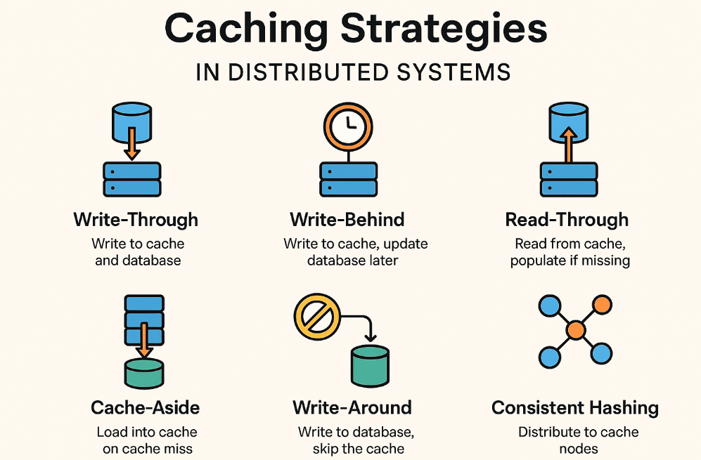
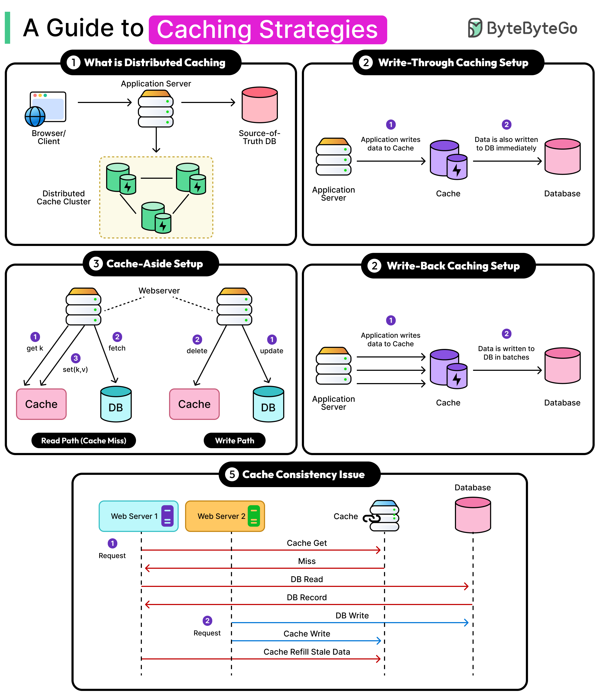

Caching trades memory (and a small risk of staleness) for speed, by keeping a copy of expensive-to-produce data somewhere faster to read than its source of truth. It's one of the highest-leverage performance techniques available — but "there are only two hard things in computer science: cache invalidation and naming things" is a cliché precisely because getting invalidation wrong causes real, hard-to-debug correctness bugs. Treat every cache as a deliberate consistency tradeoff, not a free performance win.

## 1. Why Cache — And What You're Trading Away

| Benefit                                                                                      | Cost                                                                                           |
| -------------------------------------------------------------------------------------------- | ---------------------------------------------------------------------------------------------- |
| Avoids repeating expensive work (a slow SQL join, an external API call, a heavy computation) | Cached data can go stale — the source of truth changes but the cache doesn't know yet          |
| Reduces load on the underlying system (database, downstream service)                         | Adds a new failure mode (cache unavailable, cache stampede) and a new thing to keep consistent |
| Improves p99 latency by serving hot data from memory                                         | Adds operational complexity: eviction policy, memory sizing, invalidation strategy             |

Never cache data whose staleness would cause real harm (e.g., a real-time account balance about to be used for a withdrawal decision) without an explicit, deliberate TTL and invalidation strategy for that specific case.

## 2. Where Caches Live — From Closest to Farthest

| Layer                 | Example                              | Latency                                 | Shared across instances?                    |
| --------------------- | ------------------------------------ | --------------------------------------- | ------------------------------------------- |
| In-process (local)    | `Caffeine`, `ConcurrentHashMap`      | Nanoseconds-microseconds                | No — each service instance has its own copy |
| Distributed (network) | Redis, Memcached                     | Sub-millisecond to low milliseconds     | Yes — all instances share one cache         |
| HTTP/CDN              | Browser cache, CloudFront/Cloudflare | Varies, often near-zero for a cache hit | Yes, at the edge, across all clients        |

Local caches are fastest but mean each service instance can serve slightly different (stale) data than its neighbors — fine for data that's cheap to be briefly inconsistent about (e.g., a feature flag), risky for data that must be consistent across a fleet (e.g., an inventory count feeding an overselling check). Distributed caches (Redis) solve that consistency-across-instances problem at the cost of a network hop.

## 3. Caching Patterns




### Cache-Aside (Lazy Loading) — The Most Common Pattern

The application checks the cache first; on a miss, it loads from the source of truth and populates the cache for next time.

```java
public Optional<Product> getProduct(String sku) {
    Product cached = cache.get(sku);
    if (cached != null) {
        return Optional.of(cached); // cache hit
    }

    Optional<Product> product = productRepository.findBySku(sku); // cache miss — go to the source of truth
    product.ifPresent(p -> cache.put(sku, p, Duration.ofMinutes(10)));
    return product;
}
```

Simple and widely applicable, but every cache miss pays the full latency of the underlying source — and a burst of simultaneous misses for the same key is the "cache stampede" problem.

### Write-Through

Every write goes to the cache and the source of truth together, synchronously — the cache is always up to date immediately after a write, at the cost of every write now doing two things instead of one.

```java
public void updateProduct(Product product) {
    productRepository.save(product); // source of truth
    cache.put(product.getSku(), product, Duration.ofMinutes(10)); // keep cache in sync immediately
}
```

### Write-Behind (Write-Back)

Writes go to the cache immediately and are asynchronously flushed to the source of truth later often via a queue. Lower write latency, but a real risk of data loss if the cache crashes before the flush happens — reserve this for data where that risk is acceptable (e.g., non-critical analytics counters), not financial records.

## 4. Cache Invalidation Strategies

| Strategy                       | Behavior                                                                                       | Risk                                                                |
| ------------------------------ | ---------------------------------------------------------------------------------------------- | ------------------------------------------------------------------- |
| TTL (time-to-live) expiration  | Entry automatically expires after a fixed duration, whether or not the underlying data changed | Data can be stale for up to the TTL window                          |
| Explicit invalidation on write | The write path directly evicts/updates the affected cache key                                  | Requires every write path to remember to do this — easy to miss one |
| Event-driven invalidation      | A domain event triggers cache eviction in other services/instances                             | Adds a dependency on the messaging infrastructure being reliable    |

```java
@CacheEvict(value = "products", key = "#product.sku")
public void updateProduct(Product product) {
    productRepository.save(product);
    // Spring evicts the "products" cache entry for this SKU after the method returns successfully
}
```

TTL alone is the simplest and most robust default — it bounds staleness to a known window without requiring every write path to remember to invalidate correctly. Combine it with explicit invalidation on writes you know about, and treat TTL as the safety net for the ones you don't (a direct DB update from another team, a batch job, a hotfix).

## 5. Spring's Caching Abstraction

```java
@Service
public class ProductService {

    @Cacheable(value = "products", key = "#sku")
    public Product findBySku(String sku) {
        return productRepository.findBySku(sku)
            .orElseThrow(() -> new ProductNotFoundException(sku));
        // Spring only calls this method body on a cache miss; a hit returns the cached value directly
    }

    @CachePut(value = "products", key = "#product.sku")
    public Product save(Product product) {
        return productRepository.save(product); // always runs, AND updates the cache with the result
    }

    @CacheEvict(value = "products", key = "#sku")
    public void delete(String sku) {
        productRepository.deleteBySku(sku);
    }
}
```

```java
@Bean
public CacheManager cacheManager() {
    CaffeineCacheManager manager = new CaffeineCacheManager("products");
    manager.setCaffeine(Caffeine.newBuilder()
        .maximumSize(10_000)
        .expireAfterWrite(Duration.ofMinutes(10)));
    return manager;
}
```

`@Cacheable` skips the method on a hit; `@CachePut` always runs the method but also updates the cache (correct for writes — you need the write to actually happen); `@CacheEvict` removes an entry. A common mistake is using `@Cacheable` on a write method — that would skip the actual write on a "hit," which makes no sense for a save operation.

## 6. Redis for Distributed Caching

```java
@Bean
public RedisCacheManager cacheManager(RedisConnectionFactory connectionFactory) {
    RedisCacheConfiguration config = RedisCacheConfiguration.defaultCacheConfig()
        .entryTtl(Duration.ofMinutes(10))
        .serializeValuesWith(RedisSerializationContext.SerializationPair
            .fromSerializer(new GenericJackson2JsonRedisSerializer()));

    return RedisCacheManager.builder(connectionFactory).cacheDefaults(config).build();
}
```

Redis also supports data structures beyond simple key-value (sorted sets, hashes, lists) useful for things like leaderboards or rate limiting, and its own eviction policies (`allkeys-lru`, `volatile-ttl`, etc.) for when memory fills up — configure the eviction policy deliberately rather than accepting a default that may not match your access pattern.

## 7. Cache Stampede (Thundering Herd)

When a hot cache entry expires, every concurrent request for that key can simultaneously miss and hammer the source of truth at once — potentially worse than having no cache at all, since the load arrives as a synchronized spike instead of spread out.

```java
// Mitigation: a per-key lock so only one request repopulates the cache; others wait for that result
public Optional<Product> getProduct(String sku) {
    Product cached = cache.get(sku);
    if (cached != null) return Optional.of(cached);

    Lock lock = lockRegistry.obtain("product-load:" + sku);
    lock.lock();
    try {
        cached = cache.get(sku); // re-check: another thread may have just populated it while we waited
        if (cached != null) return Optional.of(cached);

        Optional<Product> product = productRepository.findBySku(sku);
        product.ifPresent(p -> cache.put(sku, p, Duration.ofMinutes(10)));
        return product;
    } finally {
        lock.unlock();
    }
}
```

Other mitigations: staggered/jittered TTLs (so many keys don't expire at exactly the same moment), or proactively refreshing a hot key slightly before it expires rather than waiting for a miss.

## 8. HTTP Caching

Caching also applies at the API/browser layer, using standard headers instead of an application-managed cache store.

```java
@GetMapping("/api/products/{sku}")
public ResponseEntity<Product> getProduct(@PathVariable String sku) {
    Product product = productService.findBySku(sku);
    String etag = Integer.toHexString(product.hashCode());

    return ResponseEntity.ok()
        .cacheControl(CacheControl.maxAge(Duration.ofMinutes(5)))
        .eTag(etag)
        .body(product);
}
```

- **`Cache-Control: max-age`**: tells the client/CDN how long it may reuse a response without re-checking.
- **`ETag`**: a fingerprint of the response body — a client can send `If-None-Match` on the next request, and the server returns `304 Not Modified` (no body) if the content hasn't changed, saving bandwidth even after `max-age` expires.

This layer is what a CDN uses to serve responses without ever reaching your service at all for repeat requests — the cheapest possible cache hit, since it never even reaches your infrastructure.

## 9. Consistency Considerations in a Microservices Context

When each service has its own database, a cache in front of one service's data can drift out of sync with events happening in other services that affect it — e.g., an `InventoryService` cache showing stock available after an `OrderService` reservation event hasn't been processed yet. This is the same eventual-consistency tradeoff already inherent in event-driven microservices — a cache just adds one more place that consistency lag can show up. Make sure whatever cache TTL/invalidation strategy you choose is consistent with the staleness window your business logic can actually tolerate.

## 10. Best Practices

| Practice                                                                       | Recommendation                                                                                                                                                  |
| ------------------------------------------------------------------------------ | --------------------------------------------------------------------------------------------------------------------------------------------------------------- |
| Always set a TTL, even with explicit invalidation                              | TTL is the safety net for the invalidation paths you didn't think of or that another team's change bypassed.                                                    |
| Choose local vs. distributed caching deliberately                              | Local (Caffeine) for per-instance-tolerable staleness; Redis when all instances must see the same value.                                                        |
| Never cache data whose staleness causes real harm without an explicit strategy | A financial balance or inventory count used for an overselling check needs a much tighter staleness tolerance than a product description.                       |
| Guard against cache stampede on hot keys                                       | Per-key locking, jittered TTLs, or proactive refresh before expiry — especially for keys with very high request volume.                                         |
| Use `@CachePut`, not `@Cacheable`, on write paths                              | `@Cacheable` skips the method body on a "hit," which is wrong when the method needs to actually perform a write.                                                |
| Monitor cache hit rate                                                         | A cache with a low hit rate is adding complexity and a network hop for little benefit — check it's actually earning its keep, ideally alongside the metrics.    |
| Size and configure eviction policy deliberately                                | Don't let a cache grow unbounded (see the leak pattern in profiling) or accept a default Redis eviction policy without checking it matches your access pattern. |
