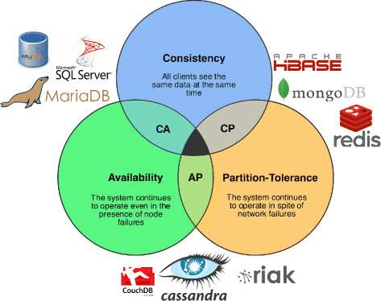

CAP theorem describes a hard constraint on any distributed data system: when the network partitions (some nodes can't talk to others), you must choose between Consistency and Availability — you cannot have both. It's not a design preference to weigh casually; it's a proof about what's physically possible when messages between nodes can be delayed or lost.

## 1. The Three Properties



| Property | Meaning |
| --- | --- |
| Consistency (C) | Every read receives the most recent write, or an error — never stale data |
| Availability (A) | Every request receives a (non-error) response — but not guaranteed to be the most recent write |
| Partition tolerance (P) | The system keeps operating despite network messages being dropped or delayed between nodes |

The theorem's actual claim is narrower than "pick any 2 of 3" — partitions are a fact of distributed networks, not a choice you get to opt out of. A single-node database trivially has C and A because it has no network to partition in the first place; the theorem only bites once you replicate data across multiple nodes. So the real choice a distributed system faces is: **when a partition happens, do you sacrifice Consistency or Availability?** P isn't the third option on the table — it's the precondition that forces the other two into conflict.

## 2. Why You Can't Have Both C and A During a Partition

Imagine two replicas, A and B, holding the same record, and the network link between them just dropped.

- A client writes a new value to replica A.
- A network partition means replica A cannot tell replica B about this write.
- Another client immediately reads from replica B.

Replica B now has exactly two options:
1. **Return its old value** — the read succeeds (Availability preserved), but it's stale (Consistency broken).
2. **Refuse to answer** until it can confirm it has the latest data — Consistency preserved, but the request gets an error or times out (Availability broken).

There is no third option that gives a fresh, correct answer from a node that has no way to know what happened on the other side of a broken network link. This is the entire theorem in one concrete scenario — everything else is elaboration on which side different systems pick, and how.

## 3. CP vs. AP — How Real Systems Choose

| Choice | Behavior during a partition | Example systems |
| --- | --- | --- |
| CP (Consistency + Partition tolerance) | Refuses or delays requests on the minority/disconnected side rather than risk returning stale data | Traditional RDBMS with synchronous replication, MongoDB (default config), HBase, ZooKeeper, etcd |
| AP (Availability + Partition tolerance) | Keeps responding on both sides of the partition, accepting that different nodes may briefly disagree | Cassandra, DynamoDB (default config), CouchDB |

Neither choice is universally correct — it depends on what the data represents. A bank ledger balance leans CP (a stale balance risking a double-spend is worse than a temporary error). A social media "like" counter leans AP (briefly showing 4,102 instead of 4,103 likes is harmless, but the feature going down entirely is a worse user experience than a stale number).

## 4. It's a Per-Operation Choice, Not a Database-Wide Label

The common mistake is treating "is this database CP or AP" as a fixed trivia fact about a technology. In practice, most systems let you tune the tradeoff per read or write, not just once at the database level.

```java
// DynamoDB Enhanced Client — the same table, two different consistency choices per read
GetItemEnhancedRequest strongRead = GetItemEnhancedRequest.builder()
    .key(key)
    .consistentRead(true) // pay extra latency, always see the latest committed write
    .build();

GetItemEnhancedRequest eventualRead = GetItemEnhancedRequest.builder()
    .key(key)
    .consistentRead(false) // default — faster, cheaper, might return slightly stale data
    .build();
```

The practical question is never "is DynamoDB CP or AP" — it's "for this specific read, can my business logic tolerate briefly-stale data, or does it need a guaranteed-current one?" A dashboard showing order counts can use an eventual read; the code confirming inventory is still in stock right before charging a card cannot.

## 5. PACELC — CAP's Missing Half

CAP only describes behavior *during a partition*, but partitions are rare — most of the time, the network is fine, and there's still a tradeoff: latency vs. consistency. PACELC extends the theorem to cover this: **if Partition, choose Availability or Consistency; Else (normal operation), choose Latency or Consistency.**

| System | During partition (PA/PC) | Normal operation (EL/EC) |
| --- | --- | --- |
| DynamoDB, Cassandra | PA — stays available, may return stale data | EL — favors low latency over waiting for all replicas to confirm |
| MongoDB (default), traditional RDBMS with sync replication | PC — refuses rather than risk staleness | EC — waits for enough replicas to acknowledge before confirming a write, trading latency for consistency |

This matters because a system's *everyday* latency/consistency tradeoff (how many replicas must acknowledge a write before it's confirmed) is a decision made constantly, not just during the rare partition event — and it's often the more consequential one for day-to-day application behavior.

## 6. Consistency Is a Spectrum, Not a Boolean

"Consistency" in CAP is really a family of possible guarantees, each a different point on a spectrum between fully strict and fully relaxed:

| Model | Guarantee |
| --- | --- |
| Strong consistency | Every read sees the most recent write, system-wide, immediately |
| Read-your-own-writes | A client always sees its own prior writes, even if other clients might briefly see stale data |
| Causal consistency | Operations that are causally related (a comment posted after reading a message) are seen in the correct order by everyone; unrelated operations may reorder |
| Eventual consistency | Given enough time with no new writes, all replicas converge to the same value — but offers no guarantee about *when* |

This is the same read-your-own-writes concept already relevant to session management and to how a CQRS read model lags behind its write model — CAP's "C" and a system's actual, chosen consistency model are related but not identical: a system can be "AP" under CAP while still offering read-your-own-writes as a middle-ground guarantee for its own clients.

## 7. Best Practices

| Practice | Recommendation |
| --- | --- |
| Treat P as given, not optional | Any system with more than one node over a real network must handle partitions — the actual choice is what happens to C or A when one occurs. |
| Choose CP vs. AP per data type, not once for the whole system | A financial balance and a "like" counter have opposite risk profiles for staleness vs. unavailability. |
| Ask "can this read tolerate staleness," not "is this database CP or AP" | Most systems let you tune consistency per operation (e.g., DynamoDB's consistent vs. eventual reads) — the label is not fixed. |
| Consider PACELC alongside CAP | The latency/consistency tradeoff during normal operation happens far more often than an actual network partition. |
| Don't conflate CAP's "C" with your application's consistency model | Read-your-own-writes, causal consistency, and eventual consistency are distinct, chooseable guarantees layered on top of the CAP tradeoff. |
| Document which consistency guarantee each critical read actually needs | Makes the tradeoff an explicit, reviewable decision instead of an accidental default. |
