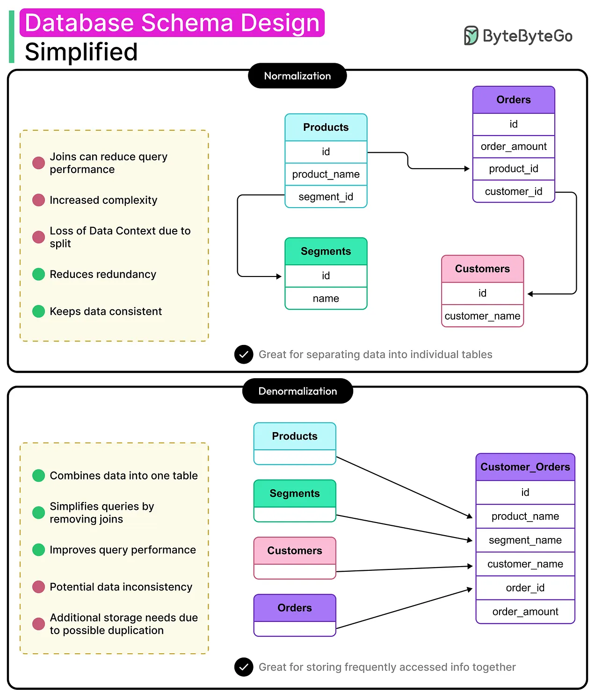
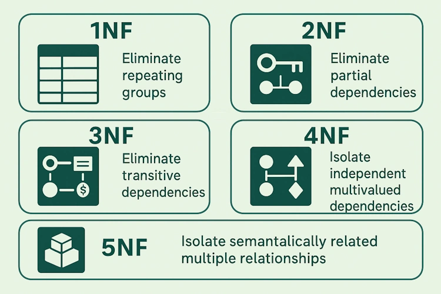

# Database Normalization

|                                                |                                 |
| ---------------------------------------------- | ------------------------------- |
|  |  |

Structure your thinking around the core engineering trade-off: **reducing data redundancy and avoiding data anomalies at the cost of query performance (`JOIN` operations).**

## 1. The 30-Second "Elevator Pitch"

> "Database normalization is a systematic approach to designing relational schemas to eliminate data redundancy and prevent data anomalies—specifically insertion, update, and deletion anomalies. We do this by breaking large, flat tables into smaller, linked tables. While it keeps data clean and consistent, higher normal forms require more `JOIN` operations, which can impact read performance."

---

## 2. The Core Normal Forms (1NF → 3NF & BCNF)

Walk through the first three normal forms using a simple real-world example, such as an **Orders** table.

### Unnormalized Table (Raw Data)

| OrderID | CustomerName | CustomerAddress | PurchasedItems  |
| :------ | :----------- | :-------------- | :-------------- |
| **101** | Alice        | NYC             | "Laptop, Mouse" |

---

### First Normal Form (1NF): Atomic Values & Key Selection

- **The Rule:** Each column must hold atomic (indivisible) values, and each record must be unique (requires a Primary Key).
- **Fixing the table:** Split multi-valued attributes like `"Laptop, Mouse"` into individual rows.

| OrderID | CustomerName | CustomerAddress | Item       |
| :------ | :----------- | :-------------- | :--------- |
| **101** | Alice        | NYC             | **Laptop** |
| **101** | Alice        | NYC             | **Mouse**  |

_Composite Primary Key:_ `(OrderID, Item)`

---

### Second Normal Form (2NF): No Partial Dependencies

- **The Rule:** Must be in 1NF, and **every non-key column must depend on the _entire_ Primary Key**, not just part of it.
- **The Problem:** `CustomerName` and `CustomerAddress` depend only on `OrderID`, not on `Item`. If Alice orders 10 items, her name and address are duplicated 10 times.
- **Fixing the table:** Move customer information to a separate table.

**`Orders` Table:**

| OrderID | Item   |
| :------ | :----- |
| 101     | Laptop |
| 101     | Mouse  |

**`CustomerOrders` Table:**

| OrderID | CustomerName | CustomerAddress |
| :------ | :----------- | :-------------- |
| 101     | Alice        | NYC             |

---

### Third Normal Form (3NF): No Transitive Dependencies

- **The Rule:** Must be in 2NF, and **no non-key column can depend on another non-key column** (i.e., if $A \rightarrow B$ and $B \rightarrow C$, then $C$ transitively depends on $A$).
- **The Problem:** In our `CustomerOrders` table, `CustomerAddress` depends on `CustomerName` (or `CustomerID`), which in turn depends on `OrderID`. `CustomerAddress` is transitively dependent on `OrderID`.
- **Fixing the table:** Split into three distinct entities:

**`OrderItems` Table:**

- Primary Key: `(OrderID, ItemID)`

**`Orders` Table:**

- Primary Key: `OrderID`
- Foreign Key: `CustomerID`

**`Customers` Table:**

- Primary Key: `CustomerID`
- Attributes: `CustomerName`, `CustomerAddress`

---

### Boyce-Codd Normal Form (BCNF): "Strict 3NF"

- **The Rule:** For every functional dependency $X \rightarrow Y$, $X$ must be a **super key**.
- **Context:** BCNF handles rare edge cases where a table is in 3NF but has **multiple overlapping composite candidate keys**. You rarely need to derive BCNF on a whiteboard, but knowing that it addresses complex multi-candidate key scenarios demonstrates deep understanding.

---

## 3. High-Yield Topics

### The Three Data Anomalies

You might ask: _"What actually goes wrong if we don't normalize?"_

1. **Insertion Anomaly:** You cannot add a new customer's address until they place an actual order (because `OrderID` is required as a key).
2. **Update Anomaly:** If Alice updates her address, you have to update multiple rows. Missing a single row leads to inconsistent data across the system.
3. **Deletion Anomaly:** If Alice cancels her only order, deleting that row accidentally wipes out her entire profile data.

---

### Normalization vs. Denormalization (The Trade-Off)

| Aspect                     | Normalized (3NF / BCNF)                    | Denormalized                           |
| :------------------------- | :----------------------------------------- | :------------------------------------- |
| **Primary Goal**           | Data integrity & consistency               | Read query performance                 |
| **Storage Cost**           | Lower (no repeated text/data)              | Higher (redundant fields)              |
| **Writes (INSERT/UPDATE)** | Fast and safe (single row affected)        | Slower (updates spread across tables)  |
| **Reads (SELECT)**         | Slower (requires multiple `JOIN`s)         | Faster (pre-aggregated / flat reads)   |
| **Primary Use Case**       | **OLTP** (Transactional / Production Apps) | **OLAP** (Data Warehouses / Analytics) |

---

## 4. Practical Denormalization Example

A real-world scenario where denormalization is preferred over strict 3NF.

### Scenario: High-Read E-Commerce Product Catalog

Consider an e-commerce platform displaying a feed of products along with their seller's name and total review count.

#### Normalized Approach (3NF):

To fetch a feed of 20 products, you must query across three distinct normalized tables:

```sql
SELECT
    p.product_id,
    p.product_name,
    p.price,
    s.seller_name,
    COUNT(r.review_id) AS total_reviews
FROM products p
JOIN sellers s ON p.seller_id = s.seller_id
LEFT JOIN reviews r ON p.product_id = r.product_id
GROUP BY p.product_id, s.seller_name;
```

- **The Bottleneck:** Aggregating `COUNT(r.review_id)` and joining across `sellers` on millions of product catalog pageviews creates an unbearable load on read queries.

#### Denormalized Approach:

We consciously introduce duplicate/derived data into the `products` table:

```sql
-- "products" table intentionally violates 3NF by storing derived and redundant fields
ALTER TABLE products
ADD COLUMN seller_name VARCHAR(100), -- Duplicate from Sellers table
ADD COLUMN review_count INT DEFAULT 0; -- Derived/aggregated column
```

Now fetching the homepage feed requires zero joins or aggregations:

```sql
SELECT product_id, product_name, price, seller_name, review_count
FROM products
ORDER BY created_at DESC
LIMIT 20;
```

#### How to manage the trade-off:

1. **Handling Updates:** When a user posts a review, we run an `UPDATE products SET review_count = review_count + 1 WHERE product_id = ?` in a database transaction or background job queue.
2. **Acceptable Risk:** A slight lag in updating `review_count` or rare inconsistency in seller name is a worth-it trade-off for sub-10ms response times on the main landing pages.

## 5. Answering Senior-Level Follow-Ups

When asked: _"When would you intentionally break 3NF?"_

> _"In high-volume OLTP applications or analytical reporting databases, deep normalization forces heavy `JOIN` operations that slow down response times. I would denormalize by introducing intentional redundancy—such as adding `user_name` directly to a `posts` table or keeping a pre-computed `total_orders` column—to avoid expensive aggregations on hot read paths, while managing write consistency using database transactions, triggers, or asynchronous jobs."_
