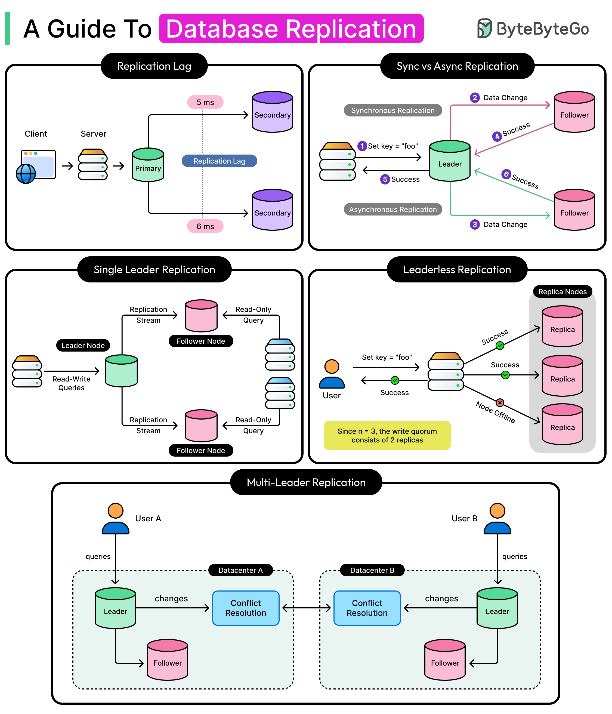

A read replica is a copy of a primary database that continuously applies the primary's changes, so read traffic can be spread across it instead of hitting the primary for every query — this is a fundamentally different problem from sharding (which splits _which data_ lives where); replication instead keeps _the same data_ duplicated and current across multiple instances. The entire practical challenge of running replicas is that "continuously applies changes" is never instantaneous — understanding _how_ replication actually keeps a replica in sync, and what happens in the gap while it catches up, is what this note covers.



## 1. Why Replicate

- **Read scaling**: route read-heavy traffic (reports, dashboards, search) to replicas, freeing the primary's capacity for writes.
- **High availability**: if the primary fails, a replica can be promoted to take over, rather than the whole system going down with the one instance holding all the data.
- **Geographic distribution**: a replica physically closer to a set of users can serve their reads with lower latency than a round trip to a primary in a distant region.

## 2. How Replication Actually Works: Shipping the Write-Ahead Log

Every write to a transactional database is first recorded in a **write-ahead log** (WAL in Postgres, the binary log/binlog in MySQL) before the actual data files are updated — this log is also the mechanism replication reuses: the primary streams its WAL to each replica, and the replica replays those same log entries against its own copy of the data.

```
Primary:  write → append to WAL → apply to data files → (async) stream WAL to replicas
Replica:  receive WAL stream → replay each entry → replica's data files converge toward the primary's state
```

Because a replica is replaying the _exact same sequence of changes_ the primary made (not re-deriving them independently), replication is deterministic and low-overhead compared to, say, re-running the original queries — but it also means a replica is fundamentally always some distance _behind_ the primary, receiving and replaying a stream rather than being updated atomically alongside it.

**Physical vs. logical replication**: physical replication (Postgres streaming replication) ships the WAL essentially byte-for-byte — fast and simple, but the replica must be the same database version and typically replicates the entire instance. Logical replication (Postgres logical decoding, MySQL row-based binlog replication) ships row-level _changes_ instead of raw WAL bytes — more flexible (replicate a subset of tables, replicate across major versions, even replicate into a different kind of consumer entirely, which is exactly the mechanism Change Data Capture pipelines into message queues are built on), at some additional overhead per change.

## 3. Synchronous vs. Asynchronous Replication — The Core Tradeoff

This is the single most consequential replication setting, and it's a direct latency-vs-durability tradeoff, the same shape as the CAP-theorem tradeoff.

| Mode                               | Primary commits when                                                                                                           | Data loss risk if primary fails                                                                 | Write latency impact                                                                                                                                     |
| ---------------------------------- | ------------------------------------------------------------------------------------------------------------------------------ | ----------------------------------------------------------------------------------------------- | -------------------------------------------------------------------------------------------------------------------------------------------------------- |
| Asynchronous (most common default) | The write is durable on the primary alone — replicas catch up independently                                                    | Any writes not yet replicated to a replica are lost if the primary fails before they're shipped | None — replication happens after commit, off the critical path                                                                                           |
| Synchronous                        | The write is durable on the primary AND at least one replica has confirmed receipt                                             | None, for a successfully committed write (RPO = 0)                                              | Every write waits on a network round trip to the replica — directly adds to write latency, and if that replica is unreachable, writes can stall entirely |
| Semi-synchronous                   | A middle ground: primary waits for at least one replica to acknowledge _receipt_ (not necessarily "applied") before committing | Reduced risk relative to fully async, without paying full synchronous latency                   | Small, bounded latency addition                                                                                                                          |

The choice here is a direct instance of the same "can this data tolerate staleness/loss" question already raised for caching CAP — for a core banking ledger entry, synchronous (or at least semi-synchronous) replication to avoid losing a committed transaction is often worth the latency cost; for a read replica serving a public product catalog, asynchronous is usually the obvious right call.

## 4. Replication Lag — What It Is and Why It Happens

Replication lag is the gap between "committed on the primary" and "visible on a given replica" — it's never exactly zero with asynchronous replication, and it can grow under several conditions:

- **Network latency/bandwidth** between primary and replica — a geographically distant replica lags more than a nearby one, all else equal.
- **The replica applying changes slower than the primary generates them** — a replica under its own read load, or with weaker hardware than the primary, can fall behind during a write-heavy burst on the primary.
- **Long-running queries or locks on the replica** — in Postgres specifically, a long-running analytical query on a replica can block WAL replay from proceeding past a conflicting change, causing lag to spike until the query finishes or is cancelled.

```sql
-- Postgres: check replication lag directly on the primary
SELECT client_addr, state, replay_lag FROM pg_stat_replication;

-- Or on the replica itself: how far behind is it, in time
SELECT now() - pg_last_xact_replay_timestamp() AS replication_lag;
```

Lag should be tracked as a first-class metric, with alerting on it the same way you'd alert on p99 latency — a replica silently falling minutes behind is exactly the kind of problem that surfaces later as a confusing "why did this user see stale data" bug report rather than an obvious outage.

## 5. The Read-After-Write Problem

The most common real-world symptom of replication lag: a user writes data through the primary, the request completes successfully, they immediately reload the page — and the read, served from a lagging replica, doesn't yet reflect their own write. This is jarring specifically because it looks like the write silently failed, even though it fully succeeded.

Three practical fixes, in order of how often they're actually used:

**Route the immediately-following read to the primary, not a replica.** The simplest and most common fix — after a write in the same user session/request flow, read the confirmation from the primary rather than a replica, at least for that specific follow-up read.

```java
@Transactional // NOT readOnly — routes to the primary
public Account updateAndReturn(Account account) {
    accountRepository.save(account);
    return accountRepository.findById(account.getId()).orElseThrow(); // read the fresh write from the primary
}
```

**Track a causal watermark and wait for the replica to catch up to it.** More precise, more complex: capture the primary's log position (an LSN in Postgres, a GTID in MySQL) at the moment of the write, and only serve a subsequent read from a replica once that replica's applied position has reached or passed it.

```java
String writeLsn = jdbcTemplate.queryForObject("SELECT pg_current_wal_lsn()", String.class);
// ... later, before reading from a replica ...
boolean replicaCaughtUp = replicaHasAppliedAtLeast(writeLsn); // compare against pg_last_wal_replay_lsn() on the replica
if (!replicaCaughtUp) {
    // fall back to the primary for this specific read, or wait briefly and retry
}
```

**Accept eventual consistency for genuinely tolerant reads.** For data where a few seconds of staleness is fine (a public dashboard, an activity feed not tied to the current user's own action), just always read from a replica and don't attempt read-after-write consistency at all.

## 6. Routing Reads vs. Writes in Spring

The routing mechanism is the same `AbstractRoutingDataSource` technique already used for tenant routing in multi-tenant-core-banking here keyed on whether the current transaction is read-only, rather than on tenant identity.

```java
public class ReadWriteRoutingDataSource extends AbstractRoutingDataSource {
    @Override
    protected Object determineCurrentLookupKey() {
        boolean readOnly = TransactionSynchronizationManager.isCurrentTransactionReadOnly();
        return readOnly ? "replica" : "primary";
    }
}
```

```java
@Bean
public DataSource routingDataSource(DataSource primaryDataSource, DataSource replicaDataSource) {
    ReadWriteRoutingDataSource routingDataSource = new ReadWriteRoutingDataSource();
    routingDataSource.setTargetDataSources(Map.of("primary", primaryDataSource, "replica", replicaDataSource));
    routingDataSource.setDefaultTargetDataSource(primaryDataSource); // fail safe toward the primary, not a replica
    return new LazyConnectionDataSourceProxy(routingDataSource); // defers the actual connection choice until first use
}
```

```java
@Transactional(readOnly = true) // routes to a replica
public List<Account> searchAccounts(String query) { ... }

@Transactional // routes to the primary
public void updateAccount(Account account) { ... }
```

`@Transactional(readOnly = true)` is doing double duty here: it's both a correctness signal and, via this routing setup, the actual mechanism selecting which physical database serves the query. `LazyConnectionDataSourceProxy` matters because it defers picking the actual connection until a statement is executed — without it, a connection could be grabbed before Spring has established whether the surrounding transaction is read-only, defeating the routing logic entirely.

## 7. Failover: What Happens When the Primary Dies

Promoting a replica to become the new primary is the mechanism behind high availability, but it's not automatic by default and has real failure modes if done carelessly.

- **Manual failover**: an operator confirms the primary is actually down (not just temporarily unreachable) and promotes a chosen replica — safest, but slow, and depends on someone being available to act.
- **Automated failover** (Patroni for Postgres, RDS Multi-AZ, Aurora): a coordination layer monitors primary health and automatically promotes a replica — faster recovery, but requires a genuinely reliable failure-detection mechanism, or it risks promoting a replica while the "failed" primary is actually still up and serving writes.
- **Split-brain risk**: if both the old primary and a newly-promoted replica end up accepting writes simultaneously (a network partition that looks like a primary failure from the replica's side, but the primary is actually still running), you get two diverging copies of the data with no single source of truth — the exact failure mode consensus/fencing mechanisms in tools like Patroni exist specifically to prevent, by ensuring only one node can ever hold write authority at a time.

A replica that was lagging at the moment of failover promotes with whatever data it had already replayed — any writes committed on the old primary but not yet shipped to that replica are lost, which is exactly the asynchronous-replication tradeoff manifesting concretely during a failover event, not just a theoretical risk.

## 8. Best Practices

| Practice                                                                           | Recommendation                                                                                                                                    |
| ---------------------------------------------------------------------------------- | ------------------------------------------------------------------------------------------------------------------------------------------------- |
| Choose sync/async replication based on what the data can actually tolerate losing  | A core ledger write and a product-catalog read have very different acceptable data-loss/latency tradeoffs.                                        |
| Monitor replication lag as a first-class metric, with alerting                     | A silently-lagging replica surfaces later as a confusing stale-read bug report rather than an obvious failure.                                    |
| Route the read immediately following a write back to the primary                   | The simplest fix for the read-after-write problem, sufficient for most user-facing flows.                                                         |
| Use `@Transactional(readOnly = true)` deliberately, not by habit                   | It's both a correctness hint and, with routing configured, the actual mechanism selecting primary vs. replica.                                    |
| Prefer automated failover with proper fencing over ad-hoc manual promotion         | A hand-rolled failover without a consensus/fencing mechanism risks a split-brain with two writable primaries.                                     |
| Never assume a freshly-promoted replica has zero data loss under async replication | Any writes not yet shipped at the moment of primary failure are gone — plan for this rather than being surprised by it during an actual incident. |
| Reserve read replicas for genuinely read-heavy or staleness-tolerant workloads     | If a query's result must reflect the very latest write, route it to the primary rather than fighting replication lag.                             |
