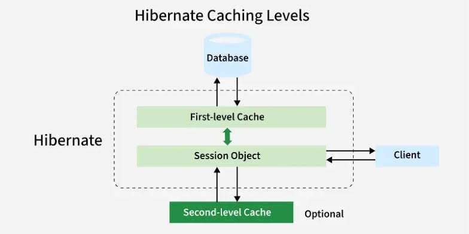

# Levels of Caching in Hibernate

Hibernate uses caching to reduce the number of direct database hits by storing frequently accessed entities in memory. It splits caching into **First-Level Cache (L1)**, **Second-Level Cache (L2)**, and a specialized **Query Cache**.



## 1. First-Level Cache (L1 Cache)

The First-Level cache is the **Session-level cache**. It is enabled by default and mandatory in Hibernate—you cannot disable it.

- **Scope:** Bound to a single `Session` (or transaction thread).
- **Lifetime:** Lives as long as the current `Session` remains open. Once the session is closed via `session.close()`, all cached objects are cleared.
- **How It Works:** When you fetch an entity using `session.get()` or `session.find()`, Hibernate checks the L1 cache. If found, it returns the cached instance without hitting the database. If not found, it queries the DB and stores the retrieved object in L1 before returning it.
- **Data Format:** Stores entity objects directly in memory.
- **Management:** You can manage L1 memory using:
  - `session.evict(entity)`: Removes a specific entity from L1.
  - `session.clear()`: Clears all entities from the current session.

## 2. Second-Level Cache (L2 Cache)

The Second-Level cache is the **SessionFactory-level cache**. It is optional and disabled by default.

- **Scope:** Shared across all sessions managed by the same `SessionFactory` (application-wide).
- **Lifetime:** Persists as long as the application or `SessionFactory` is alive.
- **How It Works:** If a request misses the L1 cache, Hibernate checks L2 before executing a SQL query to the database. If found in L2, the data is assembled into an entity and pushed to the current session's L1 cache.
- **Data Format:** Stores entity data in **disassembled/hydrated state** (key-value maps of primitive fields), not managed Java object instances. This avoids concurrent state mutations between threads.
- **Third-Party Providers:** Requires an external caching framework implementation like **Ehcache**, **Hazelcast**, or **Infinispan**.
- **Configuration:** Must be explicitly enabled in `hibernate.cfg.xml` or application properties:

```properties
hibernate.cache.use_second_level_cache=true
hibernate.cache.region.factory_class=org.hibernate.cache.jcache.JCacheRegionFactory
```

Entities must be annotated with `@Cacheable` or `@Cache`:

```java
@Entity
@Cacheable
@org.hibernate.annotations.Cache(usage = CacheConcurrencyStrategy.READ_WRITE)
public class Product {
    @Id
    @GeneratedValue
    private Long id;
    private String name;
    private Double price;
}
```

### L2 Cache Concurrency Strategies

Depending on how your data changes, you choose one of four concurrency strategies for L2:

1. **`READ_ONLY`:** For static/lookup data that never changes (fastest).
2. **`READ_WRITE`:** For data frequently read and updated, using locks to prevent dirty reads.
3. **`NONSTRICT_READ_WRITE`:** For data rarely updated where slight consistency delays are acceptable.
4. **`TRANSACTIONAL`:** For strict ACID compliance using JTA transactions (requires JTA provider).

---

## 3. Query Cache

The Query Cache is a specialized layer built on top of the L2 cache. While L1 and L2 cache entities by their primary key (ID), Query Cache handles the results of whole HQL / JPQL queries.

- **Scope:** Application-wide (requires L2 cache to be active).
- **How It Works:** It caches the **IDs** returned by a query rather than the actual entity objects. When the same query is executed again with identical parameters:
  1. Query Cache returns the list of matching entity IDs.
  2. Hibernate uses those IDs to load the actual objects from the L2/L1 cache.
- **Configuration:**

```properties
hibernate.cache.use_query_cache=true
```

Must also be explicitly requested per query:

```java
List<Product> products = session.createQuery("FROM Product p WHERE p.category = :cat", Product.class)
                                .setParameter("cat", "Electronics")
                                .setCacheable(true)
                                .getResultList();
```

---

## Comparison Summary

| Feature        | First-Level (L1)      | Second-Level (L2)              | Query Cache               |
| :------------- | :-------------------- | :----------------------------- | :------------------------ |
| **Scope**      | Session / Transaction | SessionFactory / App           | SessionFactory / App      |
| **Status**     | Mandatory (Always On) | Optional (Disabled by default) | Optional (Requires L2)    |
| **Lookups By** | Entity ID             | Entity ID                      | Query String + Parameters |
| **Stores**     | Java Entity Objects   | Disassembled Data Pairs        | List of Entity IDs        |
| **Provider**   | Hibernate Core        | External (Ehcache, Hazelcast)  | Built on L2 Provider      |
