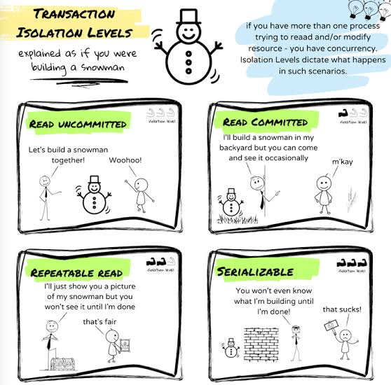
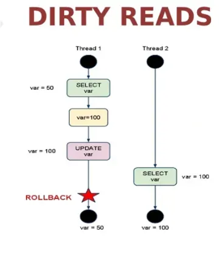
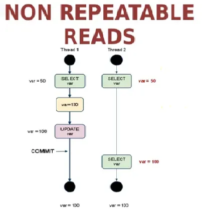
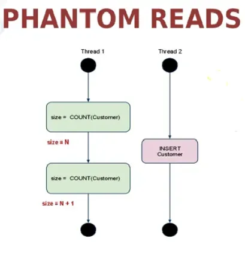

# Database Concurrency & Isolation Levels Guide

When multiple database transactions execute simultaneously, concurrent read and write operations can lead to data inconsistency. Database management systems (DBMS) resolve these issues through defined **Isolation Levels**, which use locking mechanisms or Multi-Version Concurrency Control (MVCC) to manage race conditions.

---

## 1. The 3 Classic Concurrency Problems

### 1. Dirty Read -> Read Committed (solution)

A **Dirty Read** occurs when Transaction A reads data that has been modified by Transaction B, but **Transaction B has not yet committed**. If Transaction B subsequently fails and rolls back, the data read by Transaction A never officially existed in the database.

- **Scenario:**
  1. Transaction A updates a account balance from `$100` to `$200`.
  2. Transaction B reads the balance as `$200`.
  3. Transaction A encounters an error and executes a `ROLLBACK` (balance reverts to `$100`).
  4. Transaction B calculates interest based on `$200`, producing corrupt results.

---

### 2. Non-Repeatable Read (Fuzzy Read)

A **Non-Repeatable Read** occurs when a transaction reads the exact same row twice during its execution, but **retrieves different values** because another transaction modified and committed that row between the two reads.

- **Scenario:**
  1. Transaction A reads User 42 (`Status = 'Active'`).
  2. Transaction B updates User 42 (`Status = 'Inactive'`) and commits.
  3. Transaction A re-reads User 42 and now receives `Status = 'Inactive'`.

---

### 3. Phantom Read

A **Phantom Read** occurs when a transaction executes a range query (e.g., `WHERE age > 30`), and upon re-running the identical query later in the same transaction, **finds new rows inserted or previously matching rows deleted** by another committed transaction.

- **Difference from Non-Repeatable Read:**
  - _Non-Repeatable Read:_ An **existing single row** changes its data values.
  - _Phantom Read:_ The **number of rows** returned by a search filter changes due to `INSERT` or `DELETE` operations.

---

## 2. ANSI SQL Isolation Levels Matrix

The ANSI/ISO SQL standard defines four isolation levels. Higher levels provide stricter consistency guarantees by preventing more concurrency anomalies, typically at the cost of lower throughput and higher locking overhead.

| Isolation Level      |    Dirty Read    | Non-Repeatable Read |   Phantom Read   |
| :------------------- | :--------------: | :-----------------: | :--------------: |
| **Read Uncommitted** |    ❌ Allowed    |     ❌ Allowed      |    ❌ Allowed    |
| **Read Committed**   | ✅ **Prevented** |     ❌ Allowed      |    ❌ Allowed    |
| **Repeatable Read**  | ✅ **Prevented** |  ✅ **Prevented**   |   ❌ Allowed\*   |
| **Serializable**     | ✅ **Prevented** |  ✅ **Prevented**   | ✅ **Prevented** |

> **Note:** Modern engines (like PostgreSQL) prevent Phantom Reads even at `Repeatable Read` level through Multi-Version Concurrency Control (MVCC / Snapshot Isolation), going beyond the strict ANSI specification.

---

## 3. Detailed Level Behaviors

### Read Uncommitted

- **Mechanism:** Queries do not acquire shared locks and read the latest version of data in memory, regardless of transaction status.
- **Use Case:** Read-heavy reporting queries where extreme execution speed is required and data accuracy is non-critical.

### Read Committed

- **Mechanism:** Ensures queries only read data that was committed prior to the query's start time. Prevents **Dirty Reads**.
- **Default for:** PostgreSQL, Oracle Database, SQL Server.

### Repeatable Read

- **Mechanism:** Guarantees that any row read by a transaction during its execution remains unchanged throughout that transaction's scope.
- **Default for:** MySQL (InnoDB).

### Serializable

- **Mechanism:** Completely isolates transactions from one another by enforcing sequential execution or using optimistic concurrency control (SSI) to cancel transactions that violate serializability. Prevents all concurrency anomalies (including Phantom Reads and Write Skew).
