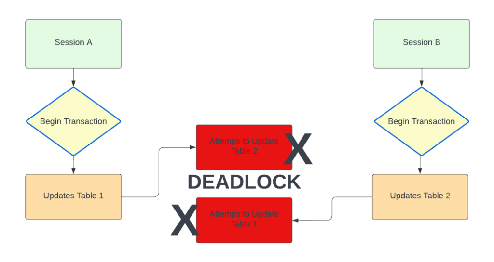
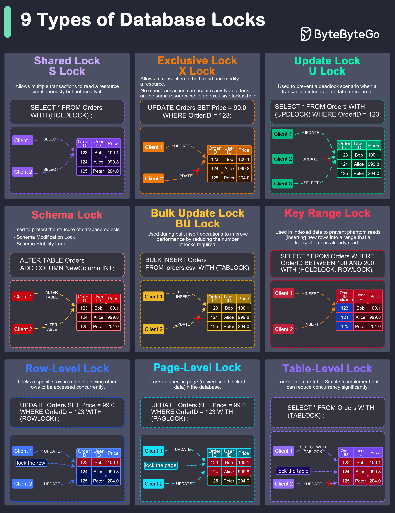

# Mitigating Row/Table-Level Lock Contention

**Lock contention** occurs in relational databases when multiple concurrent transactions attempt to access or modify the same database resource (either an individual row or an entire table) using mutually exclusive lock modes. When one transaction holds an exclusive lock on a resource, all other transactions requesting access must pause and wait in a queue until the lock is released.





**Shared Lock (S Lock)**

It allows multiple transactions to read a resource simultaneously but not modify it. Other transactions can also acquire a shared lock on the same resource.

**Exclusive Lock (X Lock)**

It allows a transaction to both read and modify a resource. No other transaction can acquire any type of lock on the same resource while an exclusive lock is held.

**Update Lock (U Lock)**

It is used to prevent a deadlock scenario when a transaction intends to update a resource.

**Schema Lock**

It is used to protect the structure of database objects.

**Bulk Update Lock (BU Lock)**

It is used during bulk insert operations to improve performance by reducing the number of locks required.

**Key-Range Lock**

It is used in indexed data to prevent phantom reads (inserting new rows into a range that a transaction has already read).

**Row-Level Lock**

It locks a specific row in a table, allowing other rows to be accessed concurrently.

**Page-Level Lock**

It locks a specific page (a fixed-size block of data) in the database.

**Table-Level Lock**

It locks an entire table. This is simple to implement but can reduce concurrency significantly.

---

## Row-Level vs. Table-Level Lock Contention

| Feature                | Row-Level Lock Contention                                                                                                                                                         | Table-Level Lock Contention                                                                                                                     |
| :--------------------- | :-------------------------------------------------------------------------------------------------------------------------------------------------------------------------------- | :---------------------------------------------------------------------------------------------------------------------------------------------- |
| **Scope**              | Locks specific records (`UPDATE users WHERE id = 42`).                                                                                                                            | Locks the entire table (`ALTER TABLE`, `TRUNCATE`, bulk updates without indexes).                                                               |
| **Concurrency Impact** | **Localized:** High concurrency for non-overlapping rows, but bottlenecks occur when many workers target the exact same row (e.g., updating a global counter or inventory stock). | **System-wide:** Complete blockage of all reads/writes to the entire table for all other transactions.                                          |
| **Overhead**           | Higher memory overhead for the database engine to track thousands of individual locks.                                                                                            | Minimal engine memory overhead (only one lock state tracked for the entire table).                                                              |
| **Common Triggers**    | High-frequency update hotspots, long-running transactions holding update locks, or unindexed foreign keys.                                                                        | DDL schema updates, explicit `LOCK TABLE` commands, or database lock escalation (e.g., SQL Server escalating many row locks into a table lock). |

---

## Primary Causes of Lock Contention

1. **Hotspots (High-Frequency Writes):** Hundreds of API requests trying to update the same row simultaneously (e.g., decrementing inventory during a flash sale or updating account balance).
2. **Long-Running Transactions:** Holding locks open while doing non-database work (network calls, external API requests, heavy application compute) before committing.
3. **Missing Indexes (Sequential Scans):** Running an `UPDATE` or `DELETE` query without an index forces the database engine to scan and lock far more rows than intended (or lock the entire table/range).
4. **Lock Escalation:** Systems like SQL Server automatically convert thousands of fine-grained row/page locks into a single coarse table lock to save memory when a transaction modifies large datasets.
5. **Inconsistent Access Ordering:** Updating multiple rows in different orders across concurrent transactions (Transaction A updates Row 1 then Row 2; Transaction B updates Row 2 then Row 1), causing lock waits or deadlocks.

---

## Mitigation Strategies

### 1. Optimize Transaction Scope

- **Keep Transactions Short:** Perform network calls, image processing, or external service queries _before_ opening a database transaction.
- **Defer Lock Acquisition:** Place `UPDATE` or `DELETE` operations at the very end of a transaction block right before `COMMIT` to minimize lock duration.

### 2. Design Around Hotspots

- **Sharding / Counter Partitioning:** Instead of updating a single row (e.g., `likes = likes + 1`), write increments to $N$ separate rows (`like_counters` table with randomly assigned IDs 1–10) and sum them when reading.
- **Asynchronous Queueing:** Push high-volume counter/inventory updates to a message queue (Kafka/RabbitMQ) or Redis, applying batch updates to the database periodically.

### 3. Application-Level Locking Patterns

- **Optimistic Locking:** Avoid database-level locks for low-conflict scenarios. Use a `version` column:
  ```sql
  UPDATE products
  SET stock = stock - 1, version = version + 1
  WHERE id = 101 AND version = 5;
  ```
  If zero rows are updated, retry the application loop.
- **Skip Locked Rows (Queue Processing):** Use `FOR UPDATE SKIP LOCKED` in PostgreSQL or MySQL when fetching job queues to prevent workers from blocking each other on the same rows:
  ```sql
  SELECT * FROM tasks
  WHERE status = 'pending'
  LIMIT 1
  FOR UPDATE SKIP LOCKED;
  ```

### 4. Database Indexing & Engine Tuning

- **Index Query Filters:** Ensure every `WHERE` clause in `UPDATE` and `DELETE` statements hits a targeted index so the engine locks only the required rows.
- **Index Foreign Keys:** Ensure foreign key columns are indexed to avoid table-level share locks on parent/child operations.
- **Use Read Committed / Snapshot Isolation:** Utilize Multi-Version Concurrency Control (MVCC) or `READ_COMMITTED_SNAPSHOT` so read queries do not block write queries and vice versa.
