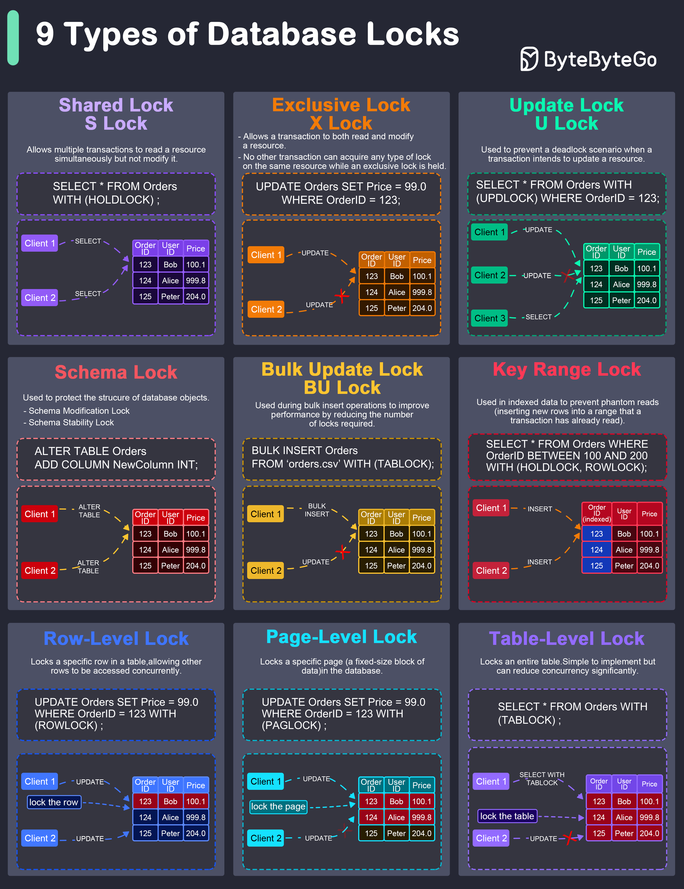

**Shared Lock (S Lock)**

It allows multiple transactions to read a resource simultaneously but not modify it. Other transactions can also acquire a shared lock on the same resource.

**Exclusive Lock (X Lock)**

It allows a transaction to both read and modify a resource. No other transaction can acquire any type of lock on the same resource while an exclusive lock is held.

**Update Lock (U Lock)**

It is used to prevent a deadlock scenario when a transaction intends to update a resource.

**Schema Lock**

It is used to protect the structure of database objects.

**Bulk Update Lock (BU Lock)**

It is used during bulk insert operations to improve performance by reducing the number of locks required.

**Key-Range Lock**

It is used in indexed data to prevent phantom reads (inserting new rows into a range that a transaction has already read).

**Row-Level Lock**

It locks a specific row in a table, allowing other rows to be accessed concurrently.

**Page-Level Lock**

It locks a specific page (a fixed-size block of data) in the database.

**Table-Level Lock**

It locks an entire table. This is simple to implement but can reduce concurrency significantly.
