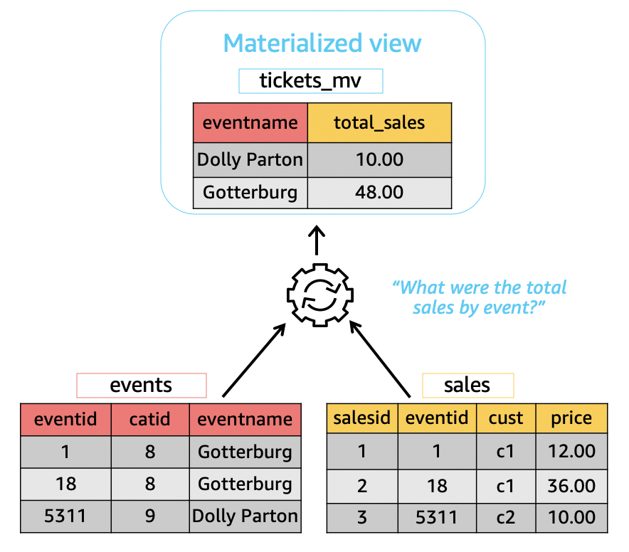
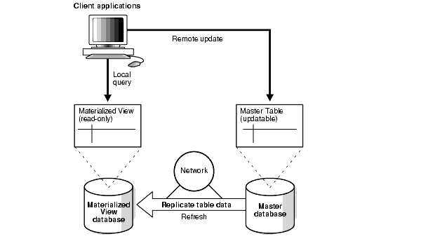

# Materialized Views

|                                    |                                         |
| ---------------------------------- | --------------------------------------- |
|  |  |

## 1. Executive Summary & "Elevator Pitch"

> **Standard View vs. Materialized View:**  
> A **standard view** is a saved SQL query that dynamically executes against base tables every time it is called.  
> A **materialized view (MV)** physically computes and stores the query results on disk like a standard table. It trades storage space and instant data freshness for extremely fast, low-latency read performance on complex joins and heavy aggregations.

---

## 2. Core Comparison

| Feature            | Standard View                      | Materialized View                                 |
| :----------------- | :--------------------------------- | :------------------------------------------------ |
| **Storage**        | 0 Bytes (Virtual / Logic only)     | Occupies **physical disk space**                  |
| **Query Speed**    | Slow on complex joins/aggregations | **Extremely Fast** (reads pre-computed disk data) |
| **Data Freshness** | 100% Real-Time                     | Asynchronous (Stale until refreshed)              |
| **Write Overhead** | None                               | Requires background computation on refresh        |
| **Indexing**       | Cannot be indexed directly         | **Can be indexed** (e.g., B-Tree, GIN)            |

---

## 3. Real-World Case Study: E-Commerce Analytics Dashboard

### Scenario

An e-commerce seller dashboard needs to display: **"Total Sales & Units Sold Per Category for the Past 30 Days."**

### Base Tables

- `orders` (10,000,000 rows)
- `order_items` (30,000,000 rows)
- `products` (100,000 rows)

---

### Approach A: Dynamic On-the-Fly Query (No MV)

```sql
-- Executed directly against transactional tables on every dashboard load:
SELECT
    p.category_name,
    COUNT(DISTINCT o.id) AS total_orders,
    SUM(oi.quantity) AS total_units_sold,
    SUM(oi.price * oi.quantity) AS total_revenue
FROM orders o
JOIN order_items oi ON o.id = oi.order_id
JOIN products p ON oi.product_id = p.id
WHERE o.order_date >= NOW() - INTERVAL '30 days'
  AND o.status = 'COMPLETED'
GROUP BY p.category_name;
```

- **Problem:** Scans over 40 million rows per request, taking **~3.5 seconds** and spiking CPU during peak traffic.

---

### Approach B: Materialized View Solution

#### 1. Definition

```sql
CREATE MATERIALIZED VIEW mv_monthly_category_sales AS
SELECT
    p.category_name,
    COUNT(DISTINCT o.id) AS total_orders,
    SUM(oi.quantity) AS total_units_sold,
    SUM(oi.price * oi.quantity) AS total_revenue
FROM orders o
JOIN order_items oi ON o.id = oi.order_id
JOIN products p ON oi.product_id = p.id
WHERE o.order_date >= NOW() - INTERVAL '30 days'
  AND o.status = 'COMPLETED'
GROUP BY p.category_name;

-- Add a unique index to enable CONCURRENT refreshes
CREATE UNIQUE INDEX idx_mv_cat_sales_name
ON mv_monthly_category_sales (category_name);
```

#### 2. Dashboard Query

```sql
-- Fast lookup directly against the materialized view:
SELECT *
FROM mv_monthly_category_sales;
```

#### 3. Performance Metrics

| Metric                | On-the-Fly Query    | Materialized View               |
| :-------------------- | :------------------ | :------------------------------ |
| **Execution Time**    | ~3,500 ms (3.5s)    | **~4 ms** (~875x faster)        |
| **Rows Scanned**      | ~40,000,000 rows    | **~50 rows** (1 per category)   |
| **DB Resource Usage** | High CPU & High I/O | Negligible I/O                  |
| **Data Freshness**    | 100% Real-Time      | Lag depends on refresh schedule |

---

## 4. Refresh Strategies

When asked _"How do you handle data staleness?"_, present these three primary refresh patterns:

### 1. Full Refresh (Scheduled)

- **Mechanism:** Completely recalculates the dataset from scratch using a cron job, Airflow, or database scheduler.
- **PostgreSQL Example:**
  ```sql
  -- Refreshes in background without locking concurrent READ queries
  REFRESH MATERIALIZED VIEW CONCURRENTLY mv_monthly_category_sales;
  ```
- **Pros:** Simple to implement, guarantees clean state.
- **Cons:** Computationally expensive during execution.

### 2. Incremental / Fast Refresh

- **Mechanism:** Uses transaction logs or delta tracking tables to capture only rows that changed (`INSERT`/`UPDATE`/`DELETE`) since the last refresh.
- **Pros:** Low CPU and memory overhead during execution.
- **Cons:** Complex configuration; limited to queries supported by delta tracking.

### 3. Trigger-Based / On-Commit

- **Mechanism:** Automatically updates the materialized view during the same transaction block when base tables commit writes.
- **Pros:** Provides near real-time data freshness.
- **Cons:** Increases write latency on transactional tables and risks table locks.

---

## 5. Architectural Trade-Offs & Alternatives

Highlight when to use alternatives over database Materialized Views:

- **Redis / Memcached:** Better for sub-millisecond, highly volatile application-level caching, but requires manual cache invalidation and sits outside ACID transactional boundaries.
- **Read Replicas:** Scales general read traffic across primary tables, but does **not** pre-compute expensive multi-table aggregations.
- **OLAP / Data Warehouses (e.g., ClickHouse, Snowflake):** Ideal when analytical aggregations exceed tens of millions of rows, avoiding load on operational OLTP databases.
