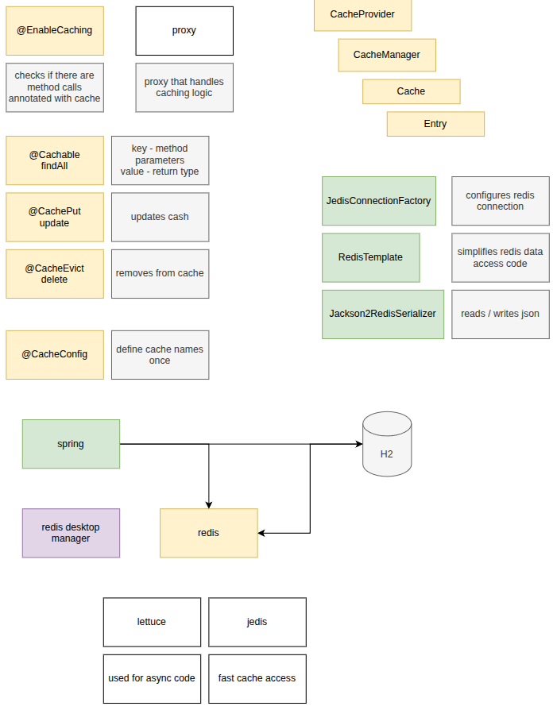

# Core Concepts of Spring Cache

Spring Cache provides an abstraction that transparently applies caching to Java methods, reducing the number of executions by storing the results of expensive or frequent calls.

## 1. Cache Abstraction Layer

Spring does not implement a caching engine itself. Instead, it acts as an **abstraction layer** (a wrapper) that integrates with popular caching providers like EhCache, Caffeine, Hazelcast, Redis, or even a simple in-memory `ConcurrentMapCache`. This means you can switch your caching backend without changing your business logic.

---

## 2. Declarative Annotations

Spring Cache relies heavily on AOP (Aspect-Oriented Programming) and Java annotations to manage cache operations transparently. The primary annotations include:

- **`@Cacheable`**: Declares that the result of a method can be cached. When the method is invoked, Spring checks if the result is already in the cache. If it is, the cached value is returned without executing the method body.
- **`@CachePut`**: Executes the method and puts its result into the cache, regardless of whether a cached entry already exists. Useful for update or insert operations.
- **`@CacheEvict`**: Removes one or more entries from the cache (e.g., clearing stale data after an update or delete operation).
- **`@Caching`**: Allows grouping multiple caching annotations of the same or different types (e.g., multiple `@CacheEvict`) on a single method.
- **`@CacheConfig`**: A class-level annotation that allows you to share common cache configurations (like the cache name) across all methods in a given class.

---

## 3. Cache Manager (`CacheManager`)

The `CacheManager` is the central interface in Spring's caching architecture. It is responsible for managing and locating `Cache` instances. Depending on your configuration, Spring will auto-configure a specific implementation (such as `ConcurrentMapCacheManager` for simple local caching or `RedisCacheManager` for distributed caching).

---

## 4. Cache Names & Keys

- **Cache Name:** Every cached item belongs to a specific cache, usually identified by a string name defined in the annotations (e.g., `@Cacheable("users")`). Think of this as a table or bucket.
- **Cache Key:** Within a cache, individual entries are stored using a key. By default, Spring uses a **SimpleKeyGenerator** that evaluates the method parameters (e.g., if a method takes an `id` parameter, that `id` becomes the key). You can customize keys using **SpEL (Spring Expression Language)** via the `key` attribute (e.g., `@Cacheable(value="users", key="#user.id")`).

---

## 5. Conditional Caching

Spring allows you to control _when_ caching should happen using SpEL expressions:

- **`condition`**: Evaluated **before** the method invocation to decide whether to check the cache (e.g., `@Cacheable(value="books", condition="#isbn.length() < 10")`).
- **`unless`**: Evaluated **after** the method invocation to decide whether to store the result in the cache (e.g., `@Cacheable(value="users", unless="#result == null")`).

---

> **Important Caveat:**
> Spring Cache operates via proxies. For caching to work, methods annotated with cache annotations must be invoked **externally** (from another Spring bean). Self-invocation (calling a cached method from within the same class) bypasses the Spring proxy and will not trigger caching.
