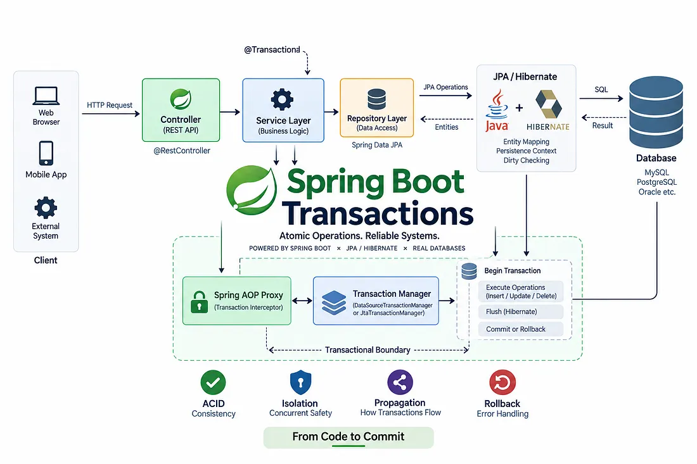

# Spring Boot Transactions Explained: `@Transactional`, Isolation, Propagation, Rollbacks, and the Bugs



## 1. How `@Transactional` Works Under the Hood

Spring’s transaction management relies on **Aspect-Oriented Programming (AOP)** and **Dynamic Proxies** (either CGLIB or JDK Dynamic Proxies).

When Spring boots up, it scans for classes and methods marked with `@Transactional`. Instead of instantiating your raw service directly, Spring wraps your bean inside a **Proxy**.

### The Proxy Flow

```
[ Client Call ]
       │
       ▼
[ Spring Proxy Object ]
       │
       ├─► 1. Open / Fetch Connection from DataSource
       ├─► 2. Set autoCommit = false
       ├─► 3. Bind Connection to Current Thread (ThreadLocal)
       │
       ▼
[ Actual Service Method Execution ]
       │
       ├─► Success?
       │      └─► Commit Transaction
       │
       └─► Exception Thrown?
              └─► Check Rollback Rules ──► Rollback / Commit
```

1. **Invocation**: When an external class calls a `@Transactional` method, it calls the **proxy**, not your actual bean instance.
2. **Transaction Interceptor**: The proxy delegates to a `TransactionInterceptor` which interacts with the `PlatformTransactionManager` (e.g., `JpaTransactionManager` or `DataSourceTransactionManager`).
3. **Connection Binding**: The transaction manager acquires a database connection from the connection pool (like HikariCP), sets `autoCommit = false`, and binds this connection to the **current thread** using a `ThreadLocal` dynamic holder (`TransactionSynchronizationManager`).
4. **Execution**: The actual service logic is executed within this bound thread context.
5. **Completion**: If the method completes without an exception, the proxy calls `connection.commit()`. If an exception occurs, the proxy decides whether to issue `connection.rollback()` based on configuration.

---

## 2. Transaction Propagation Explained

Transaction **Propagation** defines the transaction boundary when one transactional method calls another transactional method.

Spring provides seven propagation behaviors via `Propagation` enum:

### 1. `REQUIRED` (Default)

- **Behavior**: Joins the existing transaction if one exists; creates a new one if none exists.
- **Use Case**: Standard service method execution.

### 2. `REQUIRES_NEW`

- **Behavior**: Always suspends any existing transaction and starts a **brand-new, independent** transaction.
- **Use Case**: Operations that must succeed independently of the main flow, such as writing audit logs, sending notifications, or updating attempt counters.

### 3. `SUPPORTS`

- **Behavior**: Executes within a transaction if one exists; executes non-transactionally if none exists.
- **Use Case**: Read-only operations that benefit from a transaction context if available, but don't strictly require one.

### 4. `NOT_SUPPORTED`

- **Behavior**: Suspends the active transaction (if present) and runs non-transactionally.
- **Use Case**: Executing long-running non-database operations (like external API calls) to avoid holding database locks open unnecessarily.

### 5. `MANDATORY`

- **Behavior**: Uses the existing transaction. Throws an `IllegalTransactionStateException` if no active transaction exists.
- **Use Case**: Low-level repository or helper operations that should never be invoked without a parent transaction context.

### 6. `NEVER`

- **Behavior**: Runs non-transactionally. Throws an exception if an active transaction is detected.
- **Use Case**: Legacy code or specific tasks that must not run inside a database transaction context.

### 7. `NESTED`

- **Behavior**: Executes within a nested transaction using JDBC **Savepoints** if an existing transaction exists. If no transaction exists, it behaves like `REQUIRED`.
- **Use Case**: Partial rollbacks where an inner operation can fail and roll back to a savepoint without aborting the main parent transaction.

---

## 3. Isolation Levels & Concurrency Phenomena

**Transaction Isolation** controls how changes made by one concurrent transaction become visible to other concurrent transactions.

### Database Concurrency Phenomena

1. **Dirty Read**: Transaction A reads uncommitted data written by Transaction B. If B rolls back, A holds stale/invalid data.
2. **Non-Repeatable Read**: Transaction A reads a row. Transaction B updates or deletes that row and commits. Transaction A re-reads the row and sees modified or missing data.
3. **Phantom Read**: Transaction A executes a query returning a set of rows matching a condition. Transaction B inserts new rows matching that condition and commits. Transaction A executes the query again and discovers "phantom" new rows.

### Isolation Levels Comparison

| Isolation Level    | Dirty Reads | Non-Repeatable Reads | Phantom Reads |
| :----------------- | :---------: | :------------------: | :-----------: |
| `READ_UNCOMMITTED` |   Allowed   |       Allowed        |    Allowed    |
| `READ_COMMITTED`   |  Prevented  |       Allowed        |    Allowed    |
| `REPEATABLE_READ`  |  Prevented  |      Prevented       |    Allowed    |
| `SERIALIZABLE`     |  Prevented  |      Prevented       |   Prevented   |

```java
@Transactional(isolation = Isolation.REPEATABLE_READ)
public void processFinancialReport() {
    // Read operations guarantee identical data on re-reads
}
```

---

## 4. Spring Rollback Rules

A common misconception is that `@Transactional` automatically rolls back on _any_ thrown exception.

By default, Spring's transaction infrastructure:

- **Rolls back** on **Unchecked Exceptions** (`RuntimeException` and `Error`).
- **Does NOT roll back** on **Checked Exceptions** (`Exception` and its subclasses excluding `RuntimeException`).

### Overriding Default Rollback Behavior

To trigger a rollback on checked exceptions or specific custom exceptions, use the `rollbackFor` attribute:

```java
@Transactional(rollbackFor = { Exception.class, CustomBusinessException.class })
public void processPayment(OrderDto order) throws CustomBusinessException {
    // Transaction will now roll back even if a checked exception is thrown
}
```

Conversely, you can exclude specific exceptions from triggering a rollback using `noRollbackFor`:

```java
@Transactional(noRollbackFor = AuditFailedException.class)
public void executeOrder() {
    // Transaction will commit even if AuditFailedException occurs
}
```

---

## 5. Common `@Transactional` Bugs & Pitfalls

### Bug #1: The Self-Invocation Problem (Internal Method Calls)

#### The Scenario:

Calling a `@Transactional` method from another method inside the **same class**.

```java
@Service
public class OrderService {

    public void process() {
        // Direct internal call
        this.saveData();
    }

    @Transactional
    public void saveData() {
        // Database operations
    }
}
```

#### Why it fails:

`this.saveData()` invokes the method on the **actual target instance**, bypassing the Spring Proxy entirely. Because the proxy is not invoked, no transaction is ever started.

#### The Fix:

1. Move the transactional method to a separate service class.
2. Inject the service into itself (or use `ObjectProvider<OrderService>`).

---

### Bug #2: Swallowing Exceptions in `try-catch`

#### The Scenario:

Catching an exception inside a transactional method without rethrowing it.

```java
@Transactional
public void createOrder(Order order) {
    try {
        orderRepository.save(order);
        paymentService.charge(order);
    } catch (PaymentException e) {
        log.error("Payment failed", e);
        // Exception swallowed! Transaction COMMITS instead of rolling back.
    }
}
```

#### Why it fails:

The Spring Proxy relies on catching thrown exceptions to intercept failures and issue `rollback()`. If you catch and swallow the exception, the proxy assumes execution was successful and executes `commit()`.

#### The Fix:

Rethrow the exception, or manually mark the transaction for rollback using `TransactionAspectSupport`:

```java
@Transactional
public void createOrder(Order order) {
    try {
        orderRepository.save(order);
        paymentService.charge(order);
    } catch (PaymentException e) {
        log.error("Payment failed", e);
        TransactionAspectSupport.currentTransactionStatus().setRollbackOnly();
    }
}
```

---

### Bug #3: `UnexpectedRollbackException` with `Propagation.REQUIRED`

#### The Scenario:

An inner method throws an exception, catches it, or sets rollback-only, while the outer method attempts to commit.

```java
@Service
public class OuterService {
    @Autowired private InnerService innerService;

    @Transactional
    public void execute() {
        try {
            innerService.performSubTask(); // Throws exception inside
        } catch (Exception e) {
            log.warn("Subtask failed, but continuing outer flow...");
        }
    } // Outer attempts to commit here -> UnexpectedRollbackException!
}

@Service
public class InnerService {
    @Transactional
    public void performSubTask() {
        throw new RuntimeException("Subtask failed!");
    }
}
```

#### Why it fails:

Since both methods use `Propagation.REQUIRED` (the default), they share the **same global transaction**. When `InnerService` throws a `RuntimeException`, the transaction is marked as **Rollback-Only**. Even though `OuterService` catches the exception and attempts to complete successfully, the transaction manager refuses to commit a transaction marked as rollback-only, throwing an `UnexpectedRollbackException`.

#### The Fix:

If `InnerService` failure should not abort `OuterService`, change its propagation to `REQUIRES_NEW`:

```java
@Service
public class InnerService {
    @Transactional(propagation = Propagation.REQUIRES_NEW)
    public void performSubTask() {
        throw new RuntimeException("Subtask failed!");
    }
}
```

---

### Bug #4: Annotating Non-Public Methods

#### The Scenario:

Placing `@Transactional` on a `private`, `protected`, or package-private method.

```java
@Service
public class UserService {

    @Transactional // IGNORED BY DEFAULT
    private void updateUserRecord(User user) {
        // ...
    }
}
```

#### Why it fails:

Standard Spring AOP proxies (both CGLIB and JDK dynamic proxies) only intercept **public** method calls. `@Transactional` on non-public methods is silently ignored by default without throwing an error.

#### The Fix:

Make the method `public`, or move the transactional boundary to a public entry point.

---

## Summary Checklist

- **Use Proxies Correctly**: Avoid self-invocation inside the same class.
- **Check Exception Types**: Remember that checked exceptions require explicit `rollbackFor` configuration.
- **Don't Swallow Exceptions**: Rethrow exceptions or explicitly call `setRollbackOnly()`.
- **Choose the Right Propagation**: Use `REQUIRES_NEW` when inner failures should not rollback outer transactions.
- **Keep Methods Public**: `@Transactional` requires public visibility when using standard Spring AOP proxies.
