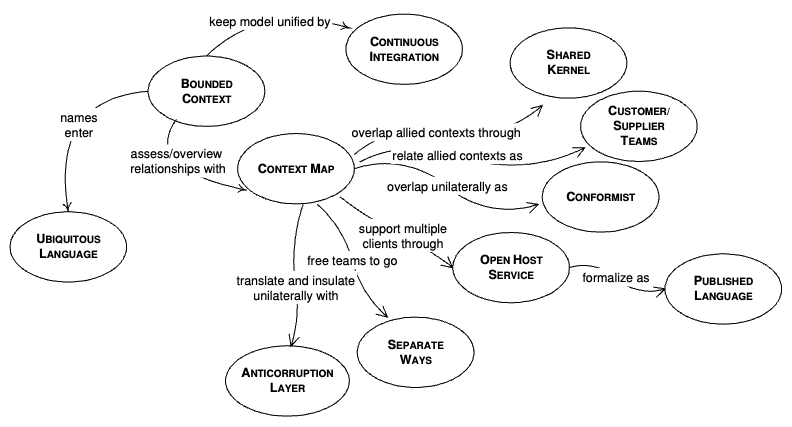

Domain-Driven Design (DDD) is an approach to structuring software around the business domain itself, not the database schema or technical layers. It splits into two levels: **strategic design** (how you carve up a large domain into manageable pieces and how those pieces relate) and **tactical design** (the building blocks — entities, value objects, aggregates — you use to model each piece in code). DDD pairs naturally with microservices patterns — a bounded context is often exactly what becomes one microservice.



## 1. Ubiquitous Language

A shared vocabulary between developers and domain experts, used consistently in conversation, code, and documentation — no translation layer between "what the business calls it" and "what the code calls it."

```java
// BAD: technical/generic naming that doesn't match how the business actually talks
public class DataProcessor {
    public void process(DataObject obj) { ... }
}

// GOOD: matches the exact terms domain experts use
public class LoanApplication {
    public UnderwritingDecision underwrite() { ... }
}
```

If the business calls something a "reservation" and the code calls it a `Booking`, that mismatch will eventually cause confusion or bugs — align the names, don't just pick whichever sounds more "technical."

## 2. Bounded Context

A boundary within which a specific model and ubiquitous language apply consistently. The same real-world concept can (and often should) mean different things in different contexts.

```
Sales context:      Product { name, price, promotionEligible }
Shipping context:    Product { weight, dimensions, fragile }
Inventory context:   Product { sku, stockLevel, warehouseLocation }
```

All three are "Product," but each context only models the attributes relevant to its own concerns. Trying to build one universal `Product` class that serves all three contexts leads to a bloated, coupled model that nobody's language actually matches. Each bounded context typically maps to one service/module with its own database — the same idea as "database per service" in microservices.

## 3. Context Mapping — How Bounded Contexts Relate

When contexts must integrate, DDD names the relationship explicitly so the coupling and integration cost are visible up front.

| Pattern                     | Meaning                                                                                            |
| --------------------------- | -------------------------------------------------------------------------------------------------- |
| Shared Kernel               | Two teams share a small, jointly-owned subset of the model — high coordination cost, use sparingly |
| Customer-Supplier           | Upstream team's changes affect downstream; downstream has some influence over upstream's roadmap   |
| Conformist                  | Downstream just accepts the upstream model as-is, no negotiation power                             |
| Anti-Corruption Layer (ACL) | Downstream translates the upstream model into its own, insulating itself from upstream's design    |
| Open Host Service           | Upstream exposes a well-defined, stable API/protocol for many consumers                            |

## 4. Anti-Corruption Layer (ACL) in Practice

Prevents an external or legacy system's model from leaking into and polluting your own domain model.

```java
// External legacy system's model — not something you control or want to depend on directly
public class LegacyCustomerRecord {
    public String custNm, custAddr1, custAddr2, custStat;
}

// ACL: translates the legacy shape into your own clean domain model
public class LegacyCustomerAdapter {
    public Customer toDomain(LegacyCustomerRecord legacy) {
        return new Customer(
            new CustomerName(legacy.custNm),
            new Address(legacy.custAddr1, legacy.custAddr2),
            CustomerStatus.fromLegacyCode(legacy.custStat)
        );
    }
}
```

Your domain (`Customer`, `Address`, `CustomerStatus`) never has to know the legacy system's quirky field names or status codes — only the ACL does.

## 5. Entities

An object defined by its identity, not its attributes — two entities with identical field values are still different if their IDs differ, and the same entity can change all its attributes over time and still be "the same" entity.

```java
public class Account {
    private final AccountId id; // identity — never changes
    private BigDecimal balance;  // attributes — can change over time
    private AccountStatus status;

    public void withdraw(BigDecimal amount) {
        if (amount.compareTo(balance) > 0) {
            throw new InsufficientFundsException(id, amount, balance);
        }
        this.balance = this.balance.subtract(amount);
    }

    @Override
    public boolean equals(Object o) {
        return o instanceof Account other && this.id.equals(other.id); // identity-based equality
    }
}
```

## 6. Value Objects

An object defined entirely by its attributes, with no identity — two value objects with the same values are interchangeable and should be immutable.

```java
public record Money(BigDecimal amount, Currency currency) {
    public Money {
        if (amount.scale() > currency.getDefaultFractionDigits()) {
            throw new IllegalArgumentException("Too many decimal places for " + currency);
        }
    }

    public Money add(Money other) {
        if (!this.currency.equals(other.currency)) {
            throw new IllegalArgumentException("Cannot add different currencies");
        }
        return new Money(this.amount.add(other.amount), this.currency);
    }
}
```

A `record` is a near-perfect fit for value objects in modern Java: immutable, structural equality by default, and self-validating via a compact constructor. Prefer modeling concepts like money, addresses, date ranges, and email addresses as value objects instead of raw `BigDecimal`/`String` — it makes invalid states (negative money, malformed email) unrepresentable.

## 7. Aggregates and Aggregate Roots

An aggregate is a cluster of entities/value objects treated as a single consistency boundary — all changes to anything inside the aggregate go through its **aggregate root**, which enforces the invariants for the whole cluster.

```java
public class Order { // aggregate root
    private final OrderId id;
    private final List<OrderLine> lines = new ArrayList<>(); // only reachable through Order
    private OrderStatus status;

    public void addLine(ProductId productId, int quantity) {
        if (status != OrderStatus.DRAFT) {
            throw new IllegalStateException("Cannot modify a submitted order");
        }
        lines.add(new OrderLine(productId, quantity));
    }

    public void submit() {
        if (lines.isEmpty()) {
            throw new IllegalStateException("Cannot submit an empty order");
        }
        this.status = OrderStatus.SUBMITTED;
    }

    // No setter for `lines` — external code can never bypass addLine()'s invariant checks
}
```

Rules of thumb:

- External code never reaches into an aggregate's internals directly (no `order.getLines().add(...)`) — only through the root's methods.
- Keep aggregates small. A common mistake is modeling `Customer` with every `Order` they've ever placed inside it — that's usually two aggregates (`Customer`, `Order`), linked by an ID reference, not one giant object graph.
- One transaction should typically modify exactly one aggregate instance. Cross-aggregate consistency is handled via domain events, not by stretching a transaction across aggregates (this is exactly why sagas exist).

## 8. Repositories

Provide an illusion of an in-memory collection of aggregates, hiding persistence details — the domain layer works with `save`/`findById`, never raw SQL.

```java
public interface OrderRepository {
    Optional<Order> findById(OrderId id);
    void save(Order order);
}
```

The interface lives in the domain layer; the implementation (JPA, JDBI, whatever) lives in the infrastructure layer. This is what keeps domain logic free of persistence concerns.

## 9. Domain Services

Business logic that doesn't naturally belong to any single entity or value object — typically operations involving multiple aggregates.

```java
@Service
public class FundsTransferService { // domain service, not tied to one entity
    public void transfer(Account from, Account to, Money amount) {
        from.withdraw(amount);
        to.deposit(amount);
        // coordinates two aggregates; doesn't belong inside either Account itself
    }
}
```

Only reach for a domain service when logic genuinely spans multiple aggregates — if it fits naturally on one entity, put it there instead (avoids an "anemic domain model," see section 11).

## 10. Domain Events

Represent something meaningful that happened in the domain — used to communicate across aggregates or bounded contexts without tight coupling.

```java
public record OrderSubmitted(OrderId orderId, CustomerId customerId, Instant occurredAt) {}

public class Order {
    private final List<Object> domainEvents = new ArrayList<>();

    public void submit() {
        // ... validation
        this.status = OrderStatus.SUBMITTED;
        domainEvents.add(new OrderSubmitted(id, customerId, Instant.now()));
    }

    public List<Object> pullDomainEvents() {
        List<Object> events = List.copyOf(domainEvents);
        domainEvents.clear();
        return events;
    }
}
```

The application layer publishes these events (e.g., via `ApplicationEventPublisher`) after the aggregate is successfully persisted — this is the same mechanism used for Sagas and CQRS read-model updates.

## 11. Anemic Domain Model — The Anti-Pattern to Avoid

An anemic model has entities that are just data bags (getters/setters, no behavior), with all logic pushed into "service" classes — this defeats the purpose of DDD by separating data from the behavior that protects its invariants.

```java
// ANEMIC (avoid): Account has no behavior, anything can mutate balance however it wants
public class Account {
    private BigDecimal balance;
    public BigDecimal getBalance() { return balance; }
    public void setBalance(BigDecimal balance) { this.balance = balance; } // no validation possible
}

public class AccountService {
    public void withdraw(Account account, BigDecimal amount) {
        account.setBalance(account.getBalance().subtract(amount)); // invariant checking lives outside the entity, easy to bypass
    }
}
```

Compare to section 5's `Account.withdraw()` — the rich model makes invalid states impossible from outside the entity itself; the anemic model relies on every caller remembering to call the right service method correctly.

## 12. Strategic vs Tactical — Know Which Problem You're Solving

| Level     | Concerned with                                                              | Tools                                                                             |
| --------- | --------------------------------------------------------------------------- | --------------------------------------------------------------------------------- |
| Strategic | How to split a large domain into contexts, and how those contexts integrate | Bounded contexts, context mapping, ubiquitous language                            |
| Tactical  | How to model the inside of one bounded context in code                      | Entities, value objects, aggregates, repositories, domain services, domain events |

A common mistake is jumping straight to tactical patterns (aggregates, repositories) without first doing the strategic work of figuring out where the boundaries actually are — the tactical patterns only pay off once applied within a well-scoped bounded context.

## 13. Best Practices

| Practice                                                 | Recommendation                                                                                                                                                                                                              |
| -------------------------------------------------------- | --------------------------------------------------------------------------------------------------------------------------------------------------------------------------------------------------------------------------- |
| Start with the language, not the code                    | Talk to domain experts, agree on terms, and use those exact terms as class/method names.                                                                                                                                    |
| Don't force one model to serve every context             | Let "Product" (or any concept) differ across bounded contexts rather than building one bloated universal class.                                                                                                             |
| Keep aggregates small and enforce invariants at the root | External code should never bypass the aggregate root to mutate internals directly.                                                                                                                                          |
| Model concepts as value objects, not primitives          | Money, addresses, ranges — wrap them so invalid states are unrepresentable, instead of passing raw `BigDecimal`/`String` around.                                                                                            |
| Avoid anemic domain models                               | Put behavior on the entities/aggregates that own the data, not exclusively in "service" classes.                                                                                                                            |
| Use an ACL when integrating with legacy/external systems | Don't let an external system's data shape leak into and pollute your own domain model.                                                                                                                                      |
| Don't apply full DDD tactical patterns to simple CRUD    | If a bounded context genuinely has no complex business rules, a rich domain model is unnecessary ceremony — reserve DDD's heavier tools for the domain's actual complexity ("core domain"), not every corner of the system. |
