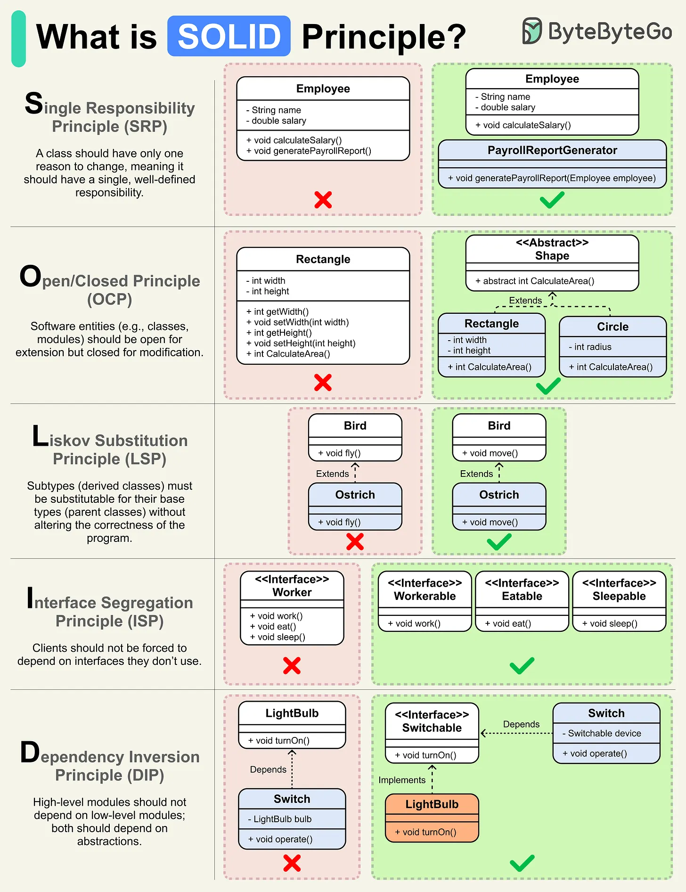

SOLID is five design principles that each address a specific way object-oriented code becomes hard to change safely as it grows. They're widely known by name and easy to recite, but each one solves a real, concrete problem — the value is in recognizing when a codebase has actually grown into that problem, not in applying all five preemptively to every class from day one.



## 1. Single Responsibility Principle (SRP)

A class should have one reason to change. "Responsibility" here means one axis of change driven by one stakeholder/concern — not literally "one method."

```java
// BAD: three unrelated reasons to change bundled into one class
public class ReportGenerator {
    public String generateReport(List<Order> orders) { /* ... */ }
    public void sendEmail(String report, String recipient) { /* ... */ }
    public byte[] compressReport(String report) { /* ... */ }
}

// GOOD: each class changes for exactly one reason
public class ReportGenerator {
    public String generateReport(List<Order> orders) { /* ... */ }
}
public class ReportEmailer {
    public void send(String report, String recipient) { /* ... */ }
}
public class ReportCompressor {
    public byte[] compress(String report) { /* ... */ }
}
```

The test isn't "does this class do more than one thing syntactically" — it's "would a change to reporting logic and a change to email delivery both require editing this same class for unrelated reasons?" If yes, they're coupled together for no good reason, and a change to one risks breaking the other.

## 2. Open/Closed Principle (OCP)

A class should be open for extension but closed for modification — adding new behavior shouldn't require editing existing, already-tested code.

```java
// BAD: adding a new discount type means editing this method and re-testing all existing branches
public BigDecimal calculateDiscount(Order order, String discountType) {
    if (discountType.equals("LOYALTY")) return order.getTotal().multiply(new BigDecimal("0.10"));
    if (discountType.equals("SEASONAL")) return order.getTotal().multiply(new BigDecimal("0.15"));
    // adding "BULK" here means touching this method again
    return BigDecimal.ZERO;
}

// GOOD: adding a new discount type means adding a new class, existing code is untouched
public interface DiscountStrategy {
    BigDecimal calculate(Order order);
}
public class LoyaltyDiscount implements DiscountStrategy {
    public BigDecimal calculate(Order order) { return order.getTotal().multiply(new BigDecimal("0.10")); }
}
public class SeasonalDiscount implements DiscountStrategy {
    public BigDecimal calculate(Order order) { return order.getTotal().multiply(new BigDecimal("0.15")); }
}
// Adding BulkDiscount later requires zero changes to LoyaltyDiscount, SeasonalDiscount, or any caller
```

This is exactly the mechanism the Strategy design pattern implements — OCP is the _principle_, Strategy (and several other GoF patterns) are _ways of achieving it_ in code.

## 3. Liskov Substitution Principle (LSP)

A subtype must be usable anywhere its base type is expected, without the caller needing to know or care which concrete subtype it actually got. Violating this means inheritance was used for surface-level code reuse without the subtype actually honoring the base type's behavioral contract.

```java
// BAD: classic violation — a Square IS-A Rectangle geometrically, but not behaviorally
public class Rectangle {
    protected int width, height;
    public void setWidth(int w) { this.width = w; }
    public void setHeight(int h) { this.height = h; }
    public int getArea() { return width * height; }
}
public class Square extends Rectangle {
    @Override public void setWidth(int w) { this.width = w; this.height = w; } // surprise side effect
    @Override public void setHeight(int h) { this.width = h; this.height = h; }
}

// A caller relying on Rectangle's contract breaks silently when handed a Square
public void resize(Rectangle r) {
    r.setWidth(5);
    r.setHeight(10);
    assert r.getArea() == 50; // FAILS for a Square — got 100 instead, because setHeight also changed width
}
```

The fix isn't a clever workaround — it's recognizing that `Square` doesn't actually behave like a `Rectangle` in every context a `Rectangle` is used, so forcing an inheritance relationship between them was the wrong move in the first place. A subtype that has to change or restrict the base type's behavior to "make it work" is usually a sign the hierarchy itself is wrong, not a sign the base class needs a workaround.

## 4. Interface Segregation Principle (ISP)

Prefer several small, focused interfaces over one large, general-purpose one — a class shouldn't be forced to implement methods it has no meaningful behavior for.

```java
// BAD: forces every implementer to provide behavior for methods that may not apply to them
public interface Worker {
    void work();
    void eat();
}
public class RobotWorker implements Worker {
    public void work() { /* ... */ }
    public void eat() { throw new UnsupportedOperationException(); } // a robot doesn't eat
}

// GOOD: split into focused interfaces — implement only what actually applies
public interface Workable {
    void work();
}
public interface Eatable {
    void eat();
}
public class RobotWorker implements Workable {
    public void work() { /* ... */ }
}
public class HumanWorker implements Workable, Eatable {
    public void work() { /* ... */ }
    public void eat() { /* ... */ }
}
```

A method that throws `UnsupportedOperationException` (or silently does nothing) just to satisfy an interface is a direct signal the interface is forcing an implementer to accept a contract it can't actually fulfill — the fix is splitting the interface, not tolerating the exception.

## 5. Dependency Inversion Principle (DIP)

Depend on abstractions, not concrete implementations — a high-level module (business logic) shouldn't directly depend on a low-level module's (a specific database, a specific external API client) concrete details; both should depend on an interface between them.

```java
// BAD: OrderService is directly coupled to a specific persistence technology
public class OrderService {
    private final JpaOrderRepository repository = new JpaOrderRepository(); // concrete, hardcoded
    public void placeOrder(Order order) { repository.save(order); }
}

// GOOD: OrderService depends on an abstraction; the concrete implementation is injected
public interface OrderRepository {
    void save(Order order);
}
public class JpaOrderRepository implements OrderRepository {
    public void save(Order order) { /* JPA-specific persistence */ }
}
public class OrderService {
    private final OrderRepository repository; // depends on the interface, not a specific technology
    public OrderService(OrderRepository repository) { this.repository = repository; }
    public void placeOrder(Order order) { repository.save(order); }
}
```

This is what actually makes a class unit-testable without a real database (inject a fake `OrderRepository` in a test) and swappable later (switch from JPA to JDBI without touching `OrderService` at all) — dependency injection frameworks like Spring exist largely to make wiring these abstractions together convenient at scale.

## 6. How the Five Reinforce Each Other

These aren't five independent rules — they compound. OCP is usually _achieved_ through DIP (depending on an abstraction is what lets you add a new implementation without modifying existing code) and often expressed through ISP (a small, focused interface is easier to implement a new variant of than a large one). SRP keeps each of those pieces small enough to reason about in the first place. LSP is what makes the abstraction in DIP actually trustworthy — an interface is only useful if every implementation genuinely honors its contract, not just its method signatures.

## 7. When Not to Apply Them

A small, stable utility class doesn't need an interface "just in case a second implementation shows up someday" — that's speculative complexity, the same trap warned about in clean code more generally. Apply SOLID when a concrete pain point actually shows up: a class keeps changing for unrelated reasons (SRP), adding a new variant means editing tested code (OCP), a subtype needs special-casing by its callers (LSP), an interface forces unused methods (ISP), or a class is hard to test because it's wired directly to a concrete dependency (DIP). Introducing the abstraction before any of these pains exist just adds indirection with nothing to show for it.

## 8. Best Practices

| Practice                                                            | Recommendation                                                                                                                                  |
| ------------------------------------------------------------------- | ----------------------------------------------------------------------------------------------------------------------------------------------- |
| Apply SOLID reactively, not preemptively                            | Introduce an abstraction when a concrete pain point shows up, not "just in case" for a class that's never had a second implementation.          |
| Test SRP with "who asks for this to change"                         | If two unrelated stakeholders would both need this class edited for their own reasons, it has more than one responsibility.                     |
| Use Strategy (or similar) to satisfy OCP                            | Adding a new behavior should mean adding a new class, not editing and re-testing an existing conditional chain.                                 |
| Treat an LSP violation as a hierarchy design problem                | A subtype needing special-casing by its callers means the inheritance relationship itself is wrong, not that the base class needs a workaround. |
| Split an interface the moment an implementer can't honor part of it | A thrown `UnsupportedOperationException` or empty stub method is a direct signal to apply ISP.                                                  |
| Depend on abstractions at architectural boundaries                  | DIP is what makes a class unit-testable without real infrastructure and swappable without touching its callers.                                 |
| Remember the five compound, not operate independently               | OCP is usually achieved via DIP and expressed via ISP — they work together, not as five separate checklist items.                               |
