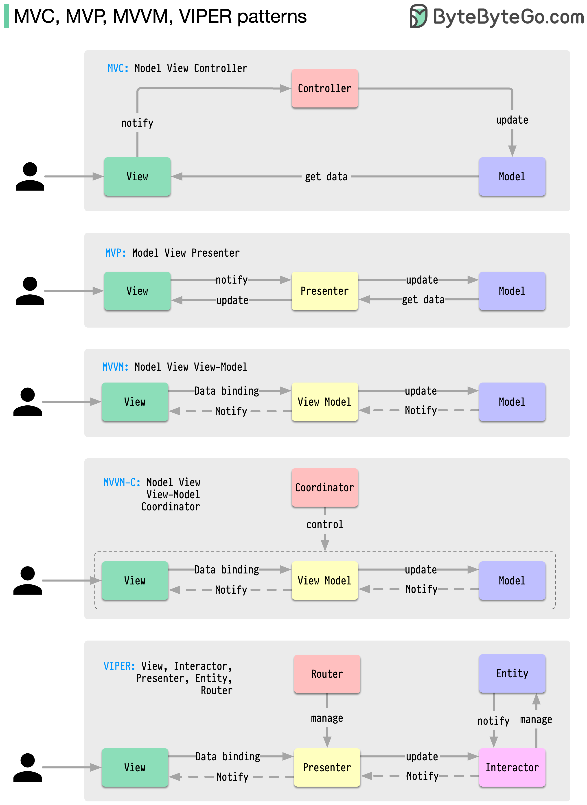

MVC, MVP, MVVM, MVVM-C, and VIPER are all answers to the same underlying question: how do you split a UI screen's code so that the visual layer, the display logic, and the business/domain logic don't collapse into one unmanageable, untestable class? Each pattern draws the boundaries slightly differently, and each later pattern generally exists to fix a specific weakness the previous one accumulated as UI codebases scaled up.



## 1. The Shared Problem: A UI Layer That Does Everything

Without a deliberate split, a UI component (an Activity, a ViewController, a React component) tends to accumulate three unrelated responsibilities: rendering widgets, reacting to user input, and holding/transforming the actual data being displayed. That combination is exactly what makes UI code notoriously hard to unit test — testing "does this screen calculate the discount correctly" shouldn't require instantiating a real rendered view.

```java
// Everything crammed into one class: rendering, input handling, AND business logic
public class OrderScreenActivity extends Activity {
    private TextView totalLabel;
    public void onApplyDiscountClicked() {
        double total = calculateTotalWithDiscount(cartItems); // business logic, buried in the UI class
        totalLabel.setText("$" + total);
    }
    private double calculateTotalWithDiscount(List<Item> items) { /* ... */ return 0; }
}
```

Every pattern below is a different strategy for pulling `calculateTotalWithDiscount` (and everything like it) out of the UI class entirely.

## 2. MVC (Model-View-Controller)

The Model holds data and business logic; the View renders UI and is passive; the Controller receives user input, updates the Model, and tells the View what to display.

```java
// Model — pure data and business logic, no UI awareness at all
public class Order {
    private List<Item> items;
    public double calculateTotalWithDiscount() { /* ... */ return 0; }
}

// Controller — mediates between input and the Model, then updates the View
public class OrderController {
    private final Order order;
    private final OrderView view;
    public void onApplyDiscountClicked() {
        view.showTotal(order.calculateTotalWithDiscount()); // Controller reaches into the View directly
    }
}

// View — passive, just renders what it's told to
public interface OrderView {
    void showTotal(double total);
}
```

The classic weakness in most real-world MVC implementations (especially on mobile, where the "Controller" is often literally the ViewController/Activity class itself): the Controller ends up tightly coupled to a specific View, and the View and Controller are frequently the same physical class in practice — which reintroduces exactly the untestable, everything-in-one-class problem MVC was meant to solve, just with a different name on the box.

## 3. MVP (Model-View-Presenter)

MVP fixes MVC's blurred View/Controller line by making the View a true passive interface, with a Presenter that contains all display logic and talks to the View only through that interface — never touching UI framework classes directly.

```java
// View — a thin interface implemented by the actual Activity/Fragment/UI class
public interface OrderView {
    void showTotal(String formattedTotal);
    void showError(String message);
}

// Presenter — ALL display logic lives here, fully unit-testable with a fake OrderView
public class OrderPresenter {
    private final Order order;
    private final OrderView view;
    public void onApplyDiscountClicked() {
        try {
            double total = order.calculateTotalWithDiscount();
            view.showTotal(String.format("$%.2f", total)); // formatting logic lives in the Presenter, not the View
        } catch (InvalidDiscountException e) {
            view.showError(e.getMessage());
        }
    }
}

// The Activity is now genuinely thin — just wires input events to the Presenter and implements the interface
public class OrderActivity extends Activity implements OrderView {
    private OrderPresenter presenter;
    public void onApplyDiscountClicked() { presenter.onApplyDiscountClicked(); }
    @Override public void showTotal(String formattedTotal) { totalLabel.setText(formattedTotal); }
    @Override public void showError(String message) { Toast.makeText(this, message, Toast.LENGTH_SHORT).show(); }
}
```

Because the Presenter only knows about the `OrderView` interface, a unit test can inject a fake implementation and verify `showTotal`/`showError` were called correctly, with zero real UI framework involvement — this is MVP's central win over a loosely-enforced MVC.

## 4. MVVM (Model-View-ViewModel)

MVVM goes a step further: instead of the display-logic component calling explicit methods on the View (`view.showTotal(...)`), the View observes state exposed by the ViewModel through data binding or an observable stream — the ViewModel never holds a reference to the View at all.

```java
// ViewModel — exposes observable state; has NO reference to any View, not even through an interface
public class OrderViewModel {
    private final Order order;
    private final MutableLiveData<String> total = new MutableLiveData<>();
    private final MutableLiveData<String> error = new MutableLiveData<>();

    public LiveData<String> getTotal() { return total; }
    public LiveData<String> getError() { return error; }

    public void onApplyDiscountClicked() {
        try {
            total.setValue(String.format("$%.2f", order.calculateTotalWithDiscount()));
        } catch (InvalidDiscountException e) {
            error.setValue(e.getMessage());
        }
    }
}

// View — observes the ViewModel's state, no explicit method calls FROM the ViewModel needed
public class OrderActivity extends Activity {
    private OrderViewModel viewModel;
    void onCreate() {
        viewModel.getTotal().observe(this, total -> totalLabel.setText(total));
        viewModel.getError().observe(this, error -> Toast.makeText(this, error, Toast.LENGTH_SHORT).show());
    }
}
```

This inversion (View pulls/observes state, rather than being pushed to) is what makes the ViewModel completely UI-framework-agnostic and trivially reusable across different Views (e.g., the same ViewModel backing both a phone layout and a tablet layout) — MVP's Presenter, by contrast, still holds a direct reference to a specific `View` interface instance.

## 5. MVP vs. MVVM — The Key Distinction

|                                      | MVP                                                                    | MVVM                                                                               |
| ------------------------------------ | ---------------------------------------------------------------------- | ---------------------------------------------------------------------------------- |
| Communication direction              | Presenter calls explicit methods on the View interface                 | View observes state exposed by the ViewModel; ViewModel never references the View  |
| Coupling to a specific View instance | Presenter holds a live reference to one View instance                  | ViewModel has no reference to any View at all                                      |
| Reusability across different Views   | Low — a Presenter is generally paired with one specific View interface | High — the same ViewModel can back multiple different View implementations         |
| Testability                          | High — inject a fake View interface                                    | High — assert directly on the exposed observable state, no fake View needed at all |

## 6. MVVM-C (MVVM-Coordinator)

MVVM alone doesn't say anything about _navigation_ — who decides "after this screen, go to that screen." Left unaddressed, navigation logic tends to leak into ViewModels or Views, coupling a screen to knowledge of what comes after it. MVVM-C adds a Coordinator: a dedicated object owning navigation flow, so a ViewModel or View never has to know what screen comes next.

```java
// Coordinator — owns the navigation flow between screens; the ViewModel below knows nothing about this
public class OrderFlowCoordinator {
    public void start() {
        OrderViewModel viewModel = new OrderViewModel();
        viewModel.setOnOrderConfirmed(this::showConfirmationScreen); // a callback, not a direct navigation call
        navigateTo(new OrderScreen(viewModel));
    }
    private void showConfirmationScreen() {
        navigateTo(new ConfirmationScreen());
    }
}

// ViewModel — reports that something happened, has zero knowledge of what screen comes next
public class OrderViewModel {
    private Runnable onOrderConfirmed;
    public void setOnOrderConfirmed(Runnable callback) { this.onOrderConfirmed = callback; }
    public void confirmOrder() {
        // ... business logic
        if (onOrderConfirmed != null) onOrderConfirmed.run(); // signal the event, let the Coordinator decide what happens
    }
}
```

This is the same separation-of-concerns instinct behind every pattern in this file, applied specifically to navigation: a ViewModel/screen shouldn't need to know about other screens just to trigger moving to one, the same way a service class shouldn't need to know about HTTP just to run business logic.

## 7. VIPER (View-Interactor-Presenter-Entity-Router)

VIPER splits responsibilities even further than MVP/MVVM, aiming for the strongest separation of concerns among these patterns, at the cost of noticeably more boilerplate per screen.

| Component                 | Responsibility                                                                                                  |
| ------------------------- | --------------------------------------------------------------------------------------------------------------- |
| View                      | Passive UI rendering — same role as in MVP                                                                      |
| Interactor                | Business logic and use cases — deliberately separated OUT of the Presenter entirely                             |
| Presenter                 | Prepares data for display and reacts to View events — but contains no business logic itself, only display logic |
| Entity                    | Plain data/model objects, no behavior                                                                           |
| Router (a.k.a. Wireframe) | Navigation logic — the same concern MVVM-C's Coordinator addresses, made a first-class component here           |

```java
// Interactor — business logic lives ONLY here, completely separate from the Presenter
public class OrderInteractor {
    public double calculateTotalWithDiscount(Order order) { /* ... */ return 0; }
}

// Presenter — display logic and coordination, delegates business logic to the Interactor
public class OrderPresenter {
    private final OrderInteractor interactor;
    private final OrderView view;
    private final OrderRouter router;

    public void onApplyDiscountClicked(Order order) {
        double total = interactor.calculateTotalWithDiscount(order); // delegates, doesn't compute itself
        view.showTotal(String.format("$%.2f", total));
    }
    public void onOrderConfirmed() {
        router.navigateToConfirmationScreen(); // navigation is the Router's job, not the Presenter's
    }
}
```

VIPER's explicit separation of the Interactor (business logic) from the Presenter (display logic) is the piece MVP and MVVM leave more loosely defined — in MVP, it's easy for a Presenter to accumulate real business logic over time rather than just delegating it. VIPER forces that boundary from the start, at the cost of five components (and five corresponding test doubles) for even a simple screen — a real tradeoff, not a free upgrade.

## 8. Choosing Among Them

| Pattern | Best fit                                                                                                                                      |
| ------- | --------------------------------------------------------------------------------------------------------------------------------------------- |
| MVC     | Small apps, or as a starting mental model — watch for the View/Controller line blurring in practice                                           |
| MVP     | Teams wanting explicit, interface-based testability without adopting a reactive/observable style                                              |
| MVVM    | Reactive UI frameworks with native data-binding/observable support (this is why it dominates modern Android/iOS/frontend stacks)              |
| MVVM-C  | MVVM at a scale where navigation logic has started leaking into ViewModels and needs its own home                                             |
| VIPER   | Large, long-lived apps with many contributors, where the strongest possible separation of concerns justifies the added boilerplate per screen |

None of these are Java-backend concepts specifically — they're UI/presentation-layer patterns most relevant to Android, iOS, and rich frontend clients — but the underlying principle (separate rendering, display logic, business logic, and navigation into distinct, independently testable pieces) is the same instinct behind layered architecture and hexagonal architecture on the backend.

## 9. Best Practices

| Practice                                                      | Recommendation                                                                                                                           |
| ------------------------------------------------------------- | ---------------------------------------------------------------------------------------------------------------------------------------- |
| Keep the View passive in every one of these patterns          | Rendering-only Views are what make the layer above (Presenter/ViewModel/Interactor) unit-testable without real UI framework involvement. |
| Never let business logic leak into a Presenter/ViewModel      | Display logic (formatting, deciding what to show) belongs there; business rules belong in the Model/Interactor.                          |
| Choose based on your UI framework's native style, not novelty | MVVM fits naturally where the framework already supports data binding/observables; forcing it elsewhere adds friction for no benefit.    |
| Give navigation its own home once it starts leaking elsewhere | A Coordinator (MVVM-C) or Router (VIPER) keeps a screen's own logic from needing to know what screen comes next.                         |
| Match the pattern's complexity to the app's actual scale      | VIPER's five-component boilerplate is a poor fit for a small app; MVC's looseness is a poor fit for a large one.                         |
| Test the non-View layer directly, not through the UI          | A Presenter/ViewModel/Interactor's correctness should be verifiable without instantiating any real rendered view.                        |
