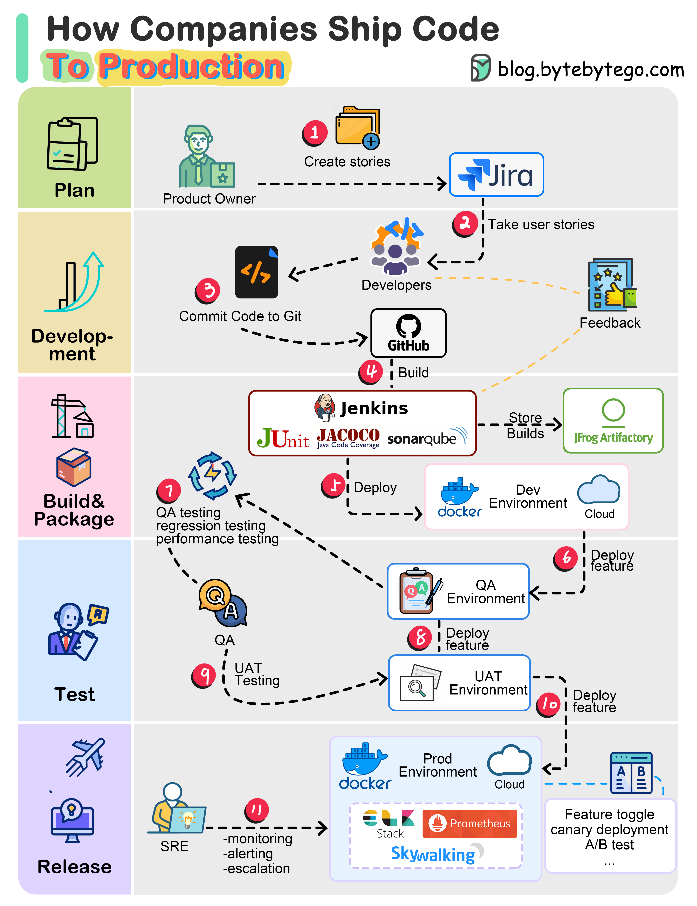
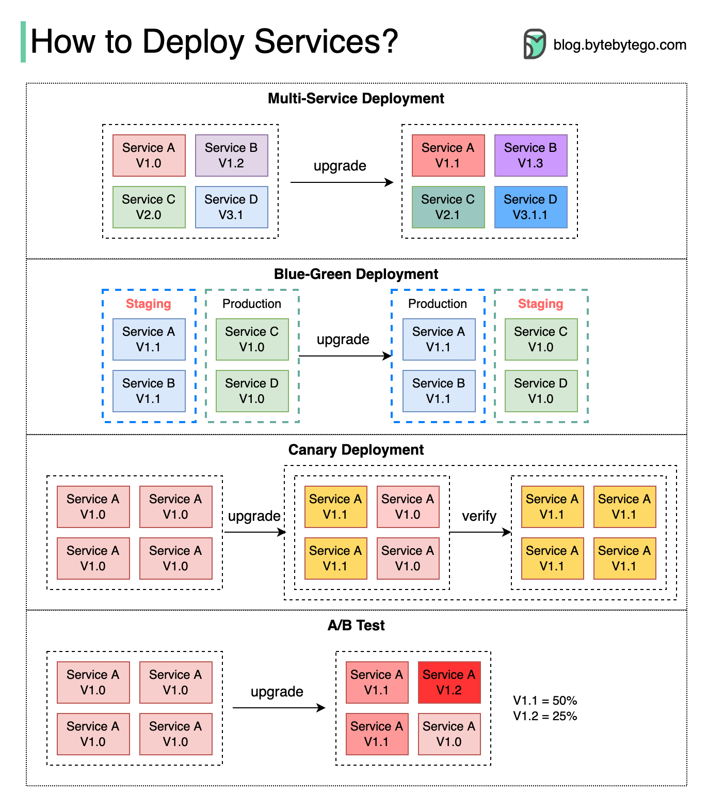

Continuous Deployment is the "last mile" of CI/CD already covered in ci-cd.md: once a build passes every gate, how does the new version actually replace the old one in production without an outage or an unrecoverable mistake? The strategies below are different answers to that same question, each trading off cost, rollback speed, and blast radius differently.



## 1. Multi-Service Deployment

Every service is upgraded to the new version at the same time, in one coordinated rollout.

```
Service A: v1 → v2  ┐
Service B: v1 → v2  ├─ all at once
Service C: v1 → v2  ┘
```

Simple to implement, but the riskiest option: if v2 of Service A has a bug that only shows up interacting with v2 of Service B, there's no intermediate state to isolate which service caused it, and rolling back means coordinating a rollback of every service simultaneously — the same all-or-nothing risk profile a big-bang release always carries.

## 2. Blue-Green Deployment

Two identical, full-scale environments exist side by side — one (blue) is currently live, the other (green) is one version ahead and idle. Once the green environment is validated, traffic is switched to it all at once, and it becomes the new live environment.

```
Before: Blue (v1, live) ←── all traffic
        Green (v2, idle, being validated)

After:  Blue (v1, idle — kept as instant rollback target)
        Green (v2, live) ←── all traffic
```

Rollback is just switching traffic back to blue — close to instant, and the exact previous version is still fully running, not being rebuilt or redeployed. The cost is running two full production-scale environments simultaneously, even though one is idle most of the time — expensive for anything beyond a small service.

## 3. Canary Deployment

A small subset of traffic is routed to the new version first; the rest keeps hitting the old version. If the canary looks healthy, traffic is gradually shifted further; if not, it's rolled back before most users are ever affected.

```
v1 (old): 95% of traffic
v2 (canary): 5% of traffic → monitored → gradually increased to 25% → 50% → 100%
```

Cheaper than blue-green (no full second environment needed) and the blast radius of a bad release is capped at the canary percentage instead of hitting everyone. The tradeoff is operational complexity: there's no separate staging environment doing this validation, so the test genuinely happens in production, on real users, and requires real-time monitoring (error rate, latency) to decide whether to proceed or automatically roll back — this is exactly the automated canary analysis already described in gitops.md's progressive delivery section.

## 4. A/B Testing

Multiple versions run in production simultaneously, on purpose, for longer than a canary's brief validation window — each version is a live "experiment" serving a subset of users, and the comparison is about product/feature outcomes (conversion rate, engagement), not primarily about deployment safety.

```
Version A: 50% of users — existing checkout flow
Version B: 50% of users — new checkout flow
→ compare conversion rate between A and B over a multi-day/week window
```

This is the cheapest way to validate a new feature against real user behavior before committing to it fully, but it needs explicit guardrails: the routing must be deliberate and controlled (typically a feature-flag system, not raw infrastructure-level traffic splitting), or a feature can end up shipped to users "by accident" before a decision was actually made to ship it.

## 5. Comparing the Strategies

| Strategy | Rollback speed | Infrastructure cost | Where validation happens |
| --- | --- | --- | --- |
| Multi-service (big-bang) | Slow — coordinated rollback across every service | Low — no extra environment | Pre-production only |
| Blue-Green | Instant — switch traffic back | High — two full production-scale environments | Green environment, before the switch |
| Canary | Fast — shrink traffic back to 0% | Low-moderate — no second full environment, just capacity headroom | Production, on a capped slice of real traffic |
| A/B Test | N/A — this isn't primarily a safety mechanism | Low — same infrastructure, split by routing/flag | Production, over an extended comparison window |

## 6. Best Practices

| Practice | Recommendation |
| --- | --- |
| Choose the strategy by what you're actually protecting against | Blue-green suits a hard cutover needing instant rollback; canary suits gradually de-risking a rollout when a second full environment isn't worth the cost. |
| Never run a canary or A/B split without real monitoring | Both rely on comparing the new version's behavior against the old in real time — without metrics, you're just deploying blind to a subset of users. |
| Gate feature exposure behind explicit flags for A/B tests | Raw traffic-splitting infrastructure without a flag system risks a half-finished feature shipping to users before a decision was made to ship it. |
| Cap canary blast radius deliberately, then increase gradually | Jumping straight to 50% defeats the purpose — the point is validating on the smallest slice that still gives a meaningful signal. |
| Weigh blue-green's cost against its instant-rollback benefit | Worth it for a service where even a brief bad rollout is unacceptable; often not worth doubling infrastructure cost for lower-risk services. |
