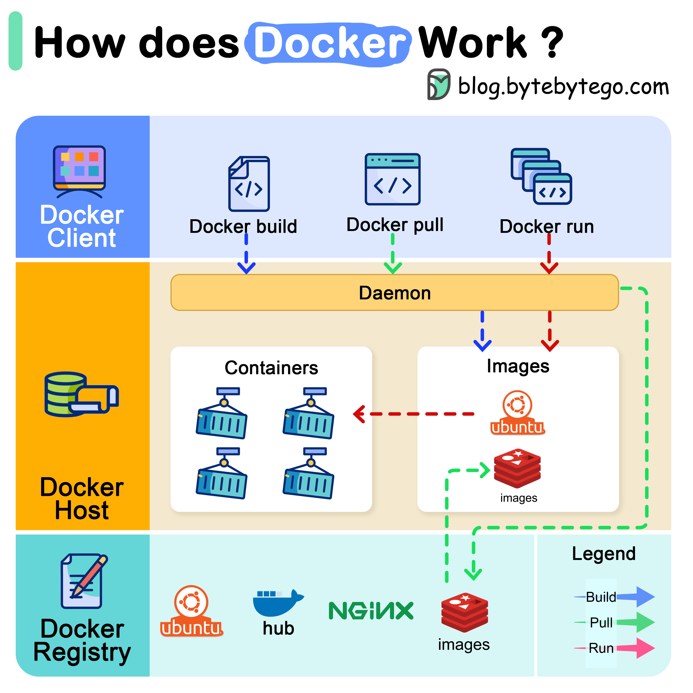

The diagram below shows the architecture of Docker and how it works when we run “docker build”, “docker pull” and “docker run”.

There are 3 components in Docker architecture:

**Docker client**

The docker client talks to the Docker daemon.

**Docker host**

The Docker daemon listens for Docker API requests and manages Docker objects such as images, containers, networks, and volumes.

**Docker registry**

A Docker registry stores Docker images. Docker Hub is a public registry that anyone can use.

Let’s take the “docker run” command as an example.

Docker pulls the image from the registry.
Docker creates a new container.
Docker allocates a read-write filesystem to the container.
Docker creates a network interface to connect the container to the default network.
Docker starts the container.
