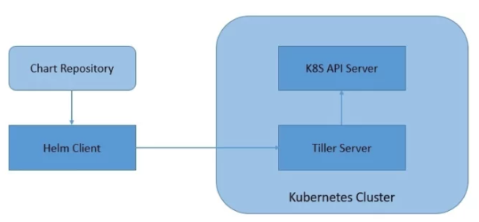

# Mastering Helm: Core Concepts, Architecture, and Examples

**Helm** is the industry-standard package manager for Kubernetes. Often described as "Homebrew or `apt` for Kubernetes," Helm helps developers and platform engineers define, install, and upgrade even the most complex Kubernetes applications.



---

## 1. Helm Core Concepts

To understand Helm, you need to be familiar with four primary concepts:

- **Helm Chart:** A package containing all the resource definitions (YAML files) necessary to run an application, tool, or service inside a Kubernetes cluster.
- **Values (`values.yaml`):** The configuration layer. Values provide input parameters to customize a chart. By swapping out values files (e.g., `values-dev.yaml` vs. `values-prod.yaml`), you can deploy the exact same chart to different environments with unique configurations.
- **Templates (`templates/` directory):** Valid Kubernetes manifest files (Deployments, Services, ConfigMaps, etc.) written using Go template syntax. Helm combines these templates with **Values** to generate pure Kubernetes YAML at deployment time.
- **Release:** A specific instance of a chart running in a Kubernetes cluster. You can install the same chart multiple times in the same cluster; each independent installation creates a new release with its own name and revision history.

---

## 2. How Helm Works

Helm relies entirely on a client-side architecture (since Helm v3, the old server-side component called _Tiller_ was removed).

1.  **The Interaction:** The user executes commands using the **Helm CLI** (`helm`) on their local machine or CI/CD pipeline.
2.  **Rendering:** When you run an install or upgrade command, Helm takes the chart templates, merges them with your configuration values, and dynamically renders them into standard Kubernetes YAML manifests.
3.  **API Communication:** Helm communicates directly with the Kubernetes API server to apply these manifests.
4.  **State Tracking:** Helm stores release history and metadata directly inside the cluster as Kubernetes **Secrets**. This allows Helm to track revisions, manage rollbacks, and audit changes without needing a separate external database.

---

## 3. Practical Example: A Simple Helm Chart

Imagine you are deploying a simple web application named `demo-app`.

### A. Chart Directory Structure

A typical Helm chart looks like this:

```text
demo-app/
├── Chart.yaml          # Metadata about the chart
├── values.yaml         # Default configuration values
└── templates/          # Kubernetes manifest templates
    ├── deployment.yaml
    └── service.yaml
```

### B. Core Files Overview

- **`Chart.yaml`** (Defines chart metadata):

  ```yaml
  apiVersion: v2
  name: demo-app
  description: A Helm chart for a simple web application
  version: 0.1.0
  appVersion: "1.0.0"
  ```

- **`values.yaml`** (Default parameters):

  ```yaml
  replicaCount: 2
  image:
    repository: nginx
    tag: "latest"
  service:
    type: ClusterIP
    port: 80
  ```

- **`templates/deployment.yaml`** (Parameterized Kubernetes Manifest):
  ```yaml
  apiVersion: apps/v1
  kind: Deployment
  metadata:
    name: {{ .Release.Name }}-deployment
  spec:
    replicas: {{ .Values.replicaCount }}
    selector:
      matchLabels:
        app: demo-app
    template:
      metadata:
        labels:
          app: demo-app
      spec:
        containers:
          - name: web
            image: "{{ .Values.image.repository }}:{{ .Values.image.tag }}"
            ports:
              - containerPort: {{ .Values.service.port }}
  ```

---

## 4. Common Helm Commands in Action

Once your chart is ready, you manage its lifecycle using a handful of CLI commands:

### Installing a Chart

To install the chart into your Kubernetes cluster and create a release named `my-web-app`:

```bash
helm install my-web-app ./demo-app
```

### Upgrading a Chart (with environment overrides)

If you want to update your application or change configuration values on the fly (e.g., scaling replicas up to 5):

```bash
helm upgrade my-web-app ./demo-app --set replicaCount=5
```

### Checking Release History

Helm tracks every modification as a new revision, making audits easy:

```bash
helm history my-web-app
```

### Rolling Back a Failed Deployment

If an upgrade breaks your application, you can instantly revert to the previous stable revision:

```bash
helm rollback my-web-app 1
```

### Uninstalling a Release

To completely remove all Kubernetes resources associated with the release:

```bash
helm uninstall my-web-app
```
