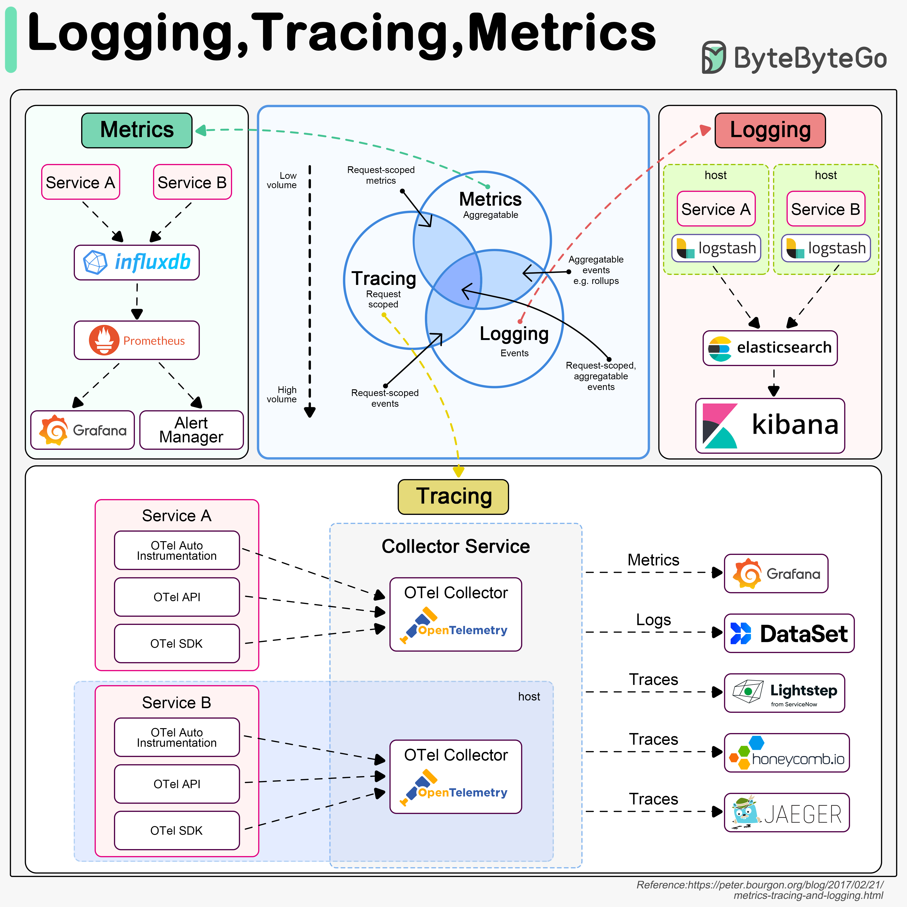
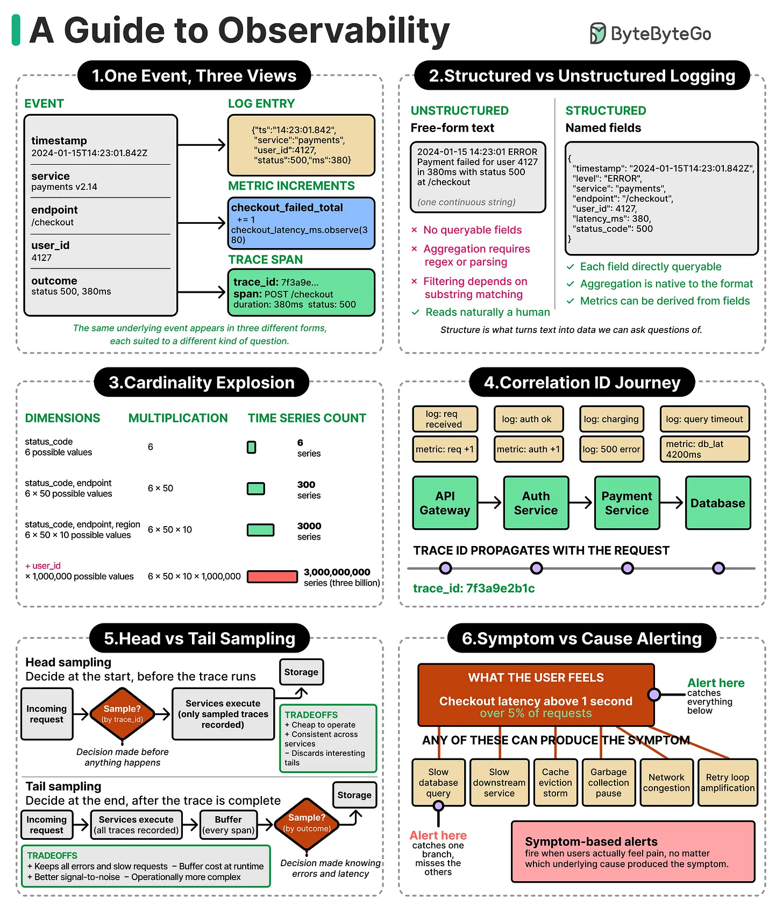

Observability is the ability to understand what a running system is doing from the outside, without having to guess or attach a debugger — built from three complementary signal types: logs (discrete events), metrics (aggregated numbers over time), and traces (the path a single request took across services). None of the three alone is enough; each answers a different question, and each now has its own dedicated note.

## 1. The Three Pillars — What Each One Answers

| Signal  | Answers                                                             | Example                                                                                               |
| ------- | ------------------------------------------------------------------- | ----------------------------------------------------------------------------------------------------- |
| Logs    | "What exactly happened, in detail?"                                 | `ERROR: Failed to charge card, reason: insufficient_funds, orderId=1234`                              |
| Metrics | "How is the system behaving in aggregate, over time?"               | `http_requests_total{status="500"}` climbing over the last 10 minutes                                 |
| Traces  | "What path did this one request take, and where did it spend time?" | Request → `OrderService` (12ms) → `InventoryService` (340ms, the bottleneck) → `PaymentService` (8ms) |

Typical workflow: a metric/alert tells you _something_ is wrong (error rate spiked); a trace tells you _where_ in the call chain it's slow or failing; logs tell you _why_ (the actual exception, the specific input that triggered it). See logs, metrics, and traces for the full detail on each pillar — structured logging, log levels, and MDC/correlation IDs; counters/gauges/histograms, p99 latency, Actuator, and SLO alerting; and distributed tracing with spans, context propagation, and sampling, respectively.

## 2. Best Practices

| Practice                                                 | Recommendation                                                                                                                                                            |
| -------------------------------------------------------- | ------------------------------------------------------------------------------------------------------------------------------------------------------------------------- |
| Treat the three pillars as complementary, not redundant  | A metric tells you something's wrong, a trace tells you where, logs tell you why — don't try to answer all three from one signal alone.                                   |
| Propagate correlation/trace IDs everywhere               | Every log line for a request should carry the same ID, across every service the request touches — this is what actually links the three pillars together for one request. |
| Instrument with OpenTelemetry, not a vendor-specific SDK | Keeps you portable across trace/metrics backends (Jaeger, Tempo, Prometheus, vendor APM tools) later.                                                                     |
| Alert on user-facing symptoms with an actionable runbook | Avoid alert fatigue from noisy, low-value alerts nobody acts on.                                                                                                          |
| Never log secrets or PII in any of the three pillars     | Logs, trace span attributes, and metric labels are all retained and searched far more broadly than most people assume.                                                    |
