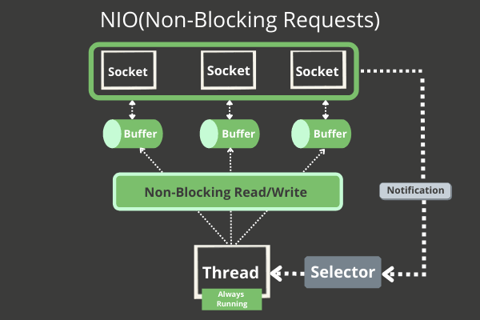

# Java Non-blocking I/O (NIO)



## 1. Overview & High-Level Comparison

Introduced in **Java 1.4 (`java.nio`)**, Non-blocking I/O (NIO) replaced the traditional "one-thread-per-connection" blocking model with an event-driven, multiplexed model where a single thread can manage multiple network connections or file streams without waiting for data to become available.

| Feature         | Blocking I/O (`java.io`)                       | Non-blocking I/O (`java.nio`)                               |
| :-------------- | :--------------------------------------------- | :---------------------------------------------------------- |
| **Model**       | Stream-oriented (byte/char by byte)            | Buffer-oriented (blocks of data)                            |
| **Execution**   | Thread blocks on `read()` or `write()`         | Thread checks availability and moves on                     |
| **Scalability** | 1 Thread per Connection (high memory overhead) | 1 Thread per $N$ Connections using a **Selector**           |
| **Use Case**    | Simple servers, small concurrent connections   | High-concurrency servers (e.g., Netty, Tomcat, web sockets) |

---

## 2. Core Components of Java NIO

### 1. Buffers

A `Buffer` is a fixed-sized container for primitive data types (e.g., `ByteBuffer`, `CharBuffer`). Data is read from a channel into a buffer, or written from a buffer into a channel.

- **`capacity`**: Total size of the buffer.
- **`position`**: Current read/write index.
- **`limit`**: Boundary beyond which you shouldn't read/write.
- **`flip()`**: Swaps the buffer from **writing mode** to **reading mode** (sets `limit = position` and `position = 0`).

### 2. Channels

A `Channel` represents an open connection to an entity capable of performing I/O operations (like a socket or file). Unlike standard streams, channels are **bi-directional**—you can both read and write using the same channel.

- Examples: `SocketChannel`, `ServerSocketChannel`, `FileChannel`.

### 3. Selectors

A `Selector` is the heart of non-blocking I/O. It is a multiplexer that monitors multiple channels for I/O events (e.g., `OP_ACCEPT`, `OP_CONNECT`, `OP_READ`, `OP_WRITE`).

- A single thread registers multiple `SelectableChannel`s with a `Selector`.
- The selector wakes up the thread only when an event is ready, allowing one thread to handle thousands of concurrent sockets.

---

## 3. Practical Code Examples

### Example 1: Buffers & Channels (File Reading)

```java
import java.io.RandomAccessFile;
import java.nio.ByteBuffer;
import java.nio.channels.FileChannel;

public class BufferChannelExample {
    public static void main(String[] args) throws Exception {
        // Open file channel in Read/Write mode
        try (RandomAccessFile file = new RandomAccessFile("example.txt", "rw");
             FileChannel channel = file.getChannel()) {

            // 1. Allocate a ByteBuffer of 48 bytes
            ByteBuffer buffer = ByteBuffer.allocate(48);

            // 2. Read from Channel into Buffer
            int bytesRead = channel.read(buffer);

            while (bytesRead != -1) {
                // 3. Flip buffer from write mode to read mode
                buffer.flip();

                // 4. Read data out of the buffer byte-by-byte
                while (buffer.hasRemaining()) {
                    System.out.print((char) buffer.get());
                }

                // 5. Clear buffer to make it ready for writing again
                buffer.clear();
                bytesRead = channel.read(buffer);
            }
        }
    }
}
```

#### Buffer State Transition

```text
Writing Data into Buffer:  [H][e][l][l][o] _  _  _   (position = 5, limit = 48)
Call buffer.flip():        [H][e][l][l][o] _  _  _   (position = 0, limit = 5)
Reading Data from Buffer:  Reading byte by byte until position reaches limit.
```

---

### Example 2: Non-Blocking TCP Echo Server using Selectors

```java
import java.net.InetSocketAddress;
import java.nio.ByteBuffer;
import java.nio.channels.*;
import java.util.Iterator;
import java.util.Set;

public class NioEchoServer {
    public static void main(String[] args) throws Exception {
        // 1. Open Selector and ServerSocketChannel
        Selector selector = Selector.open();
        ServerSocketChannel serverChannel = ServerSocketChannel.open();

        // 2. Configure as NON-BLOCKING and bind to port 8080
        serverChannel.configureBlocking(false);
        serverChannel.bind(new InetSocketAddress("localhost", 8080));

        // 3. Register channel with Selector to listen for incoming connections
        serverChannel.register(selector, SelectionKey.OP_ACCEPT);
        System.out.println("NIO Server started on port 8080...");

        while (true) {
            // 4. Block until at least one registered event happens
            selector.select();

            // 5. Retrieve set of keys that triggered events
            Set<SelectionKey> selectedKeys = selector.selectedKeys();
            Iterator<SelectionKey> iter = selectedKeys.iterator();

            while (iter.hasNext()) {
                SelectionKey key = iter.next();

                // Handle ACCEPT: New client attempting to connect
                if (key.isAcceptable()) {
                    ServerSocketChannel server = (ServerSocketChannel) key.channel();
                    SocketChannel clientChannel = server.accept();
                    clientChannel.configureBlocking(false);

                    // Register the new client channel with selector for READ operations
                    clientChannel.register(selector, SelectionKey.OP_READ);
                    System.out.println("Accepted connection from: " + clientChannel.getRemoteAddress());
                }

                // Handle READ: Client sent data
                if (key.isReadable()) {
                    SocketChannel clientChannel = (SocketChannel) key.channel();
                    ByteBuffer buffer = ByteBuffer.allocate(256);
                    int bytesRead = clientChannel.read(buffer);

                    if (bytesRead == -1) {
                        // Connection closed by client
                        System.out.println("Client disconnected: " + clientChannel.getRemoteAddress());
                        clientChannel.close();
                    } else {
                        buffer.flip();
                        // Echo data back to client
                        clientChannel.write(buffer);
                    }
                }

                // 6. Remove processed key from set!
                iter.remove();
            }
        }
    }
}
```

---

### Example 3: Non-Blocking Client

```java
import java.net.InetSocketAddress;
import java.nio.ByteBuffer;
import java.nio.channels.SocketChannel;

public class NioClient {
    public static void main(String[] args) throws Exception {
        SocketChannel client = SocketChannel.open();
        client.configureBlocking(false);
        client.connect(new InetSocketAddress("localhost", 8080));

        // Finish connection process if non-blocking connect takes time
        while (!client.finishConnect()) {
            System.out.println("Connecting to server...");
        }

        // Send message
        String message = "Hello from Java NIO Client!";
        ByteBuffer buffer = ByteBuffer.wrap(message.getBytes());
        client.write(buffer);

        // Read response
        ByteBuffer readBuffer = ByteBuffer.allocate(256);
        while (client.read(readBuffer) == 0) {
            // Do other work while waiting for server response
        }

        readBuffer.flip();
        byte[] bytes = new byte[readBuffer.remaining()];
        readBuffer.get(bytes);
        System.out.println("Server Response: " + new String(bytes));

        client.close();
    }
}
```

---

## 4. Key Interview Pitfalls & Discussion Points

1. **Why is `FileChannel` not truly non-blocking?**
   - OS-level limitations mean standard file I/O operations block at the kernel disk level. Non-blocking modes only truly apply to network Sockets (`SocketChannel`, `ServerSocketChannel`). For asynchronous file access, Java 7 introduced `AsynchronousFileChannel` (NIO.2).
2. **Direct vs. Non-Direct Buffers:**
   - `ByteBuffer.allocateDirect()` allocates memory outside the JVM garbage-collected heap directly in OS native memory. It reduces buffer copying overhead for OS I/O calls, but allocation and deallocation are slower.
3. **NIO vs. NIO.2 (Java 7):**
   - Java 7 introduced NIO.2 (`java.nio.file`), which added `Path`, `Files`, and Asynchronous Channel handlers (`AsynchronousSocketChannel`), utilizing callback/future-based async models instead of explicit selector loops.
