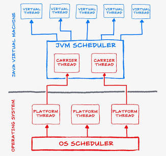

# Java Virtual Threads: Overview and Best Practices

**Virtual threads** are lightweight threads introduced in Java 21 (Project Loom) designed to drastically improve application throughput in I/O-heavy concurrent workloads without changing the standard thread-per-request programming model.



```
       +-------------------------------------------------------+
       |                   Virtual Threads                     |
       |  [VT 1]  [VT 2]  [VT 3]  [VT 4]  ...  [VT 1,000,000]   |
       +-------------------------------------------------------+
                                  |
               (Scheduled onto Carrier Threads by JVM)
                                  v
       +-------------------------------------------------------+
       |                    Carrier Threads                    |
       |             [Platform Thread]  [Platform Thread]      |
       +-------------------------------------------------------+
                                  |
                                  v
       +-------------------------------------------------------+
       |                       OS Threads                      |
       |               [OS Thread]      [OS Thread]            |
       +-------------------------------------------------------+
```

---

## How Virtual Threads Work

Traditionally, every `java.lang.Thread` was a **platform thread**—a thin wrapper around an operating system (OS) thread. Platform threads carry high overhead (~1 MB stack pre-allocated) and are limited in number (thousands max).

Virtual threads decouple the Java thread from the OS thread:

- **M:N Mapping:** Millions of virtual threads run on top of a small pool of OS platform threads called **carrier threads**.
- **Continuation & Unmounting:** When a virtual thread performs a blocking I/O operation (e.g., database query, HTTP call, `Thread.sleep()`), the JVM **unmounts** its call stack from the carrier thread and stores it on the Java heap.
- **Carrier Reuse:** The freed carrier thread immediately executes another virtual thread. Once the I/O completes, the JVM mounts the virtual thread back onto an available carrier thread to resume execution.

---

## Key Differences

| Feature              | Platform Threads             | Virtual Threads                                |
| :------------------- | :--------------------------- | :--------------------------------------------- |
| **OS Relationship**  | 1:1 mapping with OS thread   | M:N mapping managed by the JVM                 |
| **Memory Footprint** | ~1 MB stack per thread       | Starts at a few hundred bytes (heap allocated) |
| **Creation Cost**    | Expensive (requires OS call) | Virtually free (microseconds)                  |
| **Max Capacity**     | Thousands                    | Millions simultaneously                        |
| **Target Workload**  | CPU-bound computation        | I/O-bound blocking tasks                       |

---

## Best Practices for Virtual Threads

### 1. Do Not Pool Virtual Threads

Virtual threads are lightweight, short-lived instances meant to be created per task and garbage-collected when done.

- **Anti-Pattern:** Pooling virtual threads via `Executors.newFixedThreadPool()`.
- **Correct Usage:** Use `Executors.newVirtualThreadPerTaskExecutor()` or create them directly using `Thread.ofVirtual()`.

```java
// Recommended: One task per virtual thread executor
try (var executor = Executors.newVirtualThreadPerTaskExecutor()) {
    IntStream.range(0, 10_000).forEach(i ->
        executor.submit(() -> performIoTask(i))
    );
} // Auto-closes and waits for tasks to finish
```

---

### 2. Use Semaphores or Rate Limiters for Concurrency Controls

In traditional code, developers used fixed thread pools to limit access to external resources (e.g., database connections). Since virtual threads should not be pooled, limiting thread count to cap load will no longer work.

- **Recommended:** Use a `java.util.concurrent.Semaphore` or dedicated pool (like a DB connection pool) to protect limited resources.

```java
public class ResourceGuard {
    private final Semaphore semaphore = new Semaphore(10); // Limit to 10 concurrent requests

    public void accessResource() throws InterruptedException {
        semaphore.acquire();
        try {
            // Call database or limited API
        } finally {
            semaphore.release();
        }
    }
}
```

---

### 3. Avoid Pinning Carrier Threads (`synchronized` and Native Calls)

A virtual thread becomes **pinned** to its carrier thread when it cannot be unmounted during blocking operations. Pinning defeats the purpose of virtual threads because the underlying platform thread remains blocked.

Pinning happens when executing blocking operations inside:

1. `synchronized` blocks or methods.
2. Native methods or Foreign Function & Memory (FFM) calls.

- **Fix:** Replace `synchronized` with `ReentrantLock` for blocking critical sections.

```java
// Avoid:
public synchronized void fetchData() {
    blockingIoCall(); // Pins the carrier thread!
}

// Recommended:
private final ReentrantLock lock = new ReentrantLock();

public void fetchData() {
    lock.lock();
    try {
        blockingIoCall(); // Virtual thread safely unmounts if needed
    } finally {
        lock.unlock();
    }
}
```

> **Tip:** You can detect pinned threads at runtime by passing the JVM flag:  
> `-Djdk.tracePinnedThreads=full`

---

### 4. Keep ThreadLocal Storage Minimal

Because you can easily spin up hundreds of thousands of virtual threads, using large objects in `ThreadLocal` can exhaust heap memory rapidly.

- **Recommendation:** Minimize `ThreadLocal` payload size, or migrate to **Scoped Values** (introduced in Java 20/21) for sharing immutable context across virtual threads safely.

---

### 5. Reserve Platform Threads for CPU-Bound Tasks

Virtual threads do **not** make CPU calculations faster; they only improve throughput for code waiting on I/O.

- **I/O-Bound Tasks** (DB queries, REST calls, file reading) $\rightarrow$ **Virtual Threads**.
- **CPU-Bound Tasks** (Video encoding, heavy math, crypto hashing) $\rightarrow$ **Platform Threads** or `ForkJoinPool`.
