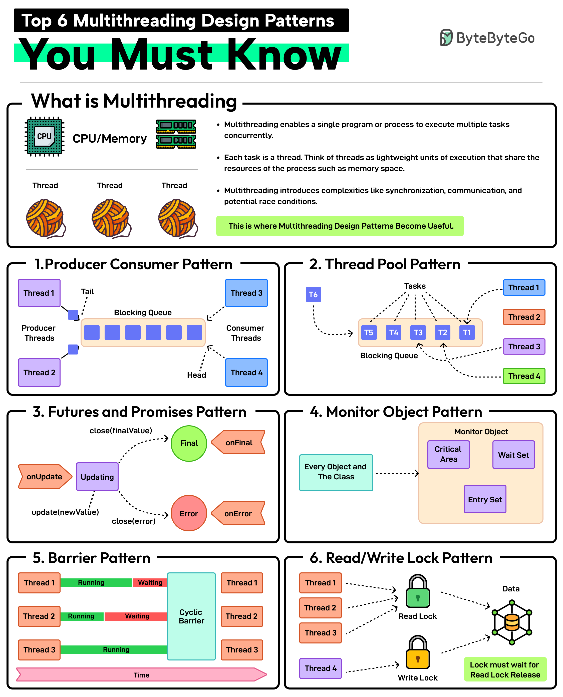

Multithreading is the Java implementation technique for running work on multiple actual threads (platform or virtual) that the JVM schedules — the concrete mechanics behind the concepts covered in concurrency and parallelism, and the direct tool for addressing the shared-mutable-state problem introduced there. This note covers threads themselves: their lifecycle, how to coordinate access to shared state safely, how to avoid creating threads by hand, and the classic failure mode (deadlock) that coordinating multiple threads can introduce. Asynchronous programming — the non-blocking, callback/future-based style often built on top of thread pools — is covered separately, since it's a distinct way of structuring work rather than a property of threads themselves.



**Producer-Consumer Pattern**
This pattern involves two types of threads: producers generating data and consumers processing that data. A blocking queue acts as a buffer between the two.

**Thread Pool Pattern**
In this pattern, there is a pool of worker threads that can be reused for executing tasks. Using a pool removes the overhead of creating and destroying threads. Great for executing a large number of short-lived tasks.

**Futures and Promises Pattern**
In this pattern, the promise is an object that holds the eventual results and the future provides a way to access the result. This is great for executing long-running operations concurrently without blocking the main thread.

**Monitor Object Pattern**
Ensures that only one thread can access or modify a shared resource within an object at a time. This helps prevent race conditions. The pattern is required when you need to protect shared data or resources from concurrent access.

**Barrier Pattern**
Synchronizes a group of threads. Each thread executes until it reaches a barrier point in the code and blocks until all threads have reached the same barrier. Ideal for parallel tasks that need to reach a specific stage before starting the next stage.

**Read-Write Lock Pattern**
It allows multiple threads to read from a shared resource but only allows one thread to write to it at a time. Ideal for managing shared resources where reads are more frequent than writes.

## 1. Thread States — The Lifecycle Every Thread Goes Through

Every `Thread` in the JVM is, at any moment, in exactly one of six states, queryable via `Thread.getState()` — understanding these states is what makes a thread dump (or a hung application) actually readable.

```
NEW ──start()──> RUNNABLE ──(scheduled by OS)──> [running]
                     ↑↓                              │
                     │                    ┌──────────┴──────────┐
              (lock acquired /       waiting on a lock      calling wait()/join()/
               notified / time      (synchronized block)      park() with no timeout
               elapsed)                    │                        │
                     │                     ▼                        ▼
                     │                 BLOCKED                  WAITING
                     │                                              │
                     └──────────────────────────────────────────────┘
                                                                     │
                                                          (sleep()/wait(timeout)/
                                                           join(timeout))
                                                                     ▼
                                                              TIMED_WAITING
                                                                     │
                                                          (run() method returns)
                                                                     ▼
                                                              TERMINATED
```

| State           | Meaning                                                                                                                                      |
| --------------- | -------------------------------------------------------------------------------------------------------------------------------------------- |
| `NEW`           | The `Thread` object exists but `start()` hasn't been called yet                                                                              |
| `RUNNABLE`      | Eligible to run — either actually executing, or waiting for the OS scheduler to give it CPU time                                             |
| `BLOCKED`       | Waiting to acquire a lock (a `synchronized` block/method) that another thread currently holds                                                |
| `WAITING`       | Waiting indefinitely for another thread's action — `Object.wait()` with no timeout, `Thread.join()` with no timeout, or `LockSupport.park()` |
| `TIMED_WAITING` | Same as `WAITING`, but bounded — `Thread.sleep(ms)`, `Object.wait(timeout)`, `Thread.join(timeout)`                                          |
| `TERMINATED`    | The thread's `run()` method has returned (normally or via an uncaught exception) — it can never be started again                             |

```java
Thread worker = new Thread(() -> {
    try { Thread.sleep(1000); } catch (InterruptedException e) { Thread.currentThread().interrupt(); }
});
System.out.println(worker.getState()); // NEW
worker.start();
System.out.println(worker.getState()); // RUNNABLE (likely — scheduling is not instantaneous)
Thread.sleep(100);
System.out.println(worker.getState()); // TIMED_WAITING — currently inside Thread.sleep(1000)
```

The distinction between `BLOCKED` and `WAITING` is the one worth internalizing for debugging: `BLOCKED` means "stuck wanting a lock someone else holds" (a contention problem, possibly a deadlock), while `WAITING`/`TIMED_WAITING` means "voluntarily paused, waiting for a signal or a timer" (usually expected, not a bug) — a thread dump full of `BLOCKED` threads is a very different problem from one full of `WAITING` threads.

## 2. `synchronized` and Locks

`synchronized` gives mutual exclusion: only one thread can hold a given lock at a time — the most direct fix for the race condition described conceptually in concurrency.

```java
public class Counter {
    private int count = 0;

    public synchronized void increment() {
        count++; // now atomic w.r.t. other synchronized methods on "this"
    }

    public synchronized int get() {
        return count;
    }
}
```

`java.util.concurrent.locks.ReentrantLock` is the more flexible cousin of `synchronized` (supports tryLock, timeouts, fairness), but always release it in a `finally` block:

```java
private final ReentrantLock lock = new ReentrantLock();

public void increment() {
    lock.lock();
    try {
        count++;
    } finally {
        lock.unlock();
    }
}
```

Prefer `synchronized` unless you specifically need tryLock/timeouts/multiple conditions — it's simpler and harder to misuse.

## 3. Atomics for Simple Counters/Flags

For single variables, `java.util.concurrent.atomic` classes avoid locking entirely (using CPU-level compare-and-swap):

```java
private final AtomicInteger count = new AtomicInteger(0);

public void increment() {
    count.incrementAndGet();
}
```

Common types: `AtomicInteger`, `AtomicLong`, `AtomicBoolean`, `AtomicReference<T>`.

## 4. Thread Pools with `ExecutorService`

Never create raw `new Thread(...)` per task in application code — it doesn't scale and gives you no lifecycle control. Use an executor:

```java
ExecutorService executor = Executors.newFixedThreadPool(4);

Future<Integer> future = executor.submit(() -> {
    // some computation
    return 42;
});

Integer result = future.get(); // blocks until done, throws ExecutionException on failure

executor.shutdown(); // always shut down, or the JVM won't exit
```

Common pool types:

| Pool Type                                     | When to use                                             |
| --------------------------------------------- | ------------------------------------------------------- |
| `Executors.newFixedThreadPool(n)`             | CPU-bound work, bounded parallelism (size ≈ core count) |
| `Executors.newCachedThreadPool()`             | Many short-lived tasks, unbounded — risky under load    |
| `Executors.newVirtualThreadPerTaskExecutor()` | I/O-bound work at massive scale (Java 21+)              |

## 5. Virtual Threads (Java 21+, Project Loom)

Virtual threads are cheap, JVM-managed threads — you can spawn millions without exhausting OS resources. They're ideal for I/O-bound workloads (HTTP calls, DB queries) where a thread mostly just waits and concurrency (not parallelism) is what actually helps.

```java
try (var executor = Executors.newVirtualThreadPerTaskExecutor()) {
    List<Future<String>> results = IntStream.range(0, 10_000)
        .mapToObj(i -> executor.submit(() -> callSlowService(i)))
        .toList();

    for (var f : results) {
        System.out.println(f.get());
    }
} // executor auto-closes and awaits termination
```

Key rule: virtual threads are for blocking I/O, not CPU-bound work — for CPU-bound parallelism, stick to a fixed platform-thread pool sized to your core count.

Virtual threads also changed the calculus against reactive programming (Project Reactor/WebFlux) — both target the same underlying problem (don't exhaust threads waiting on I/O). See Reactive Programming for when to pick ordinary blocking code on virtual threads versus a fully reactive stack.

## 6. Structured Concurrency (Java 21+, preview → stabilizing)

Groups related subtasks so they succeed or fail together, avoiding leaked threads and making error handling explicit:

```java
try (var scope = new StructuredTaskScope.ShutdownOnFailure()) {
    Future<User> user = scope.fork(() -> fetchUser(userId));
    Future<List<Order>> orders = scope.fork(() -> fetchOrders(userId));

    scope.join();           // wait for both
    scope.throwIfFailed();  // propagate first exception, cancel the other task

    return new Profile(user.resultNow(), orders.resultNow());
}
```

If `fetchUser` fails, `fetchOrders` is automatically cancelled instead of running to completion for nothing.

## 7. Concurrent Collections

Never use `HashMap`/`ArrayList` across threads without external synchronization — use the concurrent-safe versions instead:

| Collection                                      | Use case                                                          |
| ----------------------------------------------- | ----------------------------------------------------------------- |
| `ConcurrentHashMap<K,V>`                        | Thread-safe map, high read/write concurrency, no full-map locking |
| `CopyOnWriteArrayList<T>`                       | Read-heavy, rarely-written lists (e.g. listener registries)       |
| `BlockingQueue<T>` (e.g. `LinkedBlockingQueue`) | Producer/consumer pipelines                                       |

```java
BlockingQueue<Task> queue = new LinkedBlockingQueue<>();

// producer
queue.put(new Task(...)); // blocks if queue is bounded and full

// consumer
Task task = queue.take(); // blocks until an item is available
```

## 8. Deadlock — When Threads Wait on Each Other Forever

A deadlock happens when two or more threads each hold a lock the other needs, and neither will ever release what it's holding — every thread involved is stuck in the `BLOCKED` state permanently, and no amount of waiting resolves it on its own.

```java
private final Object lockA = new Object();
private final Object lockB = new Object();

// Thread 1
void transferAToB() {
    synchronized (lockA) {
        synchronized (lockB) { // Thread 1 now wants lockB
            // ... transfer logic
        }
    }
}

// Thread 2 — acquires the SAME two locks, but in the OPPOSITE order
void transferBToA() {
    synchronized (lockB) {
        synchronized (lockA) { // Thread 2 now wants lockA
            // ... transfer logic
        }
    }
}
```

If Thread 1 acquires `lockA` and Thread 2 acquires `lockB` at nearly the same moment, Thread 1 then blocks waiting for `lockB` (held by Thread 2), while Thread 2 blocks waiting for `lockA` (held by Thread 1) — neither can proceed, and neither ever will, since progress for each depends entirely on the other giving something up first.

Deadlock formally requires four conditions to all hold simultaneously (the Coffman conditions) — breaking any single one prevents it:

| Condition        | Meaning                                                                   |
| ---------------- | ------------------------------------------------------------------------- |
| Mutual exclusion | A resource (lock) can only be held by one thread at a time                |
| Hold and wait    | A thread holds one resource while waiting to acquire another              |
| No preemption    | A lock can't be forcibly taken away from the thread holding it            |
| Circular wait    | A cycle of threads exists where each waits on a resource held by the next |

```java
// Fix: always acquire locks in a single, globally consistent order — breaks the "circular wait" condition
void transfer(Object first, Object second, Runnable logic) {
    Object lockOne = System.identityHashCode(first) < System.identityHashCode(second) ? first : second;
    Object lockTwo = lockOne == first ? second : first;
    synchronized (lockOne) {
        synchronized (lockTwo) {
            logic.run(); // both threads now agree on acquisition order, no matter which account is "from" or "to"
        }
    }
}
```

`ReentrantLock.tryLock(timeout)` offers a second way out — instead of blocking indefinitely (risking deadlock), a thread that can't get the second lock within a bounded time gives up, releases what it's holding, and retries — trading a small chance of wasted retry work for the guarantee of never hanging forever. A thread dump (`jstack <pid>` or a JFR/profiler snapshot) is the standard tool for confirming a suspected deadlock in production — it shows exactly which threads are `BLOCKED`, on which lock, and (for a genuine deadlock) reports it explicitly as a detected cycle.

## 9. Best Practices

| Practice                                                                                 | Recommendation                                                                                                                                                                   |
| ---------------------------------------------------------------------------------------- | -------------------------------------------------------------------------------------------------------------------------------------------------------------------------------- |
| Never call `Thread.stop()`/`suspend()`                                                   | Deprecated and unsafe; use cooperative cancellation (`interrupt()`, cancellation flags).                                                                                         |
| Always shut down executors                                                               | Use try-with-resources (Java 19+ `AutoCloseable` executors) or explicit `shutdown()`/`awaitTermination()`.                                                                       |
| Size thread pools to the workload                                                        | CPU-bound: threads ≈ core count. I/O-bound: use virtual threads instead of guessing pool size.                                                                                   |
| Acquire locks in a single, globally consistent order                                     | Breaks the circular-wait condition that deadlock requires — this is the most reliable prevention, more so than hoping timing never lines up badly.                               |
| Prefer `tryLock` with a timeout over indefinite blocking when deadlock risk is plausible | Trades a small chance of a wasted retry for the guarantee of never hanging forever on a lock cycle.                                                                              |
| Don't block virtual threads on `synchronized` under heavy contention                     | Can "pin" a virtual thread to its carrier thread (improved in later JDKs via `ReentrantLock` preference), reducing the scalability benefit virtual threads are meant to provide. |
| Use a thread dump to diagnose a suspected hang, not guesswork                            | `jstack` (or an equivalent snapshot) shows exactly which threads are `BLOCKED` and on what, and explicitly flags a detected deadlock cycle.                                      |
