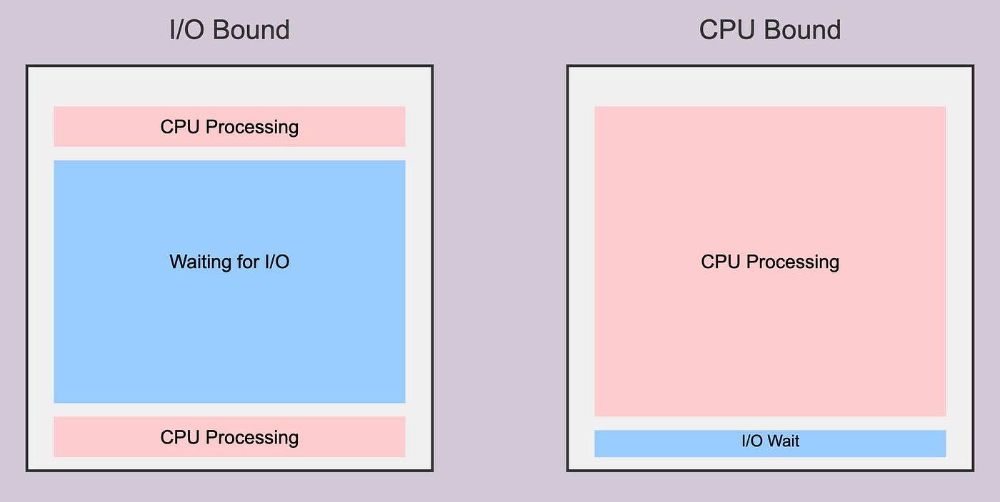
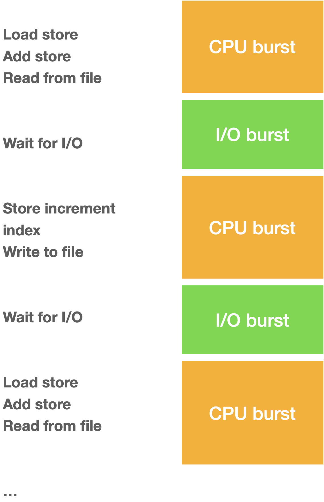

# Java Concurrency: Blocking I/O vs. CPU-Bound Tasks

Understanding whether a task is **Blocking I/O** or **CPU-bound** dictates how you allocate thread resources in Java. Choosing the wrong concurrency model leads to either resource exhaustion or CPU starvation.

|                               |                                |
| ----------------------------- | ------------------------------ |
|  |  |

## 1. The Two Types of Workloads

### A. Blocking I/O (Input/Output Bound)

- **Definition:** The thread spends most of its execution time **waiting** for external operations to complete—such as database queries, HTTP API requests, or file system access. The CPU remains idle during this waiting period.

- **Bottleneck:** External network/disk response times and thread capacity, not CPU processing power.

- **The Problem:** Traditional platform threads in Java map 1:1 to OS threads and consume \~1 MB of stack memory each. Blocking thousands of OS threads wastes massive amounts of memory just waiting for external signals.

- **Real-World Applications:**
  - **API Gateways & Microservices:** Aggregating data by making downstream REST or gRPC HTTP calls to multiple microservices.
  - **Web Scraping & Web Crawlers:** Fetching HTML, JSON, or media assets from thousands of web addresses concurrently.
  - **Database-Heavy CRUD Apps:** Querying relational databases (PostgreSQL, MySQL via JDBC) or NoSQL databases.
  - **Message Queue Consumers:** Listening to and consuming messages from Kafka, RabbitMQ, or AWS SQS where processing involves mostly storage or external calls.
  - **File Upload/Download Services:** Reading large logs or assets from cloud storage (e.g., AWS S3, Google Cloud Storage).

### B. CPU-Bound

- **Definition:** The thread spends nearly 100% of its execution time actively executing instructions on the CPU—such as cryptography, image processing, complex algorithms, or JSON parsing.

- **Bottleneck:** The number of physical CPU cores available on the system.

- **The Problem:** Allocating more active threads than available physical CPU cores leads to excessive context switching, which degrades overall system throughput.

- **Real-World Applications:**
  - **Media Processing & Rendering:** Image resizing, video encoding/transcoding, or audio spectrum analysis.
  - **Cryptography & Security:** Password hashing (e.g., Argon2, bcrypt), token generation, key exchange, or payload encryption/decryption.
  - **Data Analytics & Machine Learning:** Running matrix multiplications, complex financial risk calculations, or local ML model inferences.
  - **Large Payload Serialization:** Parsing massive JSON, XML, or Protocol Buffer payloads into memory structures.
  - **Search & Indexing:** Executing regex pattern matching, text parsing, or compiling full-text search indexes (e.g., Lucene/Elasticsearch operations).

## 2. Java Concurrency Cheat Sheet

| Workload Type    | Optimal Java Construct                                    | Thread Pool Sizing Strategy                                                 |
| ---------------- | --------------------------------------------------------- | --------------------------------------------------------------------------- |
| **Blocking I/O** | **Virtual Threads** (Java 21+)                            | Unbounded / Task-per-thread (`Executors.newVirtualThreadPerTaskExecutor()`) |
| **CPU-Bound**    | **Platform Threads** (`ForkJoinPool` / `FixedThreadPool`) | Fixed size matched to core count: $N_{\text{threads}} = N_{\text{cores}}$   |

## 3. Best Practices & Code Examples

### A. For Blocking I/O: Virtual Threads (Java 21+)

Virtual threads are lightweight threads managed directly by the Java runtime rather than the operating system.

- **Mechanism:** When a virtual thread blocks on I/O (e.g., `InputStream.read()`, database calls, or HTTP clients), the JVM unmounts it from the underlying OS thread (carrier thread), allowing the OS thread to execute other virtual threads.

- **Rule:** Do not pool virtual threads. Create a new virtual thread per task or request.

```
import java.net.URI;
import java.net.http.HttpClient;
import java.net.http.HttpRequest;
import java.net.http.HttpResponse;
import java.util.concurrent.Executors;
import java.util.stream.IntStream;

public class VirtualThreadIOExample {
    public void processIoTasks() {
        HttpClient client = HttpClient.newHttpClient();

        // High concurrency for I/O tasks using Virtual Threads
        try (var executor = Executors.newVirtualThreadPerTaskExecutor()) {
            IntStream.range(0, 10_000).forEach(i -> {
                executor.submit(() -> {
                    HttpRequest request = HttpRequest.newBuilder()
                            .uri(URI.create("https://api.example.com/data/" + i))
                            .build();

                    // Blocking network call (JVM safely unmounts thread during wait)
                    HttpResponse<String> response = client.send(request, HttpResponse.BodyHandlers.ofString());
                    return response.body();
                });
            });
        } // AutoCloseable executor ensures all tasks complete before exiting
    }
}
```

> **Legacy Java (Java 11 / 17):**
>
> If Virtual Threads are unavailable, use asynchronous libraries (e.g., Spring Webflux / Netty) or size a platform thread pool using the formula:
>
> $$
> N_{\text{threads}} = N_{\text{cores}} \times \left(1 + \frac{\text{Wait Time}}{\text{Compute Time}}\right)
> $$

### B. For CPU-Bound Tasks: Platform Threads

Virtual threads do not execute CPU calculations any faster than platform threads. If a task is purely computational, it requires physical execution time on an actual CPU core.

- **Mechanism:** Using excess threads for CPU tasks creates context-switching overhead without increasing throughput.

- **Rule:** Use a fixed thread pool sized strictly according to `Runtime.getRuntime().availableProcessors()`.

```
import java.util.List;
import java.util.concurrent.Executors;
import java.util.concurrent.ExecutorService;

public class CpuBoundExample {
    public void processCpuTasks(List<byte[]> dataChunks) {
        int coreCount = Runtime.getRuntime().availableProcessors();

        // Fixed pool tied to physical CPU capacity
        try (ExecutorService executor = Executors.newFixedThreadPool(coreCount)) {
            for (byte[] chunk : dataChunks) {
                executor.submit(() -> performComplexCalculation(chunk));
            }
        }
    }

    private byte[] performComplexCalculation(byte[] input) {
        // Heavy CPU work (e.g., hashing, encryption, math)
        return input;
    }
}
```

_For data collection processing, Java Parallel Streams (`collection.parallelStream()`) or `CompletableFuture` (using a custom platform thread pool) are recommended, as they utilize the underlying `ForkJoinPool.commonPool()`._
