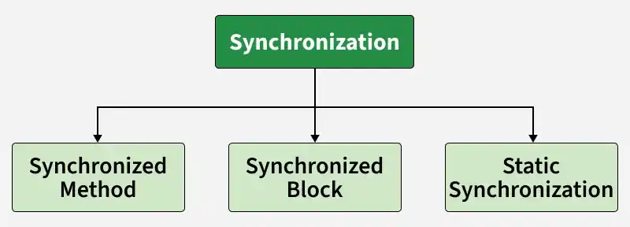

# Synchronization and Deadlocks in Java

The `synchronized` keyword in Java provides **mutual exclusion** and **memory visibility**, ensuring that only one thread executes a critical section of code at a time on a shared resource.



---

## 1. How `synchronized` Works

Every object in Java possesses an **intrinsic lock** (also called a **monitor lock**).

1. **Lock Acquisition:** Before entering a synchronized block or method, a thread must acquire the monitor lock associated with the target object.
2. **Execution:** If no other thread holds the lock, the current thread acquires it and executes the code. If another thread already holds the lock, incoming threads are blocked and placed in a wait queue.
3. **Lock Release:** When the thread leaves the synchronized block (normally or via an exception), the lock is released automatically, waking up waiting threads.

### Common Usage Patterns

- **Instance Method:** Locks on `this`.
- **Static Method:** Locks on the `Class` object (`MyClass.class`).
- **Synchronized Block:** Locks on an explicitly designated object (recommended to minimize lock granularity).

---

## 2. Java Deadlock Example

A **deadlock** occurs when two or more threads are permanently blocked, each waiting for a lock held by the other.

### Problematic Code (Causes Deadlock)

```java
public class DeadlockDemo {
    private static final Object lock1 = new Object();
    private static final Object lock2 = new Object();

    public static void main(String[] args) {
        // Thread 1: Locks lock1, then tries to lock lock2
        Thread thread1 = new Thread(() -> {
            synchronized (lock1) {
                System.out.println("Thread 1: Holding lock1...");

                try { Thread.sleep(50); } catch (InterruptedException ignored) {}

                System.out.println("Thread 1: Waiting for lock2...");
                synchronized (lock2) {
                    System.out.println("Thread 1: Acquired lock2!");
                }
            }
        });

        // Thread 2: Locks lock2, then tries to lock lock1
        Thread thread2 = new Thread(() -> {
            synchronized (lock2) {
                System.out.println("Thread 2: Holding lock2...");

                try { Thread.sleep(50); } catch (InterruptedException ignored) {}

                System.out.println("Thread 2: Waiting for lock1...");
                synchronized (lock1) {
                    System.out.println("Thread 2: Acquired lock1!");
                }
            }
        });

        thread1.start();
        thread2.start();
    }
}
```

### Output:

```text
Thread 1: Holding lock1...
Thread 2: Holding lock2...
Thread 1: Waiting for lock2...
Thread 2: Waiting for lock1...
(Execution hangs indefinitely)
```

---

## 3. Resolving Deadlocks

### Strategy A: Enforce Consistent Lock Ordering

Ensure all threads acquire locks in the exact same global order.

```java
// Thread 1: Acquire lock1 then lock2
Thread thread1 = new Thread(() -> {
    synchronized (lock1) {
        synchronized (lock2) {
            System.out.println("Thread 1 executed safely.");
        }
    }
});

// Thread 2: ALSO acquire lock1 then lock2
Thread thread2 = new Thread(() -> {
    synchronized (lock1) {
        synchronized (lock2) {
            System.out.println("Thread 2 executed safely.");
        }
    }
});
```

---

### Strategy B: Non-blocking Lock Acquisition with `ReentrantLock`

Use `tryLock()` with timeouts from `java.util.concurrent.locks.ReentrantLock` to back off if a lock cannot be acquired immediately.

```java
import java.util.concurrent.locks.Lock;
import java.util.concurrent.locks.ReentrantLock;
import java.util.concurrent.TimeUnit;

public class LockTimeoutFix {
    private static final Lock lock1 = new ReentrantLock();
    private static final Lock lock2 = new ReentrantLock();

    public static void acquireLocks(Lock firstLock, Lock secondLock) throws InterruptedException {
        while (true) {
            boolean gotFirst = firstLock.tryLock(50, TimeUnit.MILLISECONDS);
            boolean gotSecond = false;

            try {
                if (gotFirst) {
                    gotSecond = secondLock.tryLock(50, TimeUnit.MILLISECONDS);
                }
            } finally {
                if (gotFirst && gotSecond) {
                    return; // Successfully acquired both locks
                }
                if (gotFirst) {
                    firstLock.unlock(); // Release first lock if second failed
                }
            }
            Thread.sleep(10); // Pause before retrying to prevent livelock
        }
    }
}
```
