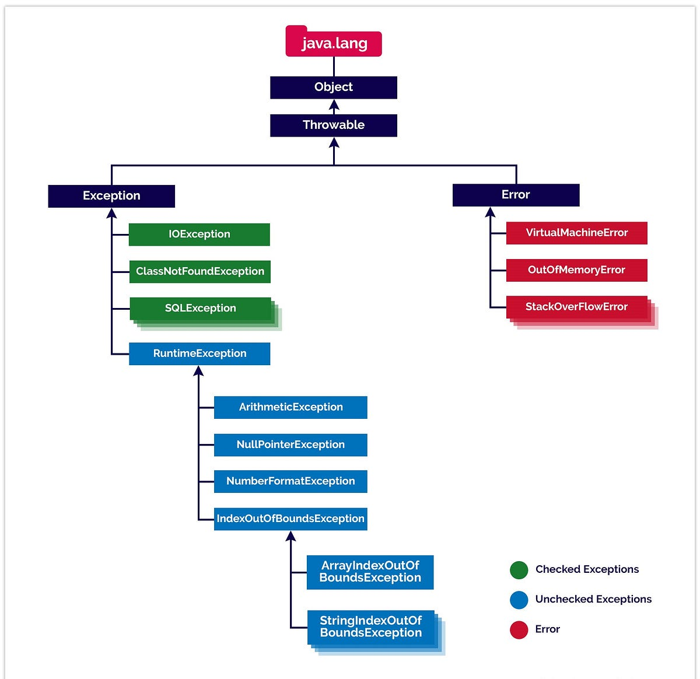

# Comprehensive Guide to Java Exceptions and Best Practices

Java handles unexpected or error conditions during runtime using **Exceptions**. An Exception is an object representing an error event that disrupts the normal flow of instructions.



---

## 1. The Java Exception Hierarchy

All exceptions and errors inherit from `java.lang.Throwable`.

```text
                    Throwable
                    /       \
              Exception      Error (Out of Memory, Stack Overflow)
               /     \
  Checked Exceptions  RuntimeException (Unchecked Exceptions)
  (IOException, etc.) (NullPointerException, etc.)
```

- **`Error`**: Serious hardware or system-level issues (e.g., `OutOfMemoryError`). Applications should **not** catch these.
- **Checked Exceptions**: Subclasses of `Exception` (excluding `RuntimeException`). The compiler **forces** you to either catch them (`try-catch`) or declare them (`throws`). Used for recoverable scenarios like missing files (`IOException`) or database issues (`SQLException`).
- **Unchecked Exceptions**: Subclasses of `RuntimeException`. The compiler does **not** force handling. These usually indicate programming logic errors (e.g., `NullPointerException`, `ArrayIndexOutOfBoundsException`, `IllegalArgumentException`).

---

## 2. Core Syntax: `try-catch-finally` & `try-with-resources`

### Basic Handling

```java
try {
    int result = 10 / 0; // Throws ArithmeticException
} catch (ArithmeticException e) {
    logger.error("Cannot divide by zero", e);
} finally {
    // Always executes, whether an exception occurred or not
    System.out.println("Cleanup tasks run here.");
}
```

### Try-with-Resources (Preferred for I/O)

Introduced in Java 7, any class implementing `AutoCloseable` or `Closeable` can be managed within the `try` declaration. Resources are closed automatically in reverse order of creation.

```java
try (BufferedReader reader = new BufferedReader(new FileReader("config.txt"))) {
    String line = reader.readLine();
} catch (IOException e) {
    logger.error("Failed to read configuration file", e);
}
// No explicit finally block needed to close 'reader'
```

---

## 3. Essential Best Practices

### 1. Catch Specific Exceptions First

Always catch the most specific exception type before broader ones. Catching `Exception` or `Throwable` too early swallows specific details and masks bugs.

```java
// BAD
try {
    parseData(file);
} catch (Exception e) { // Catches everything indiscriminately
    handleError(e);
}

// GOOD
try {
    parseData(file);
} catch (FileNotFoundException e) {
    logger.warn("File missing, using fallback", e);
} catch (IOException e) {
    logger.error("I/O error during parsing", e);
}
```

### 2. Don't Swallow Exceptions

Never leave a `catch` block empty or silently log without taking action. If you catch an exception, either restore state, rethrow it, or log it cleanly.

```java
// BAD
catch (NoSuchMethodException e) {
    // Empty block - error disappears silently
}

// GOOD
catch (NoSuchMethodException e) {
    throw new IllegalStateException("Required method is unavailable on current runtime", e);
}
```

### 3. Preserve the Original Cause (Exception Chaining)

When wrapping lower-level exceptions into custom business exceptions, pass the original exception as the `cause` parameter. Failing to do so destroys the stack trace.

```java
// BAD
catch (SQLException e) {
    throw new UserNotFoundException("User lookup failed: " + e.getMessage());
}

// GOOD
catch (SQLException e) {
    throw new UserNotFoundException("User lookup failed", e); // Keeps stack trace
}
```

### 4. Log or Rethrow — Never Both

Logging an exception and then throwing it causes duplicate log entries up the call stack, cluttering log files.

```java
// BAD
catch (IOException e) {
    logger.error("Failed to read file", e);
    throw e; // Outer catch block will likely log this again
}

// GOOD
catch (IOException e) {
    throw new ConfigurationLoadException("Unable to load initial configuration", e);
}
```

### 5. Validate Input Early to Avoid Unchecked Exceptions

Use defensive checks rather than relying on `try-catch` to control routine control flow.

```java
// BAD (Using exceptions for flow control)
try {
    return text.toUpperCase();
} catch (NullPointerException e) {
    return "";
}

// GOOD
if (text == null) {
    return "";
}
return text.toUpperCase();
```

### 6. Clean Up Resources via Try-with-Resources

Avoid manually calling `.close()` inside `finally` blocks, as closing a resource itself can throw an exception and leak other open resources.

### 7. Prefer Standard Unchecked Exceptions

Before creating custom exception classes, check if standard Java exceptions suit the domain:

- `IllegalArgumentException`: Invalid method parameter passed.
- `IllegalStateException`: Object state is unsuitable for method execution.
- `NullPointerException`: Unexpected null reference.
- `UnsupportedOperationException`: Operation not supported by the implementation.

### 8. Include Helpful Diagnostics in Messages

Exception messages should contain relevant contextual data (IDs, parameter values) to make debugging straight log files feasible.

```java
// BAD
throw new IllegalArgumentException("Invalid age");

// GOOD
throw new IllegalArgumentException("Age must be between 0 and 120, got: " + age);
```

---

## 4. Designing Custom Exception Classes

### Unchecked Custom Exception

Extend `RuntimeException` when the caller cannot reasonably recover, or when the error stems from invalid input/preconditions.

```java
public class ResourceNotFoundException extends RuntimeException {

    private final String resourceName;
    private final Object resourceId;

    public ResourceNotFoundException(String resourceName, Object resourceId) {
        super(String.format("%s not found with identifier: %s", resourceName, resourceId));
        this.resourceName = resourceName;
        this.resourceId = resourceId;
    }

    public ResourceNotFoundException(String resourceName, Object resourceId, Throwable cause) {
        super(String.format("%s not found with identifier: %s", resourceName, resourceId), cause);
        this.resourceName = resourceName;
        this.resourceId = resourceId;
    }

    public String getResourceName() {
        return resourceName;
    }

    public Object getResourceId() {
        return resourceId;
    }
}
```

### Checked Custom Exception

Extend `Exception` when the caller **must** handle or declare the exception (e.g., recoverable business logic failures, external service limits).

```java
public class InsufficientBalanceException extends Exception {

    private final String accountId;
    private final double attemptedAmount;
    private final double currentBalance;

    public InsufficientBalanceException(String accountId, double attemptedAmount, double currentBalance) {
        super(String.format("Account '%s' has insufficient funds. Requested: %.2f, Available: %.2f",
                accountId, attemptedAmount, currentBalance));
        this.accountId = accountId;
        this.attemptedAmount = attemptedAmount;
        this.currentBalance = currentBalance;
    }

    public String getAccountId() {
        return accountId;
    }

    public double getAttemptedAmount() {
        return attemptedAmount;
    }

    public double getCurrentBalance() {
        return currentBalance;
    }
}
```

### Base Custom Exception Template

When creating a suite of custom exceptions for a module, implement the four canonical constructors on a base class:

```java
public class BaseApplicationException extends Exception {

    // 1. Default constructor
    public BaseApplicationException() {
        super();
    }

    // 2. Message-only constructor
    public BaseApplicationException(String message) {
        super(message);
    }

    // 3. Message + cause (Exception Chaining)
    public BaseApplicationException(String message, Throwable cause) {
        super(message, cause);
    }

    // 4. Cause-only constructor
    public BaseApplicationException(Throwable cause) {
        super(cause);
    }
}
```
