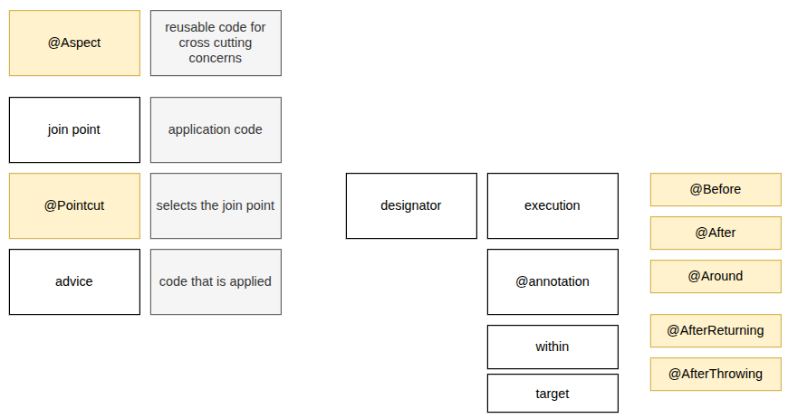

# Spring Aspect-Oriented Programming (AOP) Guide

Spring Aspect-Oriented Programming (AOP) is a powerful paradigm designed to complement Object-Oriented Programming (OOP) by addressing **cross-cutting concerns**.

While OOP structures applications into a hierarchy of classes, AOP modularizes behaviors that cut across multiple classes—such as **logging, security, transaction management, and error handling**—preventing code duplication.



---

## Core Spring AOP Concepts

To understand how Spring AOP works, you need to be familiar with its foundational terminology:

- **Aspect:** A modularization of a concern that cuts across multiple classes (e.g., a `@Aspect` class handling security checks).
- **Join Point:** A point during the execution of a program, such as the execution of a method or the handling of an exception. In Spring AOP, **join points are always method executions**.
- **Advice:** Action taken by an aspect at a particular join point. Types include:
  - `@Before`: Runs before the method execution.
  - `@AfterReturning`: Runs after a method completes successfully.
  - `@AfterThrowing`: Runs if a method throws an exception.
  - `@After` (Finally): Runs regardless of the method's outcome.
  - `@Around`: Wraps the method execution, allowing you to control when (or if) the target method runs, and to inspect or modify its return value.
- **Pointcut:** A predicate or expression that matches join points. Advice is associated with a pointcut expression and runs at any join point matched by the pointcut (e.g., executing any method in a specific service package).
- **Target Object:** The object being advised by one or more aspects. Also known as the "advised object."
- **AOP Proxy:** An object created by the AOP framework in order to implement aspect contracts (advise method executions). Spring AOP uses **JDK dynamic proxies** or **CGLIB proxies** under the hood.
- **Weaving:** Linking aspects with other application types or objects to create an advised object. Spring AOP performs weaving at **runtime**.

---

## How Spring AOP Works

Spring AOP is implemented as a **proxy-based framework**:

1. **Proxy Creation:** When you define a bean that is targeted by an aspect, Spring wraps that bean inside a dynamic proxy.
2. **Method Interception:** When a client calls a method on the bean, the call actually hits the proxy first.
3. **Advice Execution:** The proxy evaluates the pointcut expressions, executes any applicable advice (like `@Before`), and then delegates the call to the actual target object method.
4. **Proxy Types:**
   - **JDK Dynamic Proxies:** Used by default if the target object implements at least one interface.
   - **CGLIB Proxies:** Used if the target object does not implement any interfaces, generating a subclass dynamically to act as the proxy.

---

## Code Example: Logging Aspect

Here is a practical, modern Spring Boot example demonstrating how to implement a logging aspect using Java configuration and AspectJ annotations.

### 1. Enable AspectJ Support

Ensure your configuration class or Spring Boot application has `@EnableAspectJAutoProxy`:

```java
@Configuration
@EnableAspectJAutoProxy
public class AppConfig {
    // Configuration details
}
```

### 2. Create the Aspect Class

This aspect logs every execution of methods inside a specific service package and measures their execution time using an `@Around` advice.

```java
import org.aspectj.lang.ProceedingJoinPoint;
import org.aspectj.lang.annotation.Around;
import org.aspectj.lang.annotation.Aspect;
import org.aspectj.lang.annotation.Pointcut;
import org.slf4j.Logger;
import org.slf4j.LoggerFactory;
import org.springframework.stereotype.Component;

@Aspect
@Component
public class LoggingAspect {

    private static final Logger logger = LoggerFactory.getLogger(LoggingAspect.class);

    // Define a pointcut for all methods in the service package
    @Pointcut("execution(* com.example.service.*.*(..))")
    private void servicePackage() {}

    // Apply around advice to the defined pointcut
    @Around("servicePackage()")
    public Object logExecutionTime(ProceedingJoinPoint joinPoint) throws Throwable {
        long startTime = System.currentTimeMillis();

        String methodName = joinPoint.getSignature().toShortString();
        logger.info("Entering method: {} with arguments: {}", methodName, joinPoint.getArgs());

        try {
            // Proceed with the actual method execution
            Object result = joinPoint.proceed();

            long elapsedTime = System.currentTimeMillis() - startTime;
            logger.info("Exiting method: {} - Time taken: {} ms", methodName, elapsedTime);

            return result;
        } catch (Exception e) {
            logger.error("Method {} threw exception: {}", methodName, e.getMessage());
            throw e;
        }
    }
}
```

### Key Takeaways from the Example:

- **Pointcut Expression (`execution(...)`)**: Matches any method return type, any class, and any parameters (`(..)`).
- **`ProceedingJoinPoint`**: Required specifically for `@Around` advice to invoke `proceed()`, which actually triggers the target method.
