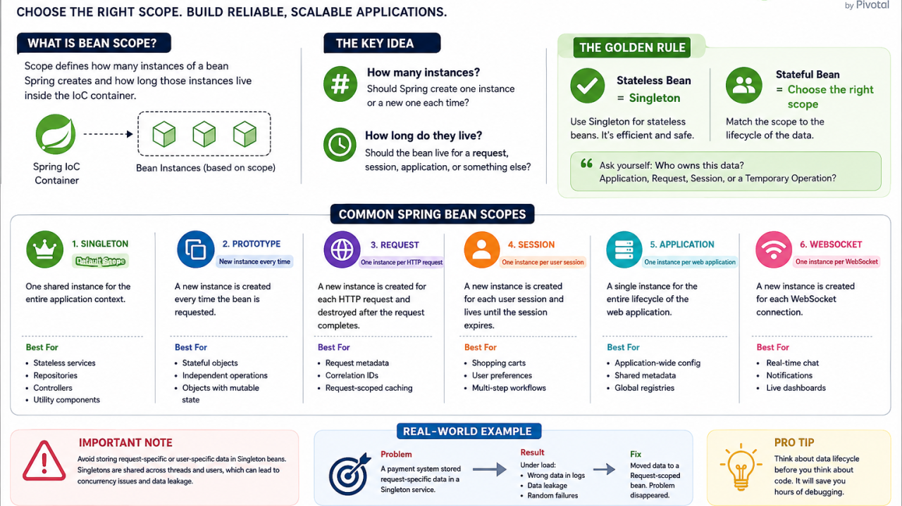

# Bean Scopes in Spring Boot: A Complete Guide



## Types of Bean Scopes

Spring Framework provides six types of bean scopes:

1. Singleton (default)
2. Prototype
3. Request
4. Session
5. Application
6. WebSocket

> **Note:** The last four scopes (`request`, `session`, `application`, and `websocket`) are only available in a web-aware Spring `ApplicationContext`.

---

## 1. Singleton Scope

### Overview

The singleton scope is the default scope in Spring. When a bean is defined as singleton, the Spring IoC container creates exactly one instance of that bean, and all requests for that bean return the same shared instance.

### Key Characteristics

- One instance per Spring IoC container
- Instance is cached and reused
- Thread-safe by default (container manages it)
- Ideal for stateless beans

### Example

```java
@Component
@Scope("singleton") // Optional, as it's the default
public class DatabaseService {

    public DatabaseService() {
        System.out.println("DatabaseService instance created");
    }

    public void connect() {
        System.out.println("Connecting to database...");
    }
}
```

### Using Singleton Bean

```java
@RestController
@RequestMapping("/api")
public class UserController {

    @Autowired
    private DatabaseService databaseService;

    @GetMapping("/test")
    public String testSingleton() {
        databaseService.connect();
        return "Singleton instance: " + databaseService.hashCode();
    }
}
```

### Configuration Methods

#### Method 1: Using `@Scope` Annotation

```java
@Component
@Scope(ConfigurableBeanFactory.SCOPE_SINGLETON)
public class SingletonBean { }
```

#### Method 2: Java Configuration

```java
@Configuration
public class AppConfig {

    @Bean
    @Scope("singleton")
    public DatabaseService databaseService() {
        return new DatabaseService();
    }
}
```

### When to Use Singleton

- Service layer beans
- DAO/Repository beans
- Configuration beans
- Stateless utility classes
- Beans that don't maintain any state

### Important Considerations

- **Thread Safety:** If your singleton bean has mutable state, you need to handle thread synchronization manually.
- **Memory Efficient:** Only one instance exists throughout the application lifecycle.
- **Performance:** No overhead of creating new instances repeatedly.

---

## 2. Prototype Scope

### Overview

With prototype scope, Spring creates a new instance every time the bean is requested. The container does not manage the complete lifecycle of prototype beans.

### Key Characteristics

- New instance created for each request
- Spring doesn't manage destruction lifecycle
- Client code is responsible for cleanup
- Not thread-safe by nature (each thread gets different instance)

### Example

Imagine a system where administrators can request large data exports (e.g., generating a PDF of yearly transaction histories). Because these reports take time, the system processes them in the background using a multi-threaded ExecutorService.

If your ReportExporter bean is a default singleton, multiple administrators running exports at the same time will overwrite each other's data fields (like currentUserId, totalRecordsProcessed, or the specific OutputStream), causing corrupted files and major data leaks.

```java
@Component
@Scope(ConfigurableBeanFactory.SCOPE_PROTOTYPE)
public class ShoppingCart {

    private List<String> items = new ArrayList<>();

    public ShoppingCart() {
        System.out.println("New ShoppingCart instance created: " + this.hashCode());
    }

    public void addItem(String item) {
        items.add(item);
    }

    public List<String> getItems() {
        return items;
    }
}
```

### Using Prototype Bean

```java
@Component
@Scope("prototype")
public class ReportExporter implements Runnable {

    // Stateful data unique to THIS specific export job
    private final String userId;
    private final ExportQueryCriteria criteria;
    private int progressPercentage = 0;

    public ReportExporter(String userId, ExportQueryCriteria criteria) {
        this.userId = userId;
        this.criteria = criteria;
    }

    @Override
    public void run() {
        // 1. Fetch data based on criteria
        // 2. Generate PDF bytes
        // 3. Update progressPercentage safely without affecting other users
    }
}

@Service
public class OrderService {

    @Autowired
    private ApplicationContext context;

    public void processOrder(String userId) {
        // Get a new instance each time
        ShoppingCart cart1 = context.getBean(ShoppingCart.class);
        ShoppingCart cart2 = context.getBean(ShoppingCart.class);

        System.out.println("cart1 == cart2: " + (cart1 == cart2)); // false
    }
}
```

### Configuration Methods

```java
@Component
@Scope(value = ConfigurableBeanFactory.SCOPE_PROTOTYPE)
public class PrototypeBean { }
```

```java
@Configuration
public class AppConfig {

    @Bean
    @Scope("prototype")
    public ShoppingCart shoppingCart() {
        return new ShoppingCart();
    }
}
```

### When to Use Prototype

- Stateful beans
- Beans that maintain user-specific data
- Heavy objects that shouldn't be shared
- Beans with mutable state

### Common Pitfall: Prototype Bean Injection

**Problem:** When you inject a prototype bean into a singleton bean, you only get one instance!

```java
@Service // Singleton by default
public class OrderService {

    @Autowired
    private ShoppingCart cart; // Only ONE instance injected!
    // All users will share the same cart - BUG!
}
```

#### Solution 1: Using ApplicationContext

```java
@Service
public class OrderService {

    @Autowired
    private ApplicationContext context;

    public void processOrder() {
        ShoppingCart cart = context.getBean(ShoppingCart.class);
        // Now you get a new instance each time
    }
}
```

#### Solution 2: Using ObjectProvider

```java
@Service
public class OrderService {

    @Autowired
    private ObjectProvider<ShoppingCart> cartProvider;

    public void processOrder() {
        ShoppingCart cart = cartProvider.getObject();
        // New instance each time
    }
}
```

#### Solution 3: Using `@Lookup`

```java
@Service
public abstract class OrderService {

    @Lookup
    public abstract ShoppingCart getShoppingCart();

    public void processOrder() {
        ShoppingCart cart = getShoppingCart();
        // Spring will override this method to return new instance
    }
}
```

---

## 3. Request Scope

### Overview

The request scope creates one bean instance per HTTP request. Each HTTP request has its own instance of the bean. This scope is only valid in web-aware Spring `ApplicationContext`.

### Key Characteristics

- One instance per HTTP request
- Instance is destroyed after request completes
- Only available in web applications
- Useful for request-specific data

### Example

```java
@Component
@Scope(value = WebApplicationContext.SCOPE_REQUEST, proxyMode = ScopedProxyMode.TARGET_CLASS)
public class LoginRequest {

    private String username;
    private String ipAddress;
    private LocalDateTime requestTime;

    public LoginRequest() {
        this.requestTime = LocalDateTime.now();
        System.out.println("New LoginRequest instance created");
    }

    // Getters and setters
}
```

### Using Request Scoped Bean

```java
@RestController
@RequestMapping("/api/auth")
public class AuthController {

    @Autowired
    private LoginRequest loginRequest;

    @PostMapping("/login")
    public ResponseEntity<String> login(@RequestBody Map<String, String> credentials) {
        loginRequest.setUsername(credentials.get("username"));
        loginRequest.setIpAddress(request.getRemoteAddr());

        // Process login
        return ResponseEntity.ok("Login successful at " + loginRequest.getRequestTime());
    }
}
```

### Understanding `proxyMode`

When injecting request-scoped beans into singleton beans, you need `proxyMode`:

```java
@Component
@Scope(value = "request", proxyMode = ScopedProxyMode.TARGET_CLASS)
public class RequestScopedBean { }
```

**Why?** Because singleton beans are created at startup, but request-scoped beans don't exist yet. Spring creates a proxy that delegates to the actual request-scoped instance at runtime.

### Alternative: Using `@RequestScope`

```java
@Component
@RequestScope
public class LoginRequest {
    // Equivalent to @Scope(value = "request", proxyMode = ScopedProxyMode.TARGET_CLASS)
}
```

### When to Use Request Scope

- Storing request-specific metadata
- User authentication details for current request
- Request tracking and logging
- Form data processing

---

## 4. Session Scope

### Overview

The session scope creates one bean instance per HTTP session. All requests from the same user session share the same bean instance.

### Key Characteristics

- One instance per HTTP session
- Shared across multiple requests from same user
- Destroyed when session expires
- Only available in web applications

### Example

```java
@Component
@Scope(value = WebApplicationContext.SCOPE_SESSION, proxyMode = ScopedProxyMode.TARGET_CLASS)
public class UserSession {

    private String userId;
    private String sessionId;
    private List<String> visitedPages = new ArrayList<>();
    private LocalDateTime loginTime;

    public UserSession() {
        this.loginTime = LocalDateTime.now();
        System.out.println("New UserSession created");
    }

    public void addVisitedPage(String page) {
        visitedPages.add(page);
    }

    // Getters and setters
}
```

### Using Session Scoped Bean

```java
@RestController
@RequestMapping("/api")
public class PageController {

    @Autowired
    private UserSession userSession;

    @GetMapping("/page/{pageName}")
    public ResponseEntity<String> visitPage(@PathVariable String pageName) {
        userSession.addVisitedPage(pageName);
        return ResponseEntity.ok("Pages visited in this session: " + userSession.getVisitedPages());
    }

    @GetMapping("/session-info")
    public ResponseEntity<UserSession> getSessionInfo() {
        return ResponseEntity.ok(userSession);
    }
}
```

### Alternative: Using `@SessionScope`

```java
@Component
@SessionScope
public class UserSession {
    // Equivalent to @Scope(value = "session", proxyMode = ScopedProxyMode.TARGET_CLASS)
}
```

### When to Use Session Scope

- User session information
- Shopping carts in e-commerce
- User preferences during session
- Multi-step form wizards
- Authentication tokens

### Session Management

```java
@Configuration
public class SessionConfig {

    @Bean
    public ServletListenerRegistrationBean<HttpSessionListener> sessionListener() {
        return new ServletListenerRegistrationBean<>(new HttpSessionListener() {
            @Override
            public void sessionCreated(HttpSessionEvent se) {
                System.out.println("Session created: " + se.getSession().getId());
            }

            @Override
            public void sessionDestroyed(HttpSessionEvent se) {
                System.out.println("Session destroyed: " + se.getSession().getId());
            }
        });
    }
}
```

---

## 5. Application Scope

### Overview

The application scope creates one bean instance per `ServletContext`. This is similar to singleton but at the `ServletContext` level rather than Spring `ApplicationContext` level.

### Key Characteristics

- One instance per web application (`ServletContext`)
- Shared across all sessions and requests
- Lives as long as the web application runs
- Only available in web applications

### Example

```java
@Component
@Scope(value = WebApplicationContext.SCOPE_APPLICATION, proxyMode = ScopedProxyMode.TARGET_CLASS)
public class ApplicationMetrics {

    private AtomicLong totalRequests = new AtomicLong(0);
    private AtomicLong activeSessions = new AtomicLong(0);
    private LocalDateTime startTime;

    public ApplicationMetrics() {
        this.startTime = LocalDateTime.now();
        System.out.println("ApplicationMetrics initialized");
    }

    public void incrementRequests() {
        totalRequests.incrementAndGet();
    }

    public long getTotalRequests() {
        return totalRequests.get();
    }

    // Other methods
}
```

### Using Application Scoped Bean

```java
@RestController
@RequestMapping("/api/metrics")
public class MetricsController {

    @Autowired
    private ApplicationMetrics metrics;

    @GetMapping
    public ResponseEntity<Map<String, Object>> getMetrics() {
        Map<String, Object> metricsData = new HashMap<>();
        metricsData.put("totalRequests", metrics.getTotalRequests());
        metricsData.put("uptime", Duration.between(metrics.getStartTime(), LocalDateTime.now()));
        return ResponseEntity.ok(metricsData);
    }
}
```

### Alternative: Using `@ApplicationScope`

```java
@Component
@ApplicationScope
public class ApplicationMetrics {
    // Equivalent to @Scope(value = "application", proxyMode = ScopedProxyMode.TARGET_CLASS)
}
```

### When to Use Application Scope

- Application-wide configuration
- Global counters and metrics
- Caching application-level data
- Shared resources across all users

### Difference from Singleton

| Aspect                | Singleton                      | Application Scope        |
| :-------------------- | :----------------------------- | :----------------------- |
| **Bound to**          | Spring `ApplicationContext`    | `ServletContext`         |
| **Web-specific**      | No                             | Yes                      |
| **Multiple contexts** | Different instance per context | One per `ServletContext` |

---

## 6. WebSocket Scope

### Overview

The websocket scope creates one bean instance per WebSocket session. This is used in applications that use WebSocket for real-time bidirectional communication.

### Key Characteristics

- One instance per WebSocket lifecycle/session
- Lives as long as the WebSocket session is active
- Only available in web-aware ApplicationContexts with WebSocket setup

---

## Comparison Table

| Scope           | Creation                  | Destruction           | Web-Aware Only | Use Case                                     |
| :-------------- | :------------------------ | :-------------------- | :------------- | :------------------------------------------- |
| **Singleton**   | Once per Spring Container | Container shutdown    | No             | Stateless services, repositories, components |
| **Prototype**   | On each `getBean()` call  | Not managed by Spring | No             | Stateful objects, short-lived instances      |
| **Request**     | Per HTTP request          | Request completion    | Yes            | Request-specific state, audit logs           |
| **Session**     | Per HTTP session          | Session expiration    | Yes            | Shopping cart, user profile/preferences      |
| **Application** | Per `ServletContext`      | Application shutdown  | Yes            | Global application stats, app-wide cache     |
| **WebSocket**   | Per WebSocket connection  | Connection close      | Yes            | Real-time chat session state                 |

---

## Best Practices

1. **Choose the Right Scope:** Default to `singleton` unless the bean has mutable state or specific lifecycle needs.
2. **Thread Safety:** Ensure singleton beans are stateless or properly synchronized.
3. **Avoid Prototype in Singleton:** Use `ObjectProvider`, `@Lookup`, or `ApplicationContext` if injecting prototype beans into singletons.
4. **Use Proxy Mode for Web Scopes:** Always set `proxyMode = ScopedProxyMode.TARGET_CLASS` (or use shortcuts like `@RequestScope`) when injecting shorter-lived beans into longer-lived ones.
5. **Cleanup Resources:** Handle resource destruction manually for `prototype` beans if necessary, as Spring doesn't manage their full lifecycle.

---

## Common Pitfalls and Solutions

### Pitfall 1: Sharing Mutable State in Singleton

- **Problem:** Shared fields in singletons modified across threads lead to race conditions.
- **Solution:** Keep singletons stateless, use thread-safe data structures (`AtomicLong`, `ConcurrentHashMap`), or switch to a narrower scope (`prototype`/`request`).

### Pitfall 2: Prototype Bean Never Destroyed

- **Problem:** Memory leaks when allocating many prototype beans that require cleanup.
- **Solution:** Use a custom `BeanPostProcessor` or clean up resources explicitly in client code.

### Pitfall 3: Circular Dependencies with Proxies

- **Problem:** Circular references between scoped proxies and singletons causing creation errors.
- **Solution:** Refactor design to decouple dependencies or use `@Lazy` initialization.

---

## Testing Beans with Different Scopes

- **Testing Singleton Beans:** Simple unit tests using standard mock injections (`@Mock`, `@InjectMocks`).
- **Testing Prototype Beans:** Verify each context/provider fetch yields a unique object instance.
- **Testing Request Scoped Beans:** Use `@WebMvcTest` along with `MockHttpServletRequest` to simulate request context boundaries.

---

## Performance Considerations

- **Memory Usage:** Singletons conserve memory; overusing prototype or session scopes can significantly increase heap footprint.
- **Creation Overhead:** Frequently instantiated prototype beans with complex initialization steps can lead to GC pressure.

---

## Recommendation

- Default to **Singleton** for all stateless beans.
- Use **Prototype** sparingly for temporary, stateful instances.
- Use **Request / Session / Application** web scopes explicitly for web contexts requiring state boundary safety via proxy mode.

---

## Conclusion

Understanding Spring Bean Scopes allows you to design cleaner architectures, prevent race conditions, and optimize resource footprint effectively across enterprise applications.
