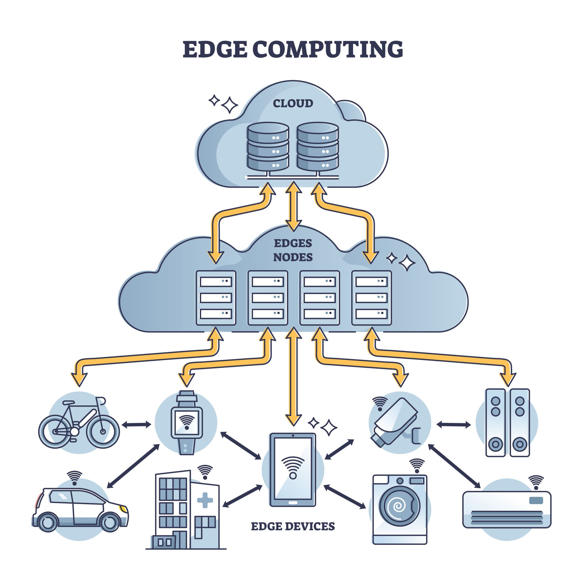

# Understanding IoT, Edge, Cloud, and Directional Traffic Flows

To understand modern distributed architectures, think of the system as a **digital nervous system**:

- **IoT** acts as the sensory organs (gathering raw input from the physical world).
- **Edge Computing** acts as localized reflexes (reacting instantly without waiting for the brain).
- **Cloud Computing** acts as the central brain (performing complex reasoning, long-term memory storage, and global strategy).
- **North-South and East-West** describe how data moves vertically between these tiers and horizontally across the same tier.



---

## 1. Core Architecture Layers

```
+-------------------------------------------------------+
|                    CLOUD COMPUTING                    |
|   (Central Data Centers, Machine Learning, Storage)   |
+-------------------------------------------------------+
                           ▲
                           │  North-South Traffic
                           ▼
+-------------------------------------------------------+
|                    EDGE COMPUTING                     | ◄--- East-West Traffic --->
|    (Local Gateway, Cell Tower Node, On-Prem Server)   |    (Node-to-Node)
+-------------------------------------------------------+
                           ▲
                           │  North-South Traffic
                           ▼
+-------------------------------------------------------+
|                 IoT / FIELD DEVICES                   | ◄--- East-West Traffic --->
|     (Sensors, Actuators, Smart Cameras, Motors)       |    (Device-to-Device)
+-------------------------------------------------------+
```

### **IoT (Internet of Things)**

- **What it is:** Physical hardware embedded with sensors, processing ability, and connectivity.
- **Role:** Collects real-world environment measurements (temperature, vibration, video feeds) or executes physical actions (opening a valve, turning on a motor).
- **Characteristics:** Constrained power, low memory, high volume of raw data.

### **Edge Computing**

- **What it is:** Compute nodes positioned **physically close** to where data is generated (e.g., an industrial PC on a factory floor, a micro-data center at a cell tower, or an onboard automotive processor).
- **Role:** Filters, aggregates, and processes raw IoT data locally to provide low-latency responses and reduce upstream network bandwidth.
- **Characteristics:** Sub-10ms response times, local operational resilience (works offline).

### **Cloud Computing**

- **What it is:** Centralized, highly scalable data centers (e.g., AWS, Microsoft Azure, Google Cloud).
- **Role:** Handles deep analytics, long-term historical data storage, heavy AI model training, and global system orchestration.
- **Characteristics:** High capacity, unlimited compute power, higher latency (50ms–200ms+).

---

## 2. Comparison Matrix

| Layer     | Primary Function                  | Response Time              | Compute Capacity   | Data Retention         |
| :-------- | :-------------------------------- | :------------------------- | :----------------- | :--------------------- |
| **IoT**   | Sensing & Physical Actuation      | Immediate (<1 ms)          | Very Low           | None / Ephemeral       |
| **Edge**  | Fast local processing & filtering | Real-Time (<10 ms)         | Medium             | Temporary (Days/Weeks) |
| **Cloud** | Global analytics & heavy AI       | Non-Real-Time (50–200+ ms) | Massive / Scalable | Permanent / Long-Term  |

---

## 3. Directional Traffic Flows: North-South vs. East-West

Network and system architects use geographical compass directions to classify how data moves through distributed systems.

```
                  NORTH
                    ▲
                    │  (Cloud)
                    │
WEST ◄──────────────┼──────────────► EAST
  (Peer Nodes)      │     (Peer Nodes)
                    │
                    ▼  (IoT / Sensors)
                  SOUTH
```

### **North-South Traffic (Vertical Flow)**

North-South traffic moves **up and down** across different layers of the architectural hierarchy.

- **Northbound (Upward):**
  - Data travels from lower-tier devices up toward higher-tier processing layers.
  - _Example:_ An IoT vibration sensor sends aggregated diagnostic logs up to an Edge server; the Edge server sends summary reports up to the Cloud database.
- **Southbound (Downward):**
  - Instructions, updates, or configurations travel from higher-tier layers down to lower-tier operational devices.
  - _Example:_ The Cloud pushes an over-the-air (OTA) firmware update down to Edge gateways, or an Edge server sends an emergency shutdown command down to an IoT actuator.
- **Key Concerns:** Protocol translation (e.g., MQTT to HTTPS), security gateways, bandwidth cost management, and payload serialization.

### **East-West Traffic (Horizontal Flow)**

East-West traffic moves **sideways** between nodes operating at the **same structural layer**.

- **Device-to-Device (IoT Level):**
  - Smart devices communicating directly with nearby smart devices without going through a central server.
  - _Example:_ A motion sensor sends a direct message via Zigbee or Bluetooth Mesh to turn on a smart lighting fixture in the same room.
- **Edge-to-Edge:**
  - Neighboring Edge servers sharing context to maintain continuous operations or distribute processing loads.
  - _Example:_ An Edge node managing Traffic Intersection A sends real-time congestion metrics directly to the Edge node at Traffic Intersection B to optimize traffic signals.
- **Cloud Microservices:**
  - Database nodes and application servers transferring data within the same data center network.
- **Key Concerns:** Ultra-low latency communication, service mesh governance, peer-to-peer security authentication, and local synchronization protocols.

---

## 4. Real-World Example: Autonomous Vehicle Fleet

To see how all these concepts converge, consider an autonomous driving ecosystem:

1. **IoT Layer (Sensing):** Cameras, Radar, and LiDAR sensors constantly scan the road.
2. **East-West Traffic (Vehicle Level):** The front camera passes visual data sideways to the vehicle's central brake controller via an internal CAN bus network.
3. **Edge Computing (In-Vehicle Processing):** An onboard AI processor analyzes the video stream locally (at the Edge) to detect a pedestrian stepping onto the road and applies the brakes within milliseconds.
4. **North-South Traffic (Northbound):** After the hazard is resolved, the vehicle sends a compressed telemetry report northbound to a roadside Edge station, which forwards an aggregated incident log northbound to the Cloud.
5. **East-West Traffic (Edge Level):** The roadside Edge station broadcasts a peer-to-peer hazard warning sideways to adjacent roadside stations and neighboring connected cars.
6. **Cloud Layer (Central Intelligence):** The Cloud aggregates incident reports from millions of vehicles globally, trains an updated computer vision model, and sends the updated AI model southbound to all fleet vehicles overnight.
