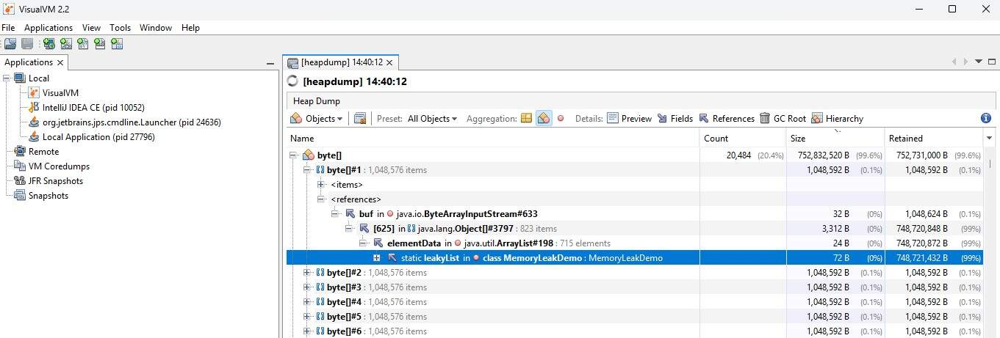

# Analyzing Offline Java Heap Dumps



Analyzing memory consumption is crucial for improving Java application performance and resolving memory-related issues like `java.lang.OutOfMemoryError`. Since a Java application allocates objects in the JVM heap, monitoring heap memory and analyzing residing objects is key to maintaining system stability.

This guide explains how to obtain heap dumps from production environments, key strategies for diagnosing memory issues, and how to analyze dumps offline using popular tools like VisualVM and Eclipse Memory Analyzer Tool (MAT).

## 1. Obtaining a Heap Dump from Production

Before analyzing a heap dump offline, you must extract a `.hprof` binary file from your production system. Below are the most reliable methods for capturing heap dumps in production environments.

### Method 1: Automatic Heap Dump on OutOfMemoryError (Recommended)

Add JVM flags to ensure that if the application crashes due to memory exhaustion, a heap dump is captured automatically without manual intervention.

```
-XX:+HeapDumpOnOutOfMemoryError -XX:HeapDumpPath=/var/log/java/heapdump.hprof

```

### Method 2: Using `jcmd` (Standard JDK Tool)

`jcmd` is the recommended command-line utility for modern JDKs. It has minimal overhead and is preferred over older utilities.

1. Find the Java process ID (PID):

   ```
   jcmd
   # or
   ps aux | grep java

   ```

2. Trigger the heap dump:

   ```
   jcmd <PID> GC.heap_dump /path/to/dumpfile.hprof

   ```

### Method 3: Using `jmap`

If `jcmd` is unavailable, you can use `jmap` (available in standard JDK installs):

```
jmap -dump:live,format=b,file=/path/to/dumpfile.hprof <PID>

```

> **Note:** Using `live` ensures only reachable objects are dumped, which reduces file size and speeds up capture.

## 2. What to Look For When Investigating Memory Problems

When opening a heap dump, navigating millions of objects can be overwhelming. Focus on these key metrics and common red flags:

### A. Shallow Size vs. Retained Size

- **Shallow Size:** The memory consumed by the object itself (e.g., fields and object headers).
- **Retained Size:** The total amount of memory freed if this object were garbage collected (includes all references held directly or indirectly).
- **Rule of Thumb:** Focus on objects with disproportionately large **retained sizes**, as these are holding onto memory blocks that Garbage Collection cannot release.

### B. Common Leak Culprits

Look out for these frequent root causes of Java memory leaks:

- **Static Collections:** Unbound `List`, `Map`, or `Set` instances declared as `static` or managed in long-lived singletons that continuously store items without eviction policies.
- **Unclosed Resources:** `InputStream`, `OutputStream`, `Connection`, or `ResultSet` instances remaining referenced in memory due to missing `try-with-resources` blocks.
- **Thread Locales & Caches:** `ThreadLocal` variables that are not cleaned up via `.remove()` in thread-pooled environments (e.g., web app containers like Tomcat), leading to thread-retained state.
- **Inner Class References:** Non-static inner classes or anonymous instances keeping implicit references to their enclosing parent class.
- **Event Listeners / Callbacks:** Registering listeners on long-lived components without explicit unregistration.

### C. GC Roots Analysis

Trace the **Shortest Path to GC Roots** for suspected objects to answer: _Why is this object still alive?_

- A Garbage Collection (GC) Root is an object accessible from outside the heap (e.g., active thread stack variables, static fields, JNI references).
- Identify the exact reference chain preventing the garbage collector from freeing the object.

---

## 3. Sample Code for Generating a Memory Leak

To demonstrate offline analysis, consider a Java program with an intentional memory leak caused by retaining references in a static list:

```
public class MemoryLeakDemo {
    private static final List<InputStream> leakList = new ArrayList<>();

    public static void main(String[] args) throws InterruptedException {
        int counter = 0;
        while (true) {
            byte[] chunk = new byte[1024 * 1024]; // 1 MB
            ByteArrayInputStream bais = new ByteArrayInputStream(chunk);
            leakList.add(bais); // Retained reference prevents GC
            counter++;
            System.out.println("Allocated " + counter + " MB");
            Thread.sleep(100);
        }
    }
}

```

## 4. Analyzing Heap Dumps with VisualVM

[VisualVM](https://visualvm.github.io/?utm_source=gemini) is an all-in-one GUI tool for monitoring, troubleshooting, and profiling Java applications.

### Key Capabilities in VisualVM:

- **Overview/Summary Tab:** Displays system properties, JVM arguments, thread count, and general runtime parameters.

- **Classes View:**
  - _Classes by Number of Instances:_ Highlights classes generating the highest instance counts.

  - _Classes by Size of Instances:_ Highlights classes consuming the largest total memory volume.

- **Objects View:** Allows inspection of individual heap objects and tracing their allocation call stacks to identify leak sources.

## 5. Analyzing Heap Dumps with Eclipse Memory Analyzer (MAT)

For large dumps or complex leak investigations, [Eclipse MAT](https://www.eclipse.org/mat/?utm_source=gemini) offers advanced diagnostic reports and memory querying capabilities.

### Key Capabilities in Eclipse MAT:

- **Leak Suspects Report:** Automatically inspects the heap and generates a high-level summary of potential leaks, identifying root objects holding onto large byte arrays or collections.

- **Top Consumers & Top Components:** Breaks down memory distribution across classes, packages, and classloaders.

- **Object Query Language (OQL):** An SQL-like language used to query object instances directly within the dump.

#### Example OQL Query

To query all `byte[]` arrays larger than 1 MB:

```
SELECT * FROM byte[] obj WHERE (obj.@length >= 1048576)

```

## 6. Summary Matrix

| Feature               | VisualVM                                     | Eclipse MAT                                           |
| --------------------- | -------------------------------------------- | ----------------------------------------------------- |
| **Primary Use Case**  | Lightweight inspection & live profiling      | Heavyweight offline leak diagnostics                  |
| **Leak Detection**    | Manual inspection of class lists & instances | Automated "Leak Suspects" report generation           |
| **Query Engine**      | Filter by name / pattern                     | Full Object Query Language (OQL) support              |
| **Resource Overhead** | Low to Moderate                              | High (requires allocated heap memory for large dumps) |
