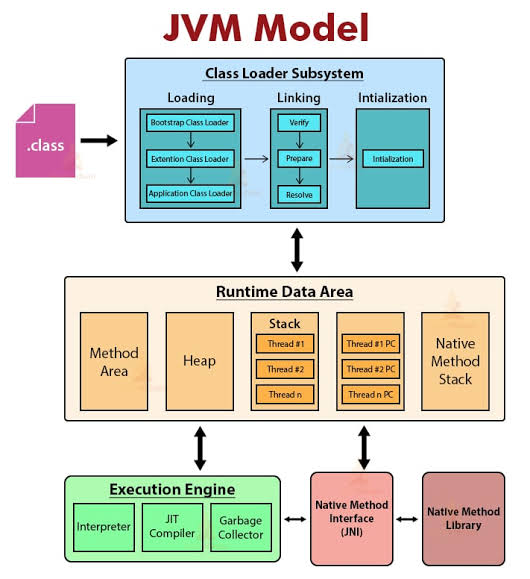

# Java Virtual Machine (JVM) Architecture

The **Java Virtual Machine (JVM)** is an abstract computing machine that enables a computer to run a Java program. It converts Java bytecode (`.class` files) into native machine code specific to the host operating system, enabling Java's core promise: **"Write Once, Run Anywhere" (WORA)**.

---

## High-Level Architectural Flow



```
+-----------------------------------------------------------------------+
|                         Class Loader Subsystem                        |
|   (Loading -> Linking [Verify, Prepare, Resolve] -> Initialize)      |
+-----------------------------------------------------------------------+
                                    |
                                    v
+-----------------------------------------------------------------------+
|                          Runtime Data Areas                           |
|  +-------------------------+ +-------------------------------------+  |
|  | Method Area (Metaspace) | |             Heap Area               |  |
|  +-------------------------+ +-------------------------------------+  |
|  +-------------------------+ +-----------------+ +-----------------+  |
|  |       JVM Stack         | |   PC Register   | | Native Stack    |  |
|  +-------------------------+ +-----------------+ +-----------------+  |
+-----------------------------------------------------------------------+
                                    |
                                    v
+-----------------------------------------------------------------------+
|                           Execution Engine                            |
|    [ Interpreter ]    [ JIT Compiler ]    [ Garbage Collector ]       |
+-----------------------------------------------------------------------+
                                    |
                    +---------------+---------------+
                    |                               |
                    v                               v
         +---------------------+        +-----------------------+
         | Native Interface    |<------>| Native Libraries      |
         | (JNI)               |        | (C / C++)             |
         +---------------------+        +-----------------------+
```

---

## Core Components

The JVM architecture consists of **three main subsystems**:

### 1. ClassLoader Subsystem

Responsible for loading, linking, and initializing class files (`.class`) into memory at runtime.

- **Loading:** Reads `.class` files and creates binary data in memory.
  - **Bootstrap ClassLoader:** Loads base Java classes (`java.lang.*`).
  - **Platform / Extension ClassLoader:** Loads platform-specific extensions.
  - **Application / System ClassLoader:** Loads user application files from the classpath.
- **Linking:**
  - **Verification:** Validates bytecode against language standards to ensure safety.
  - **Preparation:** Allocates memory for static fields and sets default values.
  - **Resolution:** Replaces symbolic references in code with direct memory addresses.
- **Initialization:** Executes `static` initializer blocks and assigns true values to static variables.

---

### 2. Runtime Data Areas (JVM Memory)

The memory allocated by the OS to run the JVM application, categorized by thread scope.

| Region                            | Scope                 | Description                                                                                            |
| :-------------------------------- | :-------------------- | :----------------------------------------------------------------------------------------------------- |
| **Method Area (Metaspace)**       | Shared across threads | Stores class structures, field/method metadata, runtime constant pools, and static variables.          |
| **Heap Area**                     | Shared across threads | Stores all instantiated objects and array objects. Managed automatically by the Garbage Collector.     |
| **JVM Stack**                     | Per thread            | Stores frame structures containing local variables, partial execution results, and method call chains. |
| **PC (Program Counter) Register** | Per thread            | Tracks the address of the currently executing JVM instruction.                                         |
| **Native Method Stack**           | Per thread            | Contains instruction execution information for native code (C/C++ libraries).                          |

---

### 3. Execution Engine

Executes the compiled bytecode stored in the Runtime Data Areas by converting it into machine-specific code.

1. **Interpreter:** Reads and executes bytecode instructions line-by-line. Fast startup, but execution of repeated loops/methods is slower.
2. **Just-In-Time (JIT) Compiler:** Compiles frequently executed bytecode ("hot spots") into native machine code to eliminate interpretation overhead. Includes optimizations such as method inlining and escape analysis.
3. **Garbage Collector (GC):** Automatically identifies and deletes unreachable objects from the Heap to free up memory and prevent leaks.

---

### Supporting Interfaces

- **Java Native Interface (JNI):** An API framework that allows Java code to interact with native C/C++ applications or dynamic libraries.
- **Native Method Libraries:** Platform-specific C/C++ native dynamic libraries required for underlying hardware interactions.
